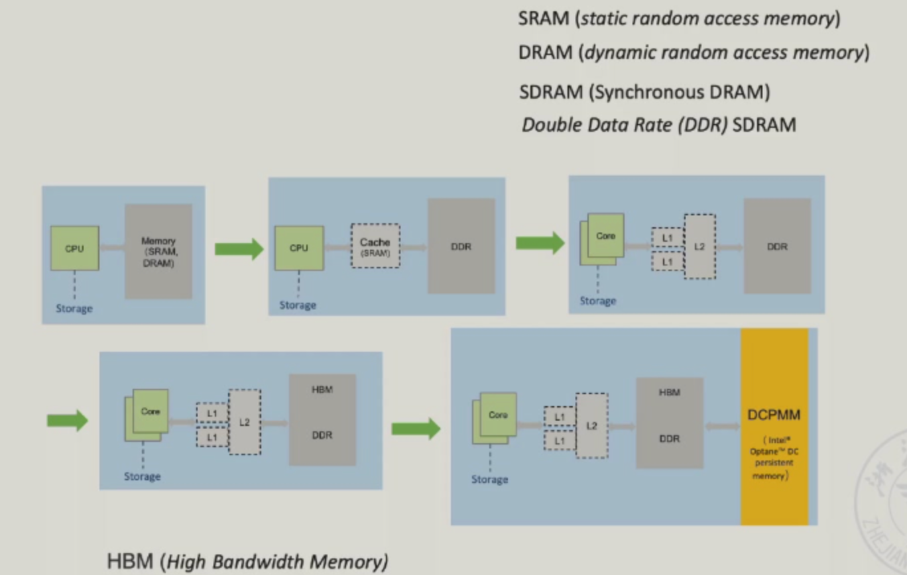
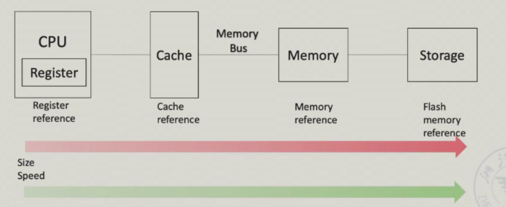
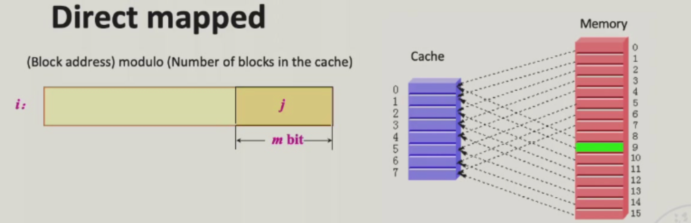
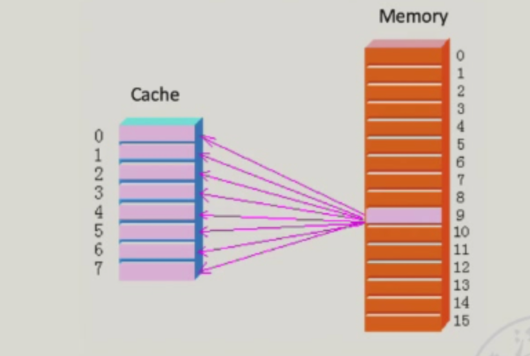
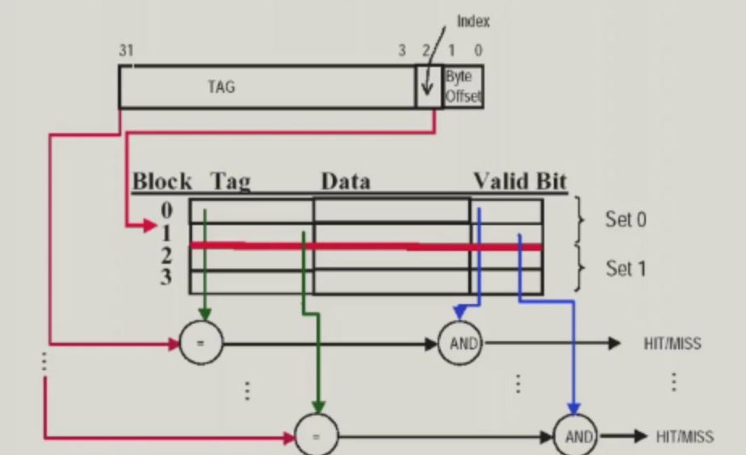

## Memory Hierarchy

### Cache 预备

- 定义：一个隐藏或者存储信息的安全场所，a safe place for hiding or storing things.

- 

- Cache的hit和miss的定义
- Block/Line Run：调度的单位是以块或者行来进行调度的（比如从memory复制过来）。
- 局部性：在任意一段时间内程序都只会访问地址空间中相对较小的一部分内容；
    - 时间局部性（temporal locality）：如果某个数据项被访问，那么在不久的将来它可能被再次访问；
    - 空间局部性（spatial locality）：如果某个数据项被访问，与它地址相邻的数据项可能很快也将被访问；
- Cache Miss：检索这个块第一个词的时间和检索这个块剩余所有词的时间；
- 命中时间（hit time）：访问本层存储的时间，包括判断访问命中或失效的时间（即查阅桌上所有书籍的时间）。
- 失效损失（miss penalty）：将相应的块从下层存储替换到上层存储中的时间，加上该数据块返回给处理器的时间（即从书架上获得另一本书并将他放在书桌上的时间）。

### 结构

- 结构发展

- Memory/Storage

- 最经典的结构

### 三种电脑对于memory的需求

- 个人：对响应时间有要求；
- 服务器：会有同时多个用户在读写，要求有更高的吞吐量和带宽。
- 嵌入式系统：受到体积的限制，memory容量比较小。关注于物理上的发热和功耗，也需要有比较好的响应性。应用和OS都被简化。

### 加速memory的方法

- 
- 

### Cache

- 需要懂的名词

- 

- 四个重要的问题：

    - a block怎么映射到高一级的内存？
    - 怎么去高一级的内存找相应的block？
    - 哪个现有的块要被replace？
    - 在覆写的时候发生了什么？

#### Q1: Block Placement

怎么找到对应的块的位置。

- Direct mapped：一般都是直接取模当作索引。
    - tag：由于每个cache块中能够保存不同存储地址的内容，所以还需要在cache中增加一组tag，这些信息用来确定请求字是否在cache中，标签中只需要保存地址的高位部分，这部分地址不会用来作为cache的索引。
    - valid bit：同时，还需要一种方法能够判断cache中的数据块中是否保存有效信息。所以要添加一个bit的有效位；
    - 
    - 
- Fully-associative：全相连，主存当中的任何一块都可以放到Cache的任何一个位置。
    - 好处：空间利用率很高；
    - 坏处：寻找的开销比较大，而且实现的算法比较难。
- Set-associative：组相连，几个一组就是几路组相连；
    - 
    - 
    - 

#### Q2:  Block Identification

- 

- 

    - 直接映射：
    - 全相连：
    - 组相连：
    - 

#### Q3: Block Replacement

当要访问的数据不在Cache当中，对于直接映射不需要考虑替换，因为只有一块对应的，没有选择问题。

- Random replacement；
- Least-Recently Used(LRU)：最近最少使用的块；
- First in， First Out(FIFO)；
