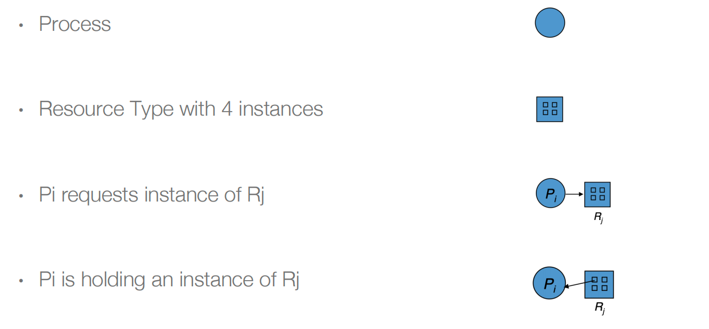

> 第十一课和第十二课在展示，第十三课开始周亚金老师开始讲课，但第十三课主要是在复习，所以没怎么记笔记，第十四课没上

## Deadlocks

### 1. 问题概述

**Deadlock**: a set of blocked processes each holding a resource and waiting to acquire a resource held by another process in the set.

死锁：一组被阻塞的进程，每个进程都持有一个资源，并等待获取由另一个进程持有的资源，两个进程相互等待，形成死锁。

如图：桥只能单向通行，有两个位置，分别记为A、B，左边在A，wait B；右边在B，wait A，这样就发生了死锁。（A和B这两个信号量初始值为1，表示资源最多只能同时有1个能访问）

**模型：每个进程如何使用资源**：请求资源、使用资源、释放资源。

#### 1.2 死锁发生需要的四个条件（重要）

- Mutual exclusion（互斥）：一次只能有一个进程使用一个资源（信号量为1）；
- Hold and wait（等待）：持有至少一个资源的进程正在等待获取其他进程持有的其他资源；
- No preemption（非抢占）：我所获得的资源不能被剥夺，只能自己主动释放；
- Circular wait（循环等待）：

#### 1.3 资源分配图（Resource-Allocation Graph）

- 两类节点和两类边

- 例子
  - R1、R3有1个instance，R2有2个instance，R4有3个instance；
  -  P1 holds one instance of R2 and is waiting for an instance of R1；
  -  P2 holds one instance of R1, one instance of R2, and is waiting for an instance of R3；
  -  P3 is holds one instance of R3；

- 如上的例子有环，会形成死锁

- 但是有环的不一定会形成死锁

- **规律**（重要）

### 2. 处理死锁的方法

#### 2.1 忽视问题

忽略问题并假装系统中从未发生死锁；

#### 2.2 预防（Prevention）

系统设计的时候，因为死锁有四个条件，所以我们可以break掉一个条件，就可以消除死锁。

- 防止ME
  - 第一种方法是不去申请共享资源；
  - 第二种方法是只能hold不共享的资源；
- Hold and wait的核心是，自己持有资源，还要去申请别的资源。所以防止Hold and wait
  - 我们可以**一次性申请**下来所有的需要的资源，要么都拿到、要么都拿不到，但是这样的话系统的并发性就会降低，就会失去多线程的优点；
  - 或者，只有**没有资源**的时候，才能去申请资源；
- 防止抢占
  - 如果进程请求资源不可用，释放当前持有的所有资源，被抢占的资源被添加到它等待的资源列表中，只有当进程能够获得所有等待的资源时，它才会重新启动。
- 防止循环等待
  - 给资源编号，每个进程都按照一定的顺序去申请资源（检测也可以遵照这个思路去检测）；
    - 看上去编程是按顺序去请求资源，但是事实上因为是动态锁，可能还是会发生循环等待，例如如下情况（高价值bug，比较难发现）但是事实上可以通过编程进行改进，通过判断来把lock进行排序

#### 2.3 避免（Avoidance）

主要在运行时起作用，每次资源分配的时候，系统就要检查一下是否会导致死锁。

##### Safe State

系统中存在一个序列对于每一个P~i~，他们的require都能被之前的进程所hold的资源或者空闲的资源所满足，这样就播阿正不会形成循环等待

##### 规律

##### 例子

只有一种类型的资源，这种资源有12个，current need其实是当前所持有的资源；

其实只要找出一个序列，就可以证明他们在safe state中；

对于T1，空闲的资源已经可以满足了；
T1结束后，会return资源，这样系统就会有（3+2）5个空闲资源，T0的请求就被满足了；
同理对于T2也成立，所以系统就在安全状态；

现在想给P2再分配一个资源，那么可不可以呢？我们就可以进行演算，看看是否还有safe state。

##### 算法

- Single instance of each resource type -> use **resource-allocation graph**
- Multiple instances of a resource type -> use the **banker’s algorithm**

###### 银行家算法

- 每个进程都必须事先声明每种资源类型的最大使用量；
- 当进程请求资源时，可能需要等待；
- 当一个进程获得所有资源时，它必须在有限的时间内释放这些资源；

**数据结构**

**具体算法：**核心是找到safe序列，可以判断是否是安全状态

**目的：**现在有一个资源分配的请求，现在假定满足这个请求，然后进行验证，如果还是（这里调用银行家算法）safe state，那就可以分配；

**例子**为了找到一个safe seq，就需要计算need看safe seq是否成立如果给P1分配102如果给P0分配020，找不到safe seq，所以不能分配

#### 2.4 （Deadlock detection and recovery）

其实跟2.3差不多，只是2.3检查的时机在即将资源分配的时候，而2.4可能就是周期性的检查系统是否在safe state，如果检测到系统是unsafe，那就要进行恢复（recovery）。

recovery：

- kil所有的死锁进程；
- 每次kil一个进程，知道不存在死锁现象；

- 不kill进程，只是强制回收资源；

### 3. 总结

