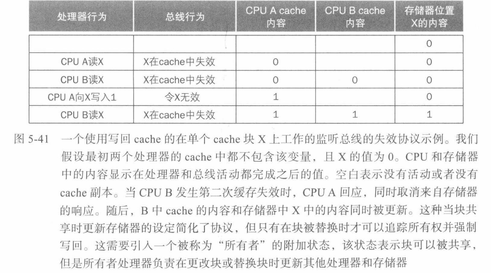
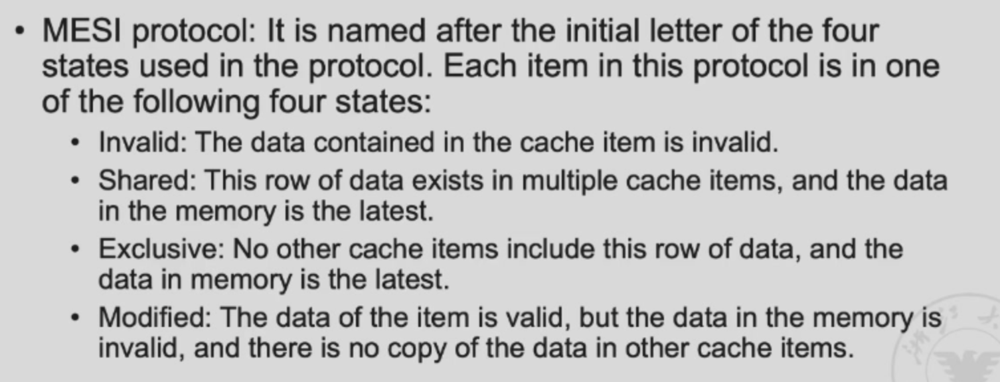
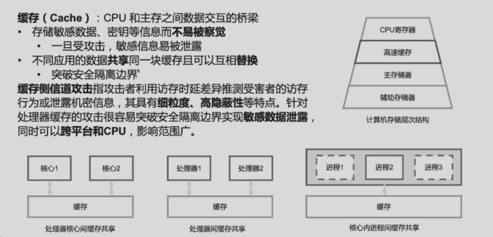
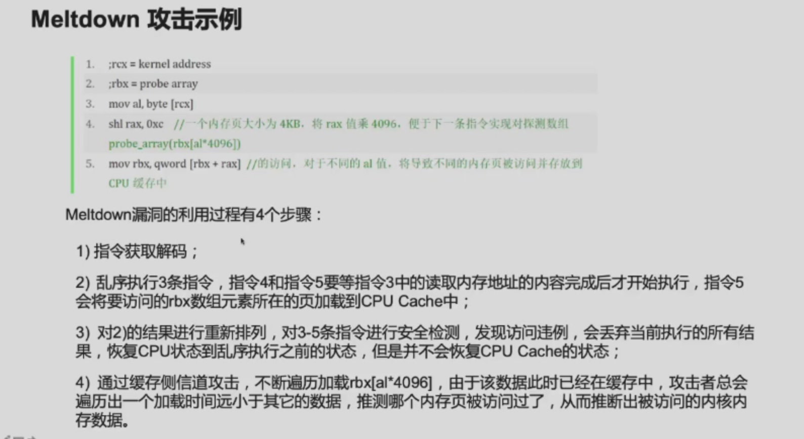
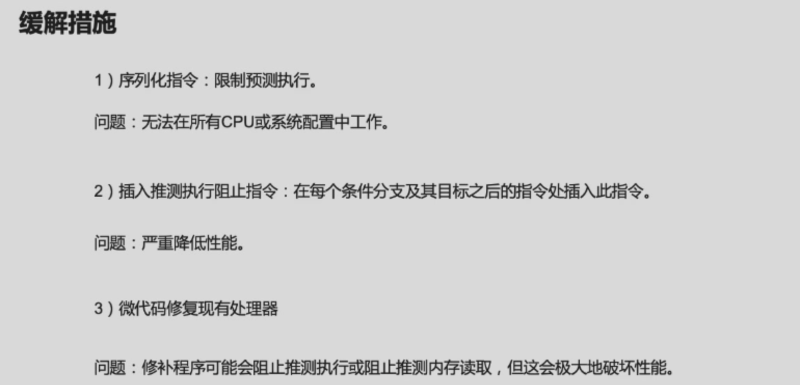
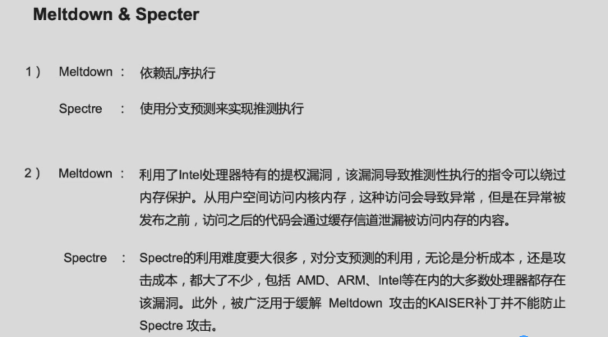
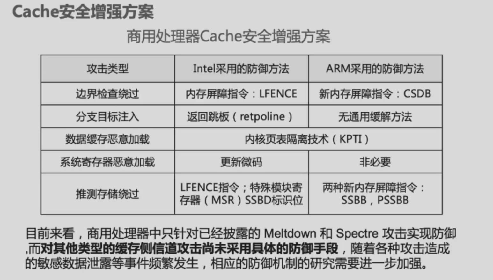
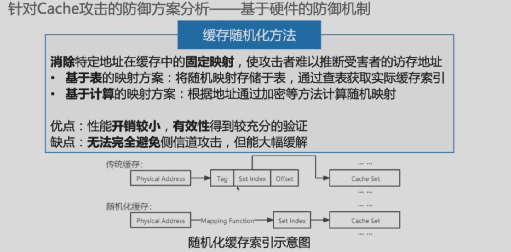

### 1. 用有限状态机来控制Cache

- **空闲：**该状态等待处理器发出的有效读或写信号，之后有限状态自动机跳转到标签比较状态。
- **标签比较：**
  - 正如名称所示，该状态检测读或写请求是命中还是失效。地址的索引部分选择用于比较的标签。如果地址中的索引部分引用的cache块中的数据是有效的，并且地址中的标签部分与标签相匹配，则命中。如果是加载指令就从选择的字中读取数据，如果是存储指令就将数据写入选择的字中。
  - 之后设置cache就绪信号。如果这是一个写操作，脏位还要设置为1。
  - 需要注意的是，写命中也需要设置有效位和标签字段，即使这看上去并不需要。这是因为标签使用单独的存储器，因此在改变脏位时也需要同时改变有效位和标签字段。
  - 如果发生命中并且当前块是有效的，有限状态自动机会返回空闲状态。失效时先更新cache标签，之后如果当前块的脏位为1，则跳转到写回状态，如果该位为0，则跳转到分配状态。

- 写返回：该状态使用由标签和cache索引组成的地址将128位的块写回存储器。之后继续停留在该状态等待存储器发出就绪信号。等待存储器写操作完成后，有限状态自动机跳转到分配状态。
- 分配：从存储器中取出一个新块。之后继续停留在该状态等待存储器发出就绪信号。等待存储器读操作完成后，有限状态自动机跳转到标签比较状态。尽管我们可以不重新使用标签比较状态而跳转到一个新的状态完成操作，但是分配状态之后的操作与标签比较状态的操作有大量的重叠，包括当访问为写操作时更新块中相应的字。

### 2. Cache Performance

- CPU Execution time：CPU时间 =（CPU执行的时钟周期数 + 等待存储访问的时钟周期数）× 时钟周期；
-  CPI Execution includes ALU and Memory instructions.
- 

- 

- 

- （具体题目没有讲，只需要理解公式即可）

#### How to Improve

（这部分是展示的内容，老师没讲）

### 3. Summary

### 4. Cache Coherence

**一致性定义：**简单来说，如果对任何一个数据项的读取都能返回该数据项最近被写入的值，则称这样的存储系统是一致的。虽然在直观上这个含糊而简单的定义很易懂，但实际的情况会比这个定义更加复杂。这个简单的定义涵盖了存储器系统行为的两个不同方面，这两个方面对于编写正确的共享存储程序都非常重要。第一个方面称为一致性（cache coherence），定义了读取操作会返回什么值。第二个方面称为连续性（memory consistency），定义了写入的值什么时候会被读取操作返回。

- 首先看一致性。如果满足以下属性，则称一个存储系统是一致的：
  - 在处理器P对位置X的值写人后，P读X的值，如果在P对X的写和读操作之间没有其他处理器对X的写操作，那么本次读一定可以返回P写人的值。因此，在图5-40中，如果CPUA在第3步后读X的值，返回值应为1。
  - 如果一个处理器对位置X的读操作是跟随在另一个处理器写人X值之后，并且读操作和写操作之间有足够的时间间隔、在两次对X的访问之间没有其他写人X的操作，那么本次读操作应该返回上次写人的值。因此，在图5-40中，需要一个机制使得在第3步CPUA将值1写入存储器位置X后，将CPUBcache中的值0替换为1。
  - 对同一位置的写入操作是串行的。也就是说，两个处理器对同一位置的两次写人操作在其他处理器看来都具有相同的顺序。例如，如果CPUB在第3步后在存储器位置X上存入值2，那么处理器永远不可能在读X值得到2之后再次读X值得到1。

- 连续性，就是写操作串行化。

#### 实现一致性的基本方案

- 迁移：数据项可以移动到本地cache并以透明的方式被使用。迁移减少了访问远程分配的共享数据项的延迟，也减少了共享存储器的带宽需求。

- 复制：当同时读取共享数据时，cache会在本地cache中创建数据项的副本。复制减少了读取共享数据项的访问延迟和争用。

支持迁移和复制对于访问共享数据的性能至关重要，因此许多处理器都采用硬件协议来维护cache的一致性。维护多个处理器之间的一致性的协议被称为**cache一致性协议**。实现cache一致性协议的关键是追踪每一个共享数据块的状态。

##### 1）UMA: Snoopy coherence protocols（监听一致性协议）

UMA：Uniform Memory Access，所以有处理器对内存访问都是一致的，所有处理器只有一个Memory；

一种实现一致性的方法是确保处理器在写人一个数据项前可以独占访问该项。这种协议被称为写无效协议，因为它在写入时使得其他cache中的副本无效。独占访问可确保在写入时没有该项的其他可读写副本存在：所有该项的其他cache中的副本都将失效。

图5-41是一个使用写回cache的监听总线失效协议的示例。为说明这个协议如何确保一致性，考虑一个写操作后跟随着另一个处理器的读操作的情景：因为这个写操作需要独占性访问，所以发出读操作的处理器cache中保存的任意副本均会失效。因此，当发出读操作时，会造成一次cache失效，cache被迫去获取该数据的最新副本。对写操作而言，我们要求写人处理器有独占访问权限，以防止任何其他处理器能够同时写人。如果两个处理器确实同时试图写人相同的数据，那么只有其中一个处理器能够赢得写权限，同时也会导致其他处理器的副本失效。其他处理器想要完成写人必须获得该数据的最新副本，这个最新副本必须包含已经被更新的值。因此，该协议还强制实现了写操作串行化。

##### 2）NUMA: Directory protocol

NUMA: 每个处理器都有自己的memory；

##### Write Invalidation Protocol

（讲得很快，应该不太考）

#### False sharing

两个Cache想去修改另一个上一级的Cache，如果两个需要修改的数据在同一个Cache line/block，那就会产生资源竞争。

## CPU漏洞实战分析(Meltdown & Spectre)

### Cache安全增强

