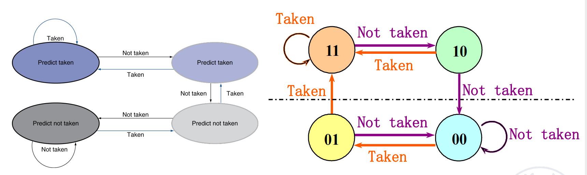
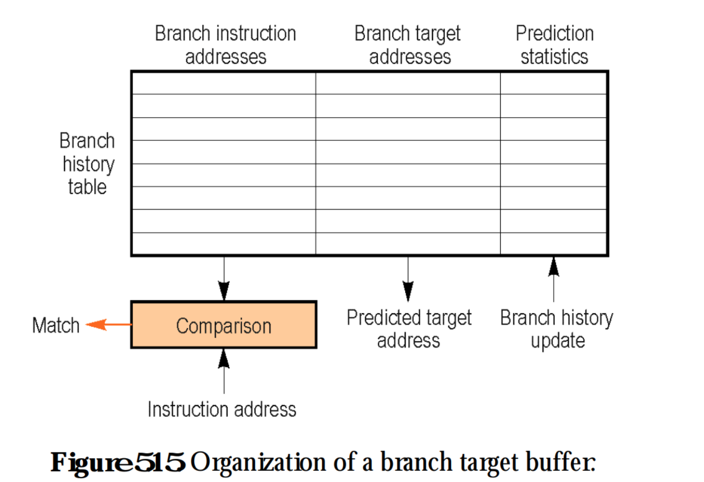

## Instruction-Level Parallelism (ILP)
### Hazards
- Structure Hazard
- Data Hazard
	- 下面这几个很重要，上课做题了的！下面这几种是对于乱序而言的；
- Control Hazard

### Dynamic Branch Prediction
>riscv一般不使用分支延迟槽，而采用分支预测；

- 静态：编译器来完成；
- 动态：也就是BHT的运用；
  - 优点1：可以更快地获取分支目标处的指令；
  - 优点2：它可以在分支目标上提供多个指令，这对于多处理器是必需的；
  - 优点3：可以不延迟地实现无条件分支，有时也可以不延迟地实现有条件分支；
- 对比：通常静态分支预测方法不需要太多硬件资源，不过它会提高编译器的复杂度，同理动态预测方法会增加硬件的复杂度，但是对编译器的要求不会太高。通常动态预测的结果会比较好，并且在编译期后决定分支，对面向对象的代码提供了更好的兼容性。

#### Branch History Table（BHT）

- BHT决定是否采用BTB的目标地址跳转(即：跳不跳?taken or not taken)；

- 运行时进行分支预测，比如对分支预测有一个table；
  - 一位：
  - 两位（可以有效防止循环的惩罚）：
  - 四位：比两位的命中率提升较小；
>- 当处于处于00状态时候，预测顺序分支
预测成功，仍处于00状态
预测失败，则调整为01状态
>- 当处于01状态时，继续预测顺序分支
预测成功，则调整为00状态
预测失败，则调整为10状态
> - 当处于10状态时，预测其他分支
预测成功，则调整为11状态
预测失败，则调整为01状态
> - 当处于11状态时，预测其他分支
预测成功，仍处于11状态
预测失败，则回退到10状态

#### Branch-Targrt Buffers（BTB）

- BTB主要记录分支指令跳转目标地址(即：往哪里跳? branch target)；

- 标记分支状态以及分支历史的一段内存被称为BTB，这段内存非常小，仅仅存储了分支指令地址，以及预测的目标地址，以及预测的位。

- 不能太小也不能太大，太大查找也要耗费时间，而且浪费硬件的空间，太小的话起不到buffer的作用了；

- 

- 看如下图所示的流程图就能清晰地掌握工作原理：

- 当一个分支指令第一次执行时，处理器为该指令分配一个Entry放入BTB中，当指令读取请求的时候，将该指令同步放到L1的Instruction Cache以及BTB中，如果在BTB中Match上该指令，Branch Target Address将会从BTB中被读取。当指令分支执行完毕后，它的Target Address也会在BTB中被更新，Prediction Statistics也同样会更新。

### Hazards 与 指令依赖的关系

