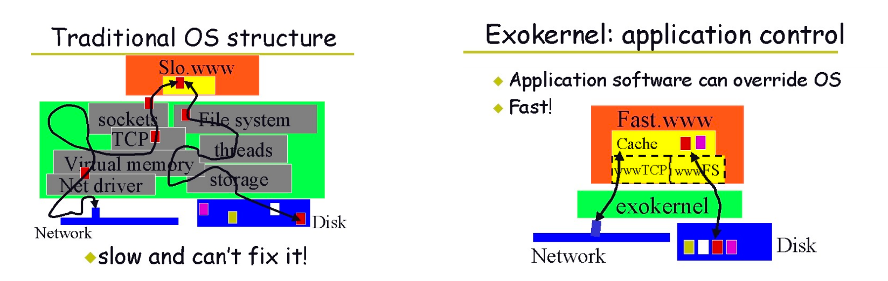
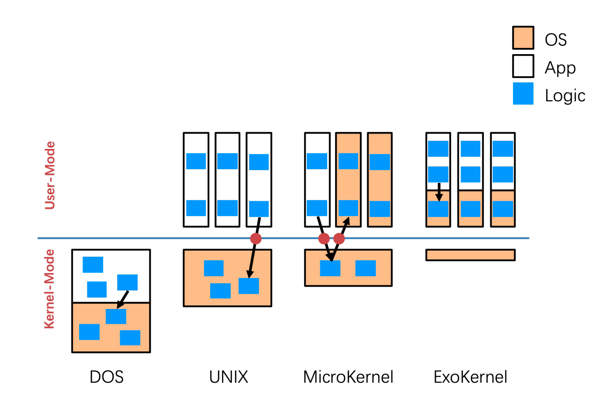
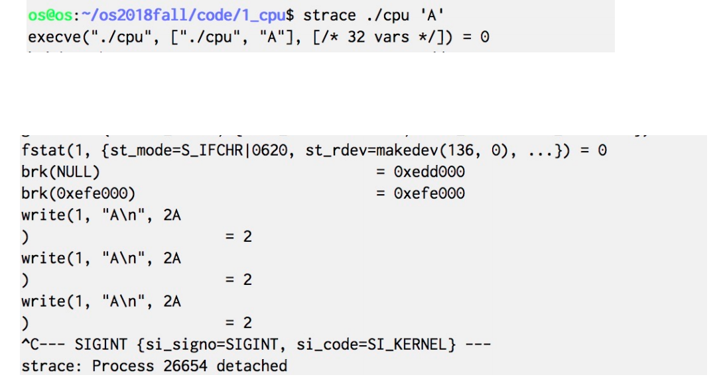
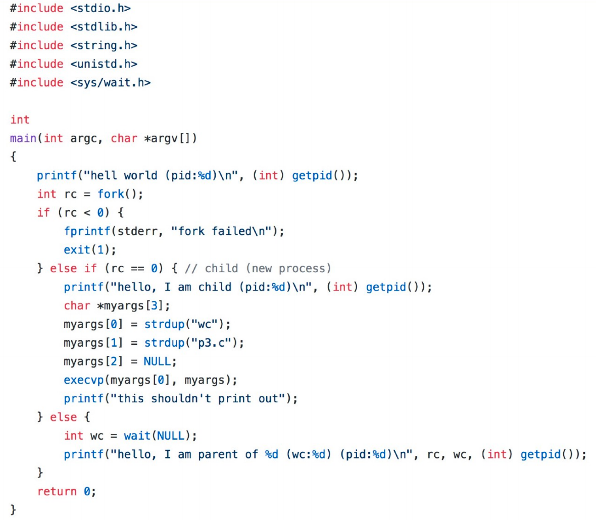
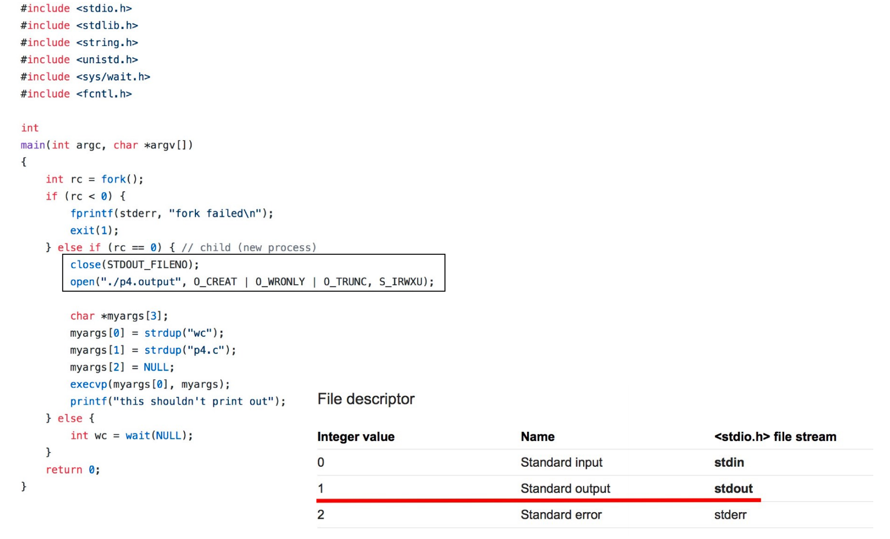

### Sorts of OS
- Simple Structure: MS-DOS
    - 对各个部分不做隔离；

- Monolithic Structure – Original UNIX
    - 优点：性能比较好，不需要频繁的切换态；
    - 缺点：
        - 安全性较弱，把很大一部分放在内核里，如果一点有问题，那就全部完蛋了，所以我们希望执行在内核态的代码越少越好，比如设备驱动程序；
        - 可扩展性较差，可以加载LKM（可加载内存模块）文件，但是这些文件与操作系统版本紧密绑定；

- Microkernel System Structure（微内核）
    - 优点：
        - 用于解决整体性结构的安全性问题；
        - 扩展性好；
        - 可调试性；
    - 缺点：
        - 开销很大，多态之间的切换和数据的拷贝；

- Exokernel: Motivation
    - 更少的抽象

#### Comparison

### Tracing

- strace – trace system calls invoked by a process（列出进程中所有的系统调用）

- gdb – source-level debugger
- perf – collection of Linux performance tools
- tcpdump – collects network packets

### 总结
- 系统调用（程序和操作系统的调用）
    - 系统调用参数传递
    - 系统调用的实现
- 各种操作系统结构

### System Call Examples
##### 1. fork()

##### 2. fork + wait
Parent process can use the wait system call to wait the child process finishes executing.

##### 3. fork + wait + exec

wc是一个program，这样，子进程就加载了另外一个program；

可以在exec前做一些精巧的控制；

##### 4. ptrace

没怎么听。。。

##### 5. set breakpoint

执行CPU异常，让父进程得到运行，以此来控制；
