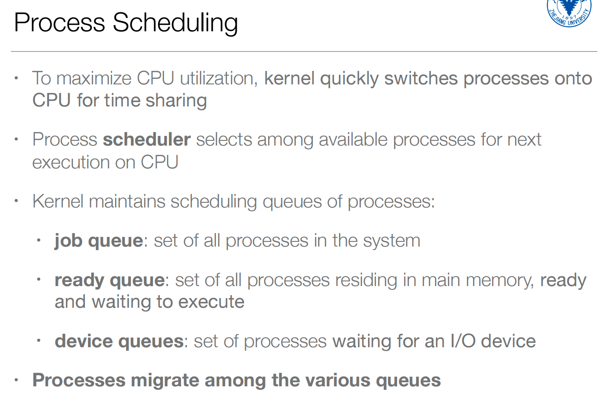
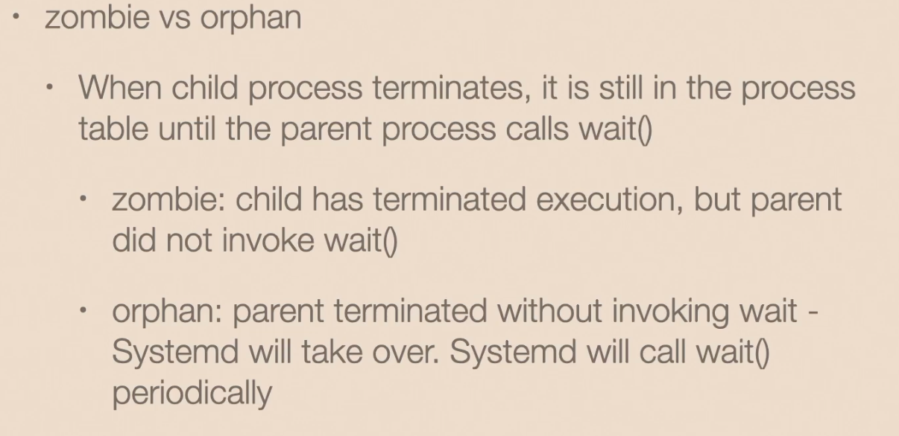
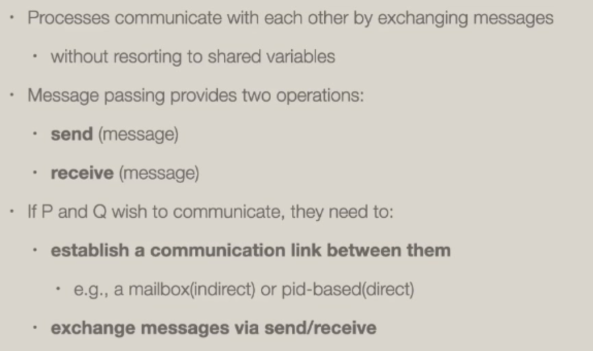
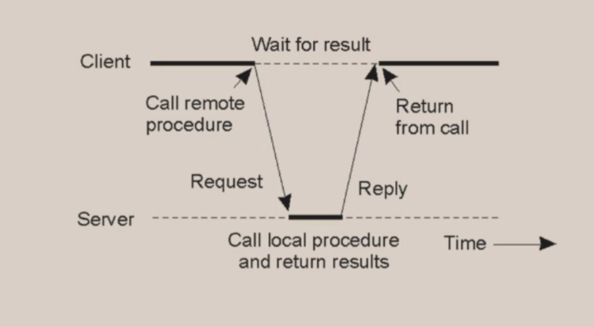

#### Concepts
- An operating system executes a variety of programs:
  - batch system – jobs
  - time-shared systems – user programs or tasks
- Process is a program in execution, its execution must progress in sequential fashion
  - a program is static and passive, process is dynamic and active
  - one program can be several processes (e.g., multiple instances of browser, or even on instance of the program)
  - process can be started via GUI or command line entry of its name
    - through system calls
- A process has  multiple parts:

#### process in memory
- 函数里的局部变量不能在data区域，只能在栈区域；
- data区域中存着全局变量、静态变量；
- text存储代码；
- 动态内存分配从heap分配；
- 通常来说stack高地址往低地址，heap低地址往高地址；

#### Process State
- new: the process is being created
- running: instructions are being executed
- waiting/blocking: the process is waiting for some event to occur
- ready: the process is waiting to be assigned to a processor
- terminated: the process has finished execution
- 

- 只要一个程序要被调度，就会进入ready排队，而不是直接被调用；
- 

#### Process Control Block (PCB)

- 

- 

#### Threads

- 线程是被调度的实体，（Multiple locations can execute at once）就是一个进程里可以有多个PC和寄存器组等；

#### Process Scheduling（调度）
- 由操作系统内核来完成进程调度；
- 和系统的响应性挂钩；
- CPU scheduler 就是一个软件的概念；
- 利用调度来增加CPU利用率；

- 

#### Swap In/Out
- swap in/out partially executed process to relieve memory pressure.

- 当系统的物理内存不够用了，可以把当前不被调度的进程的memory都写到存储里去，这就是swap in；

#### Scheduler

- 两类不同类型的进程：
  - 大部分时间都在I/O，今天的大部分程序都是I/O-bound程序；
  - 占用CPU计算资源的程序；

- 

#### Context Switch（上下文切换）

- 把一个进程的信息存放在操作系统维护的PCB中，然后把另一个进程的信息load到CPU中；
- 上下文的切换也是有开销的；

- 

- 

#### Process Creation

- 最开始是由操作系统创造出pid为1的进程，而之后所有的进程都是由这个进程fork出来的，所以生成了进程树；
- 一旦fork出来，父进程和子进程就不会共享内存；
- 

#### Process Termination

- 释放进程的一些占用的资源；
- wait()会等待子进程结束并返回，而括号内的参数可以接受子进程的返回值；

#### Zombie vs. Orphan

- 有可能父进程在处理其他事情（比如等待输入），等到父进程调用wait的时候，子进程已经没了，得不到状态了，所以子进程结束后，要等待父进程进行wait系统调用，这就形成了**僵尸进程**；
- 当子进程结束之后，操作系统发现父进程很快就结束了，父进程不一定要调用wait，直接就退出了，但子进程还在运行。而且linux系统是允许这种情况出现的。这种情况下，操作系统直接把父进程的PCB释放掉，再重新给这个子进程找一个parent，就是一号进程（Systemd），这就是**孤儿进程**；

#### Important Hierarchy

- 不同进程在操作系统中有一定的重要程度（特别是在moblie中）；
- 因为在系统内存不够用的时候，操作系统要做一个选择，要kill一些进程或者swap out到store上去；
- 前台、可见进程是重要的，后台进程不重要；

#### Android Zygote
- 安卓的所有进程都是由`Zygote`进程fork出来的，桌面操作系统是Systemd；
- Zygote进程是init进程的子进程，然后Zygote进程会把系统里面所有的系统库和用户可能会用到的一些框架，一次性load到进程空间里来；
- 比如下次启动一个进程时，直接从Zygote里fork出来，子进程是拥有父进程的所有资源的，所以子进程天生拥有所有库，所以不需要加载一些库了，所以可以节省进程启动时间；
- 但是这样也会产生安全问题，因为进程内存布局都是一样；
- 

#### Multipocess Architecture - Chrome Browser
- 进程也在浏览器中被使用作tab之间的隔离；
- 浏览器按照功能给进程分了类别，比如渲染进程，网络调用进程，这样的分类可以限制进程对系统调用的使用，比如一个种类的进程只能使用十个系统调用，从而减少攻击面；
- 

#### Interprocess Communication
- 进程之间的通信：
  - 共享memmory；
  - 消息传递，往一个消息队列里面丢数据或者往一个队列里面读取东西；

#### Message Passing

- 

- 同步消息传递，发送消息要等待消息被消费了再继续执行，消费的人要等消息来继续执行；
- 异步消息传递，互相不会block对方；

#### POSIX Shared Memory

#### Pipes

#### Client-server Communication

- 以上都是本地进程之间的交流，而要是想远程交流，则要涉及以下方式；（客户端和服务端之间的交流）

#### Sockets

- 通过socket接口，通过网络（TCP）来进行数据的交换；

#### Remote procedure calls（RPC）

- 比如P1进程想调用P2进程的一个函数；
- 序列化和反序列化字节流；
- 

- 具体过程：

- 安全原则：
  - 要让他所能修改的数据和暴露的内存范围受限；
  - 首先要从可信来源kernel来获取信息（uid和pid），而不是从caller来获取信息，因为caller传递的信息可以伪造；
  - 确定是谁来调用；
  - 知道是谁来调用之后，去做进一步的权限划分；
  - 参数的marshall和unmarshall，即序列化和反序列化，很容易出问题，在传递过程中，需要将解码方式（可以伪造）也放入字节流；
