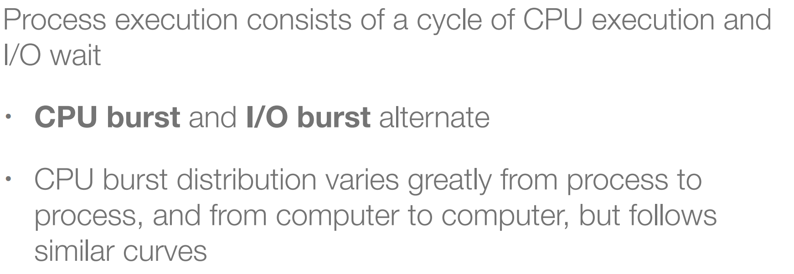
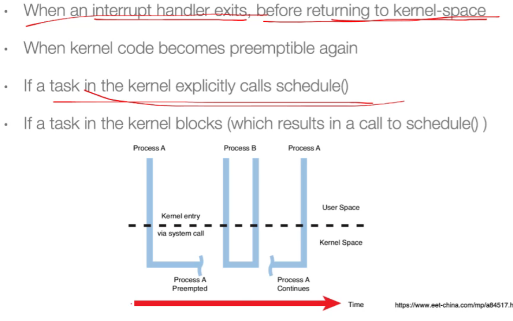
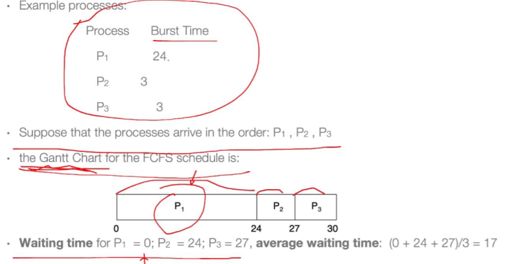
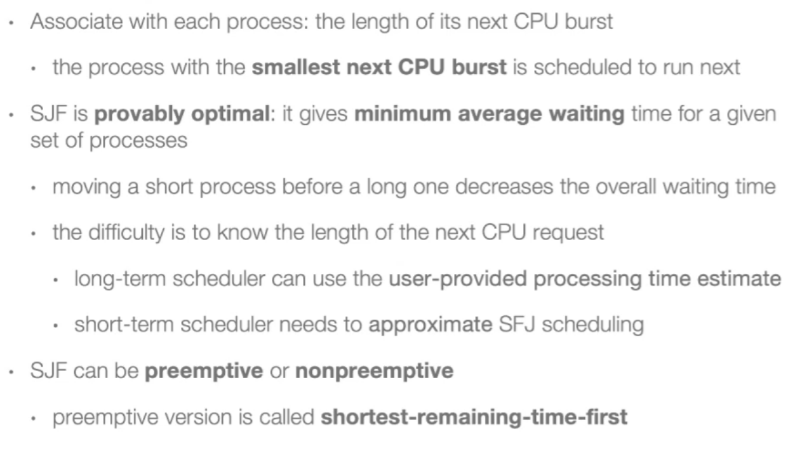
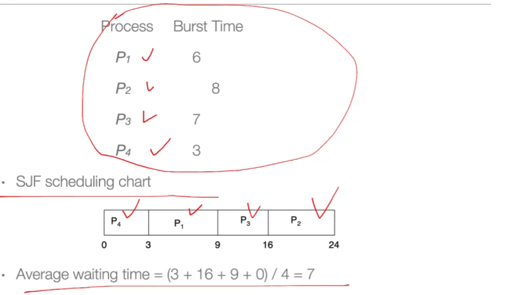
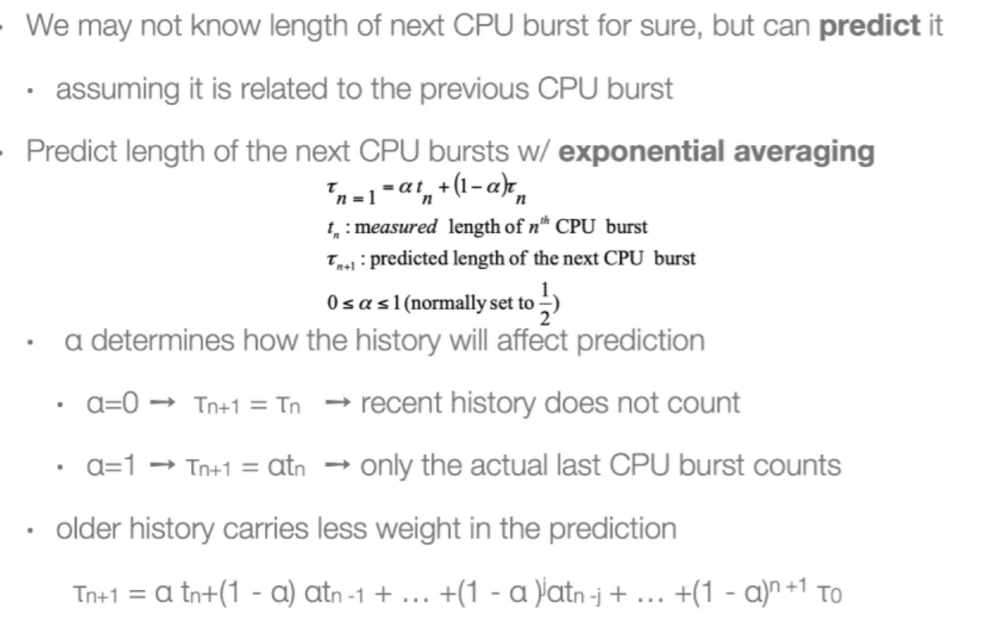
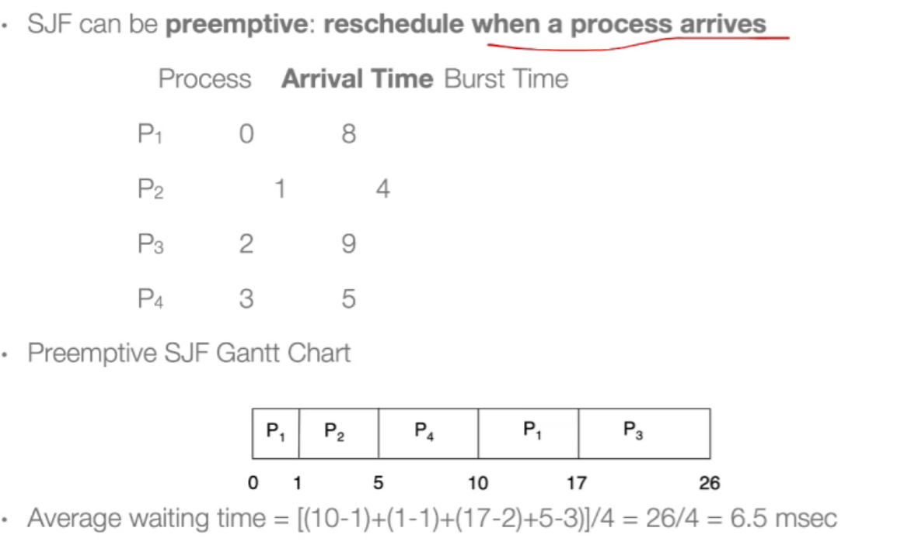
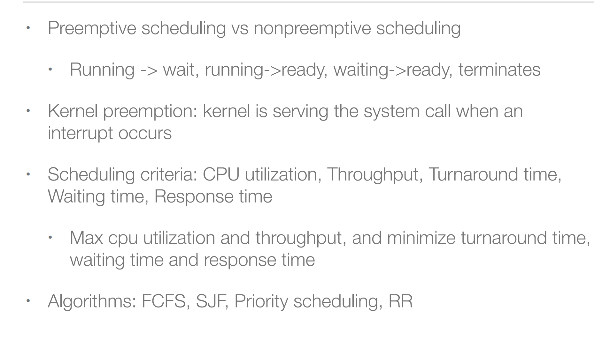
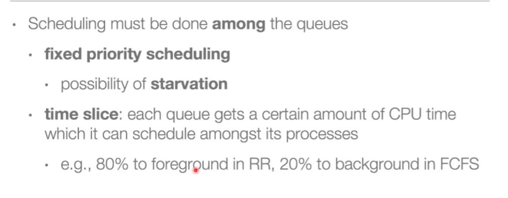
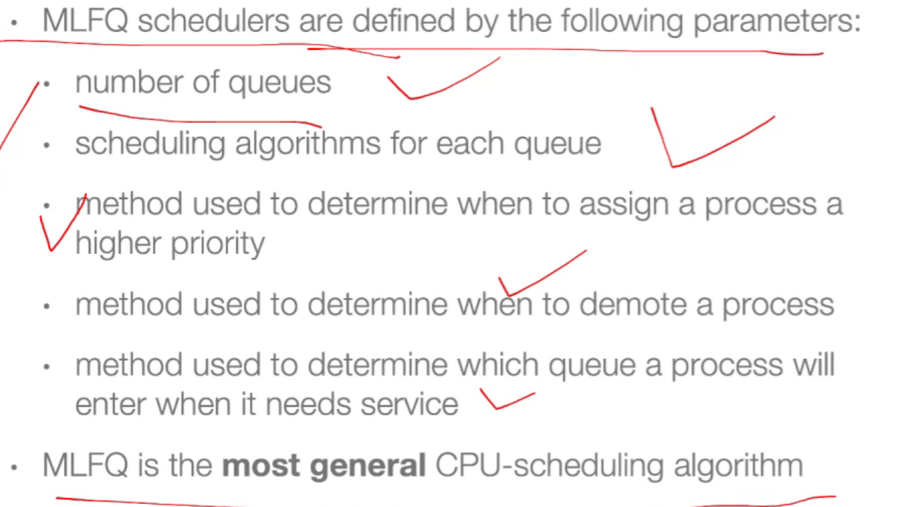

### 1. Some Terms
- 

- 硬件thread：一个CPU里面有多套register可以同时去取指令，但是执行单元只有一个；

### 2. Basic Concepts
- 大量时间在CPU，那么是CPU区间（CPU burst）；大量时间在I/O，那么是I/O区间（I/O burst）；
- CPU burst的长度随进程和计算机的不同而变化，通常具有大量短CPU burst和少量长CPU burst。I/O约束程序通常具有很多短CPU burst，CPU约束程序可能有少量长CPU burst。
- 

- 

- 

### 3. CPU Scheduler

- 软件的概念；
- 

- 调度发生的时候：

- nonpreemptive：非抢占的（一个进程不自己结束或者等待IO，CPU资源不会释放）

- preemptive：抢占式（操作系统内核需要中断来获取控制权）

- 

- 

### 4. Kernel Preemptive

- 一个进程在内核态的CPU系统调用还没执行完，就被别的更高优先级的剥夺了CPU资源；

- 

### 5. Preemption

- 抢占（Preemption）：非自愿性地停止进程；involuntarily suspending a running process is called 

  preemption. 

- 协作式（cooperative multitasking os）：a process runs until it voluntarily stops 

  or waits for IO. 

- 抢占式（preemptive multitasking os）：scheduler running in the kernel space to switch between processes. 

### 6. User Preemption

- 内核态不能抢占的情况下，用户态照样可以抢占；

- 

### 7. Kernel Preemption

- 进程A系统调用后，被打断，先运行另一个优先级更高的系统调用，然后继续运行进程A的系统调用；

- 

### 8. Why Kernel Preemption

- 可被调度的时间点多了，响应性就更好；
- 频繁地调度，对吞吐量（单位时间内完成进程数）有坏处；

### 9. Dispatch

- 调度时候，做CPU控制权的切换；

- 

- 

### 10. Scheduling Criteria

- 

- CPU利用率：越忙越好；
- 吞吐量：一个时间单位能完成多少进程的执行；
- Turnaround time：（一个进程在运行时CPU资源可能被剥夺）什么时候提交开始，到什么时候结束；
- Waiting time：被剥夺了CPU资源，在ready queue中等待的时间；
- Response time：什么时候提交开始，什么时候第一次response（第一次得到CPU资源）；

### 11. Scheduling Algorithm Optimization Criteria

- 

- 

### 12. Scheduling Algorithms

#### 12.1 First-come, first-served scheduling (FCFS)：

- 非抢占式调度；
- 
- 

#### 12.2 Shortest-job-first scheduling (SJF)

- 使系统的平均等待时间最小；
- 但是操作系统没办法预测时间的多少；
- 既可以是抢占式的，也可以是非抢占式的；

- 

- 非抢占 Example：
- 
- 预测：
- 抢占式 Example：

#### 12.3 Priority scheduling

- 可能会引发饥饿问题：增加“老化”机制；

- 抢占式和非抢占式都可以；

- 

- 

#### 12.4 Round Pobin（RR）

- 时间片轮转，轮询：

- 抢占式调度，每次时间片到就进行调度，但如果进程结束也会进行调度；
- 
- 并不一定增大时间片，turnaround time就一定会减少；
- 

#### 1-4 review

- 

#### 12.5 Multilevel Queue scheduling

- 
- 等待队列放进不同的队列；比如前台进程轮询（响应性要好），后台FCFS；
- 这样会有很多队列，所以又需要有queue的调度算法；

#### 12.6 Multilevel feedback queue scheduling

- 某个进程别分配到某个Queue里面就不会再出来了，（Multilevel Queue 一旦进入了，就不会变）；而 Multilevel Feedback Queue 会进行队列的迁移；
- 一个进程随着时间的增长，需求可能不一样；
- 

- 

### 13. Thread Scheduling（线程调度）

- 对于支持多线程的OS，OS调度的是内核线程，而不是进程。
- **竞争范围**（用户线程和内核线程所用调度方法的不同）
  - 进程竞争范围(Process-contention scope, PCS)：在实现多对一或多对多模型的系统中，线程库调度用户级线程到可用的LWP上。i.e. CPU竞争发生在“属于相同进程的线程”之间。
  - 系统竞争范围(System-contention scope, SCS)：OS将内核线程调度到物理CPU上，该竞争发生在OS的所有线程中。采用一对一模型的OS的线程调度只采用SCS。

- 

### 14. Pthread Scheduling

- POSIX Pthread API允许在线程生成中指定是PCS或SCS。竞争范围值PTHREAD_SCOPE_PROCESS表示“采用PCS调度”，PTHREAD_SCOPE_SYSTEM表示“采用SCS调度”。
  - 某些OS只允许特定的竞争范围值。E.g. Linux, Mac OS X只允许PTHREAD_SCOPE_SYSTEM。

- 

### 15. Multiple-Processor Scheduling

- 每个CPU都有很多的核，每个核有很多的硬件线程；

#### 15.1 asymmetric multiprocessing

- **非对称多处理(asymmetric multiprocessing)方法**：让单独的一个processor (master server) 处理所有调度决策、I/O处理和其他系统活动，其它processor只执行用户代码。（简单，只有一个processor访问系统数据结构，减轻数据共享的需要）

#### 15.2 symmetric multiprocessing(SMP)

- **对称多处理(symmetric multiprocessing, SMP)**方法：每个processor是self-scheduling的，每个processor检查就绪队列并选择一个进程来执行。（所用进程可能处于一个共同的就绪队列中，或每个processor都有私有的就绪队列。）
- 多个处理器（每个处理器的寄存器和缓存 是独有的）共享同一个memory，那也就共享了代码和数据，当多个处理器同时运行同一段代码去操作同一段数据，就会产生冲突，所以不同的CPU core之间要同步。

- 在绝大多数支持SMP的当代操作系统中，每个processor都有私有的就绪队列。几乎现代操作系统都支持SMP。
- 

#### 15.3 Multicore

- 

#### 15.4 CMT（硬件多线程）

- 一个CPU core里面可以有多套取指令译码访存的单元，但ALU单元还是只有一份；
- 因为访内存比较慢，执行速度远大于访存，所以会导致流水线停止；

- 

- 

- 操作系统决定哪个软件线程run在逻辑CPU上；已经决定哪个硬件thread run在物理core上；

  

#### 15.5 Load Balancing

- 多处理器负载均衡；

- 

- 
- 这些都由操作系统内核来完成；

#### 15.6 Processor Affinity（处理器亲和性）

- 一个线程在CPU core上运行很久后，他的cache命中率会提高，亲和性会增加；

- 

- 

### 16. NUMA and CPU Scheduling

- 每个CPU core都有自己的物理内存，而core也能访问其他的物理内存，但是会比较慢，所以执行一个任务要尽可能在接近那片物理内存的core上运行；

- 

### 17. Real-Time CPU Scheduling(实时系统)

- 专用操作系统，比如机器人；
- Can present obvious challenges; 
- **Soft real-time systems**: Critical real-time tasks have the highest priority, but no guarantee as to when tasks will be scheduled.（并不保证一定完成，比如linux）
  - 为什么linux不能硬实时？因为无法预期一些意料之外的事情，比如中断；
  
- **Hard real-time systems**: task must be serviced by its deadline.
  - watch dog一个硬件部件，如果超时，通过硬件连线的方式就重启；

### 18. 例子

- windows和linux都是抢占式调度，具体可看[这个](https://www.cnblogs.com/RDaneelOlivaw/p/9559910.html)。

