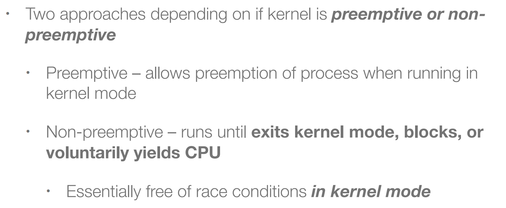
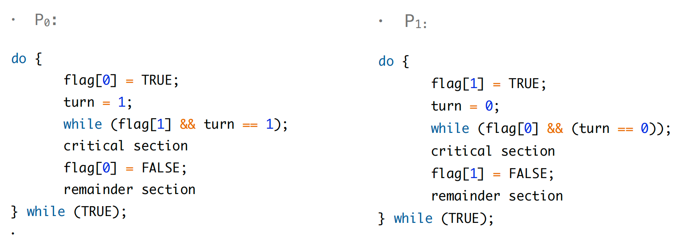

### 1. Background
系统里的进程可以并发执行，在任意时刻都可以被中断，导致进程的任务被中断。这样有可能一个进程对data的修改还没生效就执行了下一个进程，所以要进行data的同步和更新；

### 2. Race Condition（用户态和内核态都有）
由于两个或者多个进程竞争使用不能被同时访问的资源，使得这些进程有可能因为时间上推进的先后原因而出现问题，这叫做竞争条件（Race Condition）。

多个程序同时去操作同一个数据（并发地访问），执行的结果取决于执行的顺序（不是固定的）；

Several processes (or threads) access and manipulate the same data concurrently and the outcome of the execution depends on the particular order in which the access takes place, is called a race condition.

### 3. Critical Section
```c
/* General structure of a typical process Pi */
do {
    [entry section]
    [critical section]
    [exit section]
    [remainder section]
} while (true);
```
- Critical section – A segment of code that each process has, in which the process may be changing common variables, updating a table, writing a file, and so on.（同一时刻只有一个进程或线程在这里面）

- Entry section – The section of code implementing the (necessary) request for permission to enter its critical section.（等待进入critical区域）

- Exit section – The section of code that may follow the critical section.（刚刚离开critical的区域）

- Remainder section – The remaining code.（其他无关的区域）

### 4. Critical-Section Handling in OS
- Single-core system: preventing interrupts
- Multiple-processor: preventing interrupts are not feasible
- 

### Preemptive vs non-preemptive
- 用户态抢占
    - When returning to user-space from a system call.
    - When returning to user-space from an interrupt handler.

- 内核抢占

### 5. Solution to Critical-Section: Three Requirements
- **Mutual Exclusion（互斥访问）**
    - 同一时刻，只有一个执行实体可以在critical section中；
    - only one process can execute in the critical secti.
- **Progress**
    - 选择的过程是有结果的，选择要有进展，要选一个实体进入critical section；
    - if no process is executing in its critical section and some processes wish to enter their critical section, then only those processes that are not executing in their retainer sections can participate in deciding which will enter its critical section next, and this selection cannot be postponed indefinitely.
    - 当多个执行实体想要进入critical section时，由谁来决定谁进？由那几个实体共同决定。

- **Bounded waiting**
    - 不能无限制地等待；
    - There exists a bound, or limit, on the number of times that other processes are allowed to enter their critical sections after a process has made a request to enter its critical section and before that request is granted.
    - it prevents **starvation**.（解决饥饿问题）

### 6. Peterson’s Solution


atomic的意思是一个原子指令，不能被中断，即一个最小单位；

#### 6.1 example 




#### 6.2 评价

现在的体系架构不会用这种方法，因为编译器会优化代码。有可能机器执行代码和写的代码的顺序不相同。

现在的系统不提供sequential consistency。


剩下的部分没怎么听，但是好像很重要，主要在12.19录像中。
