## 计算机动画简介

### 1. 动画基本知识、动画形成的视觉原理

### 2. 传统动画应用于三维计算机动画的12条基本原则

蕴含的目的：在设计角色时，要遵循基本的物理规律，同时也要考虑时序、吸引力等问题。

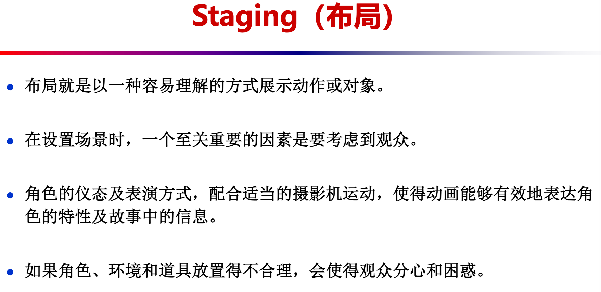

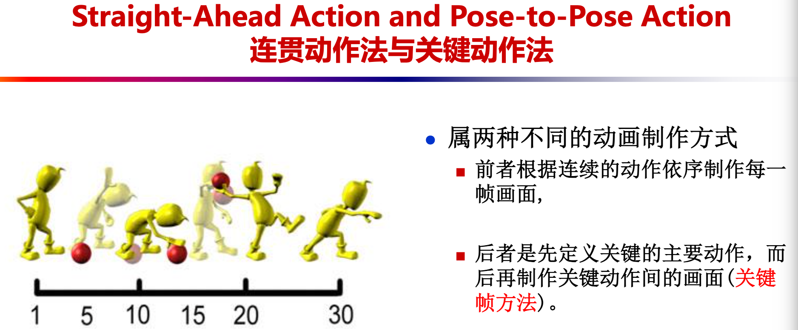

跟随动作与重叠动作代表了两个相互关联的技术，这两个技术将移动渲染得更加逼真，帮助传达人物正在跟随物理原则的印象，包括惯性原则。“跟随”意味着当动画人物停止运动的时候，身体上其他联系的部件还是会继续运动，并且这些部件会持续移动，超过人物停止的“拉回点”，只反复在中间集聚，并且展现不同程度的振动减幅。“重叠动作”是身体部件以不同速率移动的趋势（手臂会随头部在不同时间的移动而移动）。

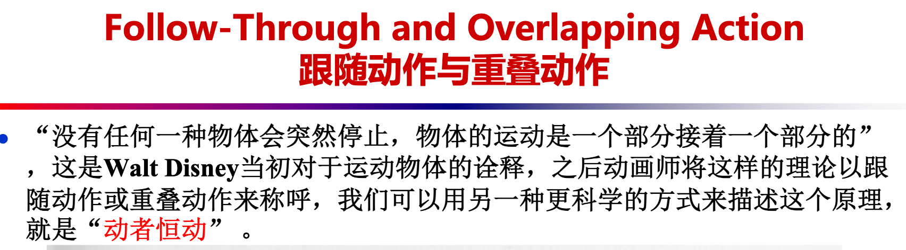

时机代表绘画的数量或者一个指定动作的帧数，在电影中被解释为动作的速度。在纯物理水平，正确的时机使得物体的出现更符合物理原则；例如，一个物体的重量决定它如何对动力做出反应，例如一个推的动作。时机在简历动画人物心情，情感，还有反应的时候是很重要的。它可以作为一个设备来传达动画人物性格的一些方面。

Solid Drawing（**立体造型**）

立体造型原则代表考虑在三维空间的形式，给予他们音量和重量。动画制作人需要是一个熟练的技术绘图员， 并且需要理解三维空间形态的基础，解剖，重量，平衡，光影等等。对于传统的动画制作人，这包括了艺术类目和来自生活中的草绘。

Appeale（**吸引力**）

卡通人物中的吸引力，与演员中所说的“魅力”是相呼应的。一个有吸引力的角色不一定是楚楚可怜的，一个恶棍或者怪物也可以很吸引，重要的是观者感觉到人物是真实的有趣的。为了让动画人物与观众可以更好地联系，这里有一些小技巧；对于可爱的人物，对称的或者特定的，像孩子一样简单的萌脸会很有效果。复杂的或者很难读懂的脸会减少吸引力，对于这种情况，更确切的定义是在动作构成或者人物设计中用到的“captivation（魅力）”。

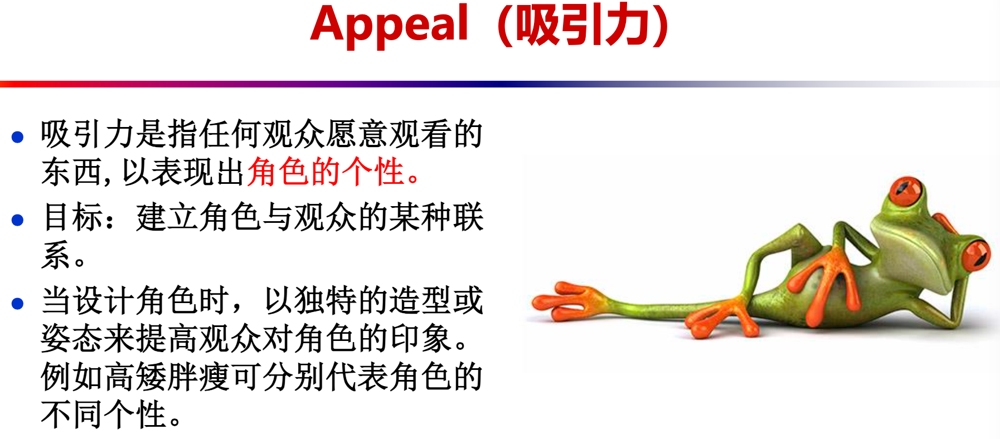

## 变换和旋转的表示

### 3. 万向节死锁的概念，旋转的四元数表示

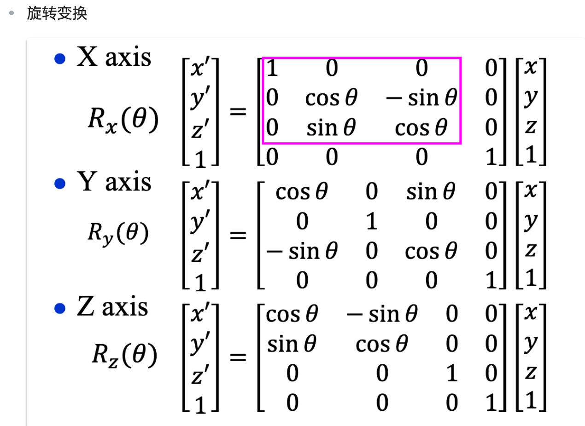

万向节死锁的概念：当两个旋转轴重合，自由度会变成二，就会发生万向节死锁。

## 二维多边形形状渐变

### 4

#### 4.1 2D Shape Blending（形状混合）涉及哪两个子问题

**子问题**：顶点的对应关系问题、顶点的插值问题。

#### 4.2 基于内在形状插值的多边形渐变方法的基本思想

**基本思想**：*线性插值会带来收缩(shrinkage)和纽结现象(Kink)。*对关键帧多边形的变长和顶点角进行插值。数学原理为乌龟几何与拉格朗日乘数法优化。（使用乌龟几何对多边形进行定义，通过插值得到中间多边形的边长和顶点角，由于通常不封闭，所以保持插值的顶点角不变，使用拉格朗日乘数法来适当调整插值得到的边长。）

#### 4.3 Edge Tweaking的思想

**Edge Tweaking（边长调整）**：保持插值的顶点角不变，适当调整插值的得到的边长。

## 二维图像morphing

### 5. 图像morphing的原理

图像自然渐变是指把一幅数字图像以一种自然流畅的、戏剧性的、超现实主义的方式变换到另一幅数字图像，避免复杂的三维造型过程。

- 首先用简单的几何元建立图像特征之间的对应关系，几何元可以为网格节点、线段、曲线、点等。
- 然后由这些特征对应关系计算出morphing所需的几何变换，几何变换定义了两幅图像上点之间的几何对应关系。
- 满射C0把第一幅图像的几何形状映射为第二幅图像的几何形状，满射C1则反过来。
- 需要两个映射的原因是图像点与点之间的对应关系不一定是一一对应。
- 图像变形对齐后再对颜色进行插值，得到中间帧图像。

### 6. 基于网格的图像morphing原理

在源图象与目标图象中放置曲面网格Ms与Md，Md指定了Ms在目标图象的对应点。曲面Ms和Md拓扑关系相同，用来定义把源图像的所有点映射到目标图象的空间变换，通过线性插值与扭曲变形得到中间帧图像。

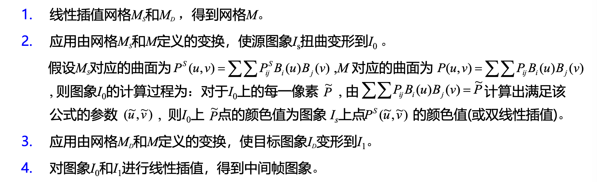

### 7. 基于线对的图像morphing原理

用线对对morphing进行直观的控制。先对单幅图像进行逆向warping映射，逐个扫描目标图象的像素，根据其位置采样源图像，然后用一或多对直线（直线段定义了一个从一幅图象到另一幅图象的映射）来指定两幅图像之间的变换。

最后进行两幅图象之间的morphing，在两幅图象中定义控制变形的对应直线对，通过插值（对直线的中点、朝向和长度进行插值）得到中间图象的直线。对交溶参数作动画，对图像进行交溶处理。

采用逆向映射：逐个扫描目标图像的像素，根据其位置采样源图像。
在源图像中定义一条有向线段，再在目标图像中定义一条有向线段，则映射把一条直线映射为另一条直线。

### 8. 二、三维形状渐变各有什么优缺点

- 二维：
  - 优点：是一种达到特殊视觉效果的有效方法；可以让人产生神奇的三维形状改变的错觉，可以避免复杂的三维造型过程。
  - 缺点：可能生成一些意料之外的图像（线对特征法）；缺乏三维几何信息，无法像其它三维物体一样进行几何变换、改变材质属性、改变光照、阴影等，摄象机的动画会受到很大的限制。

- 三维：
  - 优点：能生成更逼真和生动的特技效果，且得到的中间帧是物体的模型而不是图像，三维morphing得到的中间帧是物体的模型而不是图象，所以三维morphing的结果与视点和光照参数无关，并能够生成精确的光照和阴影效果，运用范围更广。
  - 缺点：物体之间的对应关系很难建立，而且该方法对物体的几何表示也相当苛刻。

## 三维morphing技术

### 9. 基于星型物体的多面体morphing方法

合并一对三维多面体物体模型的拓扑结构，使得它们具有相同的顶点/边/面网络结构，然后对相应的顶点进行插值。

通过合并拓扑结构将一个物体的形状变换为另外一个物体的形状通常可分为以下两步：

- 建立源物体表面上的点和目标物体上的点对应关系（对应问题）

- 插值对应的点（插值问题）

对于亏格为零的两个多面体，它们都同构于球。把它们都投影到单位球面上，然后将投影在单位球面上的两个拓扑结构合并在一起构成一个新的拓扑结构，再将新的拓扑结构映射回原来的两个多面体，即建立好了相应的点对关系。

插值相应的点点通常采用线性插值或者Hermite插值。

### 10. 基于体表示的三维morphing方法

思想：给定源物体S和目标物体T，首先根据指定的对应特征生成一个空间变换，该变换使给定的两个体扭曲变形（warp）成S’和T’，达到几何对齐的目的；然后对得到的两个扭曲变形体S’和T’进行混合（对两个体素的颜色和不透明度进行交溶处理，然后对混合后的体素进行绘制）。

混合方法：对两个体素的颜色和不透明度进行交溶处理，然后对混合后的体素进行绘制。

优点：与物体的几何和拓扑结构无关；提供了一种统一的处理方法，具有一般性（几何表示的物体都可以转化成体表示）。

缺点：走样现象严重，精度没有基于几何表示的好；几何模型转换为体素表示的计算时间较费。

## 粒子系统

### 11. 粒子系统的基本原理

**粒子系统的定义**：

- **粒子系统即模拟不规则自然景物生成和动画的系统**，使造型和动画巧妙地连成一体。景物被定义为由成千上万个不规则的，随机分布的粒子所组成，而每个粒子均有一定的生命周期，它们不断改变形状，不断运动。

**粒子系统基于的假设**：

1. 粒子一般不与其它粒子碰撞

2. 除非处于聚集状态，粒子不向其它粒子投影

3. 粒子只向其它环境投影

4. 粒子不反射光

5. 粒子通常有有限的生命周期

**粒子系统的基本思想**

- 将许多简单形状的微小粒子作为基本元素聚集起来形成一个不规则模糊物体。每个粒子均经历出生，成长，衰老和死亡的过程，与粒子有关的每一参数均将受到一个随机过程的控制。

**生成粒子系统的某一帧画面的基本步骤是**：

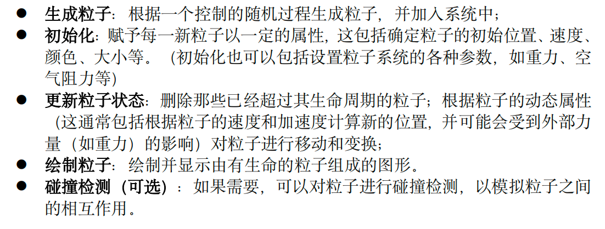

**粒子的生成**：

- 对于每一帧，根据一个控制的随机过程生成粒子：用户可以控制每帧的平均粒子数和其概率分布；粒子数可以是时间的函数。

**粒子的属性**：

- 位置，速度，大小，周期，质量，力加速器，生命周期，绘制属性……

### 请写出 Velocity Verlet 积分的计算方法。

## 群组动画

### 12. Boids模型的三条原则，每条原则的含义

Boid是一个模拟的类似于鸟一样的物体。粒子系统中的个体没有智能。而群组中个体是智能体(Agent)。

**优先级递减的群体模拟三大原则：**

- 碰撞避免原则(Collision Avoidance)：避免与相邻的群体成员相碰

- 速度匹配原则(Velocity Matching)：尽量保持与周围邻居群体成员的速度匹配

- 群体合群原则(Flock Centering)：群体成员尽量靠近。Boid局部感知的群体中心，实际上是相邻群体成员的中心，使得boid飞向与相邻boids的中心

### 13. Reynolds导航方法中的追逐和躲避模型、障碍避免模型、路径跟随、流场跟随行为模型、领导模型

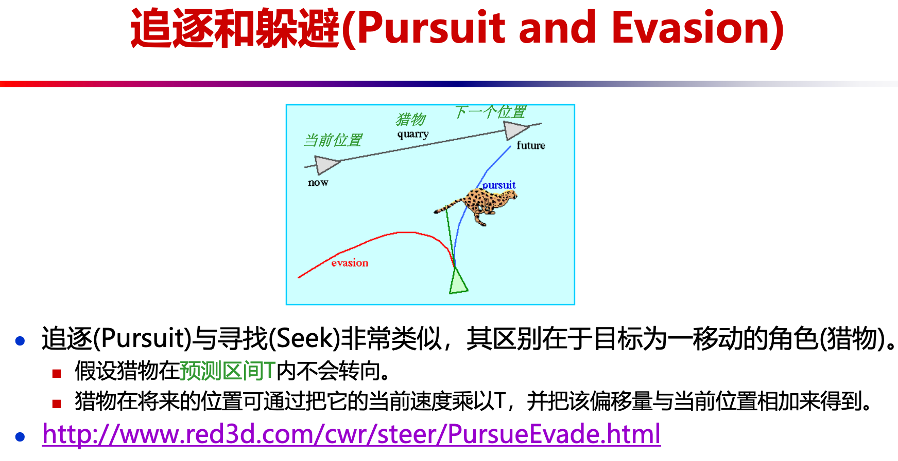

### 请描述 Steering Behaviors For Autonomous Character 中的障碍避免(ObstacleAvoidance)导航模型原理

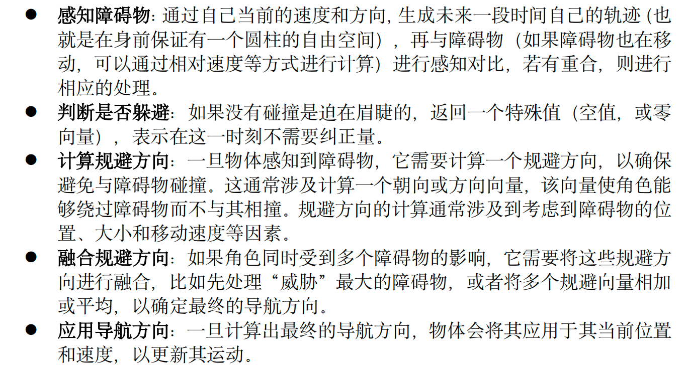

### 14. Helbing基于社会力模型的群体行为模拟方法的基本原理

社会力模型以牛顿动力学为基础，由各个力的表达式来体现行人不同的动机和影响。在社会力模型中，由于对影响个体的因素考虑得比较全面，对个体行为的建模比较合理，该模型可以逼真地模拟人群的疏散过程。
个体的实际行为受**主观意识，其它个体及障碍物**三方面因素的影响，均可等效为力在个体上的作用。

### 15. 相互速度障碍物(RVO)原理

假设个体以**匀速前进**。每个个体在保持与周围个体相对运动的同时，**在速度域中计算出可能导致碰撞的速度集合**，并对自身速度进行必要的调整。在调整过程中，碰撞避免的任务**同时分配给**相关的个体，使它们**相互协调完成**碰撞避免任务。

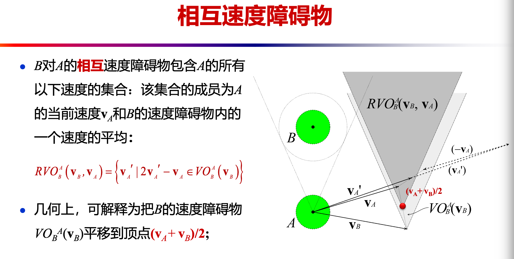

### 描述连续人群(Continuum Crowds)方法中，控制方程(Governing Equations)的定义及其含义。

## 关节动画

### 16. 运动捕获系统(MOCAP)流水线

规划 -> 标定 -> 捕获 -> 三维位置重建 -> 拟合到骨架 -> 后处理

### 17. 正向运动学、逆向运动学原理(IK)，逆向雅克比方法求解IK的原理。循环坐标下降法(CCD)原理

- 正向运动学(FK)：
  动画师通过直接指定关节处的关节运动参数来控制物体的运动；
  从关节空间映射到笛卡尔空间；
  计算整棵树（深度优先遍历）。
  - 优点：精确、确定性、实时。运算简单，计算速度较快。
  - 缺点：难以控制末端执行器的位置，不能直接控制末端执行器在工作空间中的位置和方向。
  
- 逆向运动学(IK)：
  动画师指定目标位置，系统求解满足要求的关节角；
  从笛卡尔空间映射到关节空间；
  给定初始姿态向量和目标姿态向量，**计算关节向量的值**，使得物体满足所需的姿势；
  一旦得到关节向量值后，可以对角色的初始姿态和最终姿态的关节向量值进行插值，从而得到角色动画。
  - 优点：直观的末端执行器位置控制，允许机器人在空间中执行特定的任务，适用于处理复杂的环境。
  - 缺点：逆向运动学问题通常较复杂，需要数值方法或迭代算法来解决。可能存在多个解，或者无解情况，需要进行解决方案选择。另外还可能需要约束。
  
- 逆向雅克比方法求解IK原理：通过把雅克比矩阵求逆，把该问题在当前位置局部线性化；把笛卡尔空间的速度映射到关节空间的速度；给定初始姿势和所需要的姿势，迭代变化关节角，使得末端影响器朝目标位置和方向前进。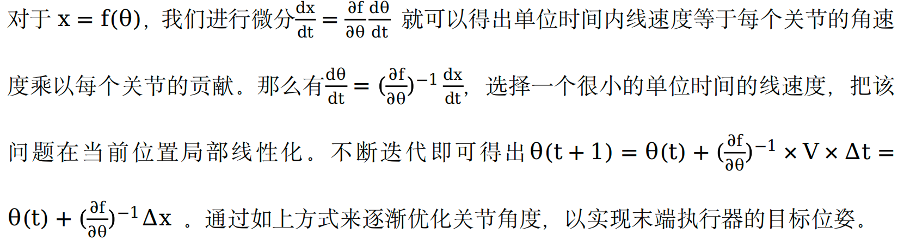

- 循环坐标下降法(CCD)原理：对所有受IK影响的骨骼，按从最远侧子骨骼到父骨骼的顺序执行迭代操作：旋转当前骨骼，使当前骨骼位置到目标骨骼的连线指向IK目标位置。

  由于所有骨骼是从一个特定状态出发开始IK计算，所得到的结果也会比较稳定。通常5～10次迭代之后就能得到很好的结果。

### 求解逆向运动学(IK)有哪些方法？

1. 逆向雅克比方法 (Inverse-Jacobian Method): 

- 使用数值迭代，不断微调关节角度，以使末端执行器达到目标位置和方向。

- 适用于各种机器人结构，但可能需要较多计算资源。

2. 循环坐标下降法 (CCD): 

- 逐一处理每个关节，每次微调一个关节的角度，以逼近目标位置和方向。

- 通常用于串联机器人，但结果可能受处理顺序影响。

3. 基于优化的方法 (Optimization-based Method): 

- 视问题为数学优化，通过最小化误差函数找到最佳关节角度。

- 适用于各种机器人结构和复杂任务，但可能需要更多计算资源。

4. 基于样例的方法 (Example-based Method): 

- 利用机器学习和训练数据，建立从末端执行器位置到关节角度的映射。

- 适应多变任务，但需要大量训练数据和计算资源。

### 18. 基于运动捕获的关节动画制作的优缺点

**优点：**只要能被捕获，可以记录人体运动的所有细节，运动真实
**缺点：**不容易进行编辑和控制，较昂贵

### 19

#### 19.1 骨架与角色模型的绑定原理

角色的表面（外皮）必须随着骨架的运动而运动（变形）；
**在骨架绑定中，皮肤的运动定义为对应控制骨架的函数**；
很多骨架绑定系统采用一个称为中性姿势或静止姿势的几何信息；

自动绑定：首先在未知的三维模型中嵌入骨架，然后计算骨骼对表面网格上每个顶点的影响权值，并将表面皮肤依附在骨骼上。

#### 19.2 顶点混合(Vertex Blending)的原理

采用一个物体模拟手臂，前臂和后臂仍单独设置动画，但关节处用一柔性的“skin”来连接。

柔性部分的一部分顶点由前臂的矩阵来变换，另一部分由后臂的矩阵来变换。即：一个三角形的顶点可以由不同的矩阵来变换，而不是一个矩阵。

进一步推广：为一个顶点可以由几个不同的矩阵进行加权变换

实施方法：通过在物体上放置关节骨架，每个骨架按用户给定的权因子影响顶点来实现。

#### 19.3 顶点混合的数学表示

### 20

#### 20.1 基于Blend Shapes表情动画的原理

对人脸表情进行三维扫描，构建Blend Shapes模型（把每个扫描模型映射到手工建立的主网格上，找到主网格每个顶点和扫描表情某个点的对应关系，处理模型的缺陷和不一致的覆盖，对所有顶点建立稠密对应关系），根据插值这些Blend Shapes来得到任意的表情。

#### 20.2 Face IK原理

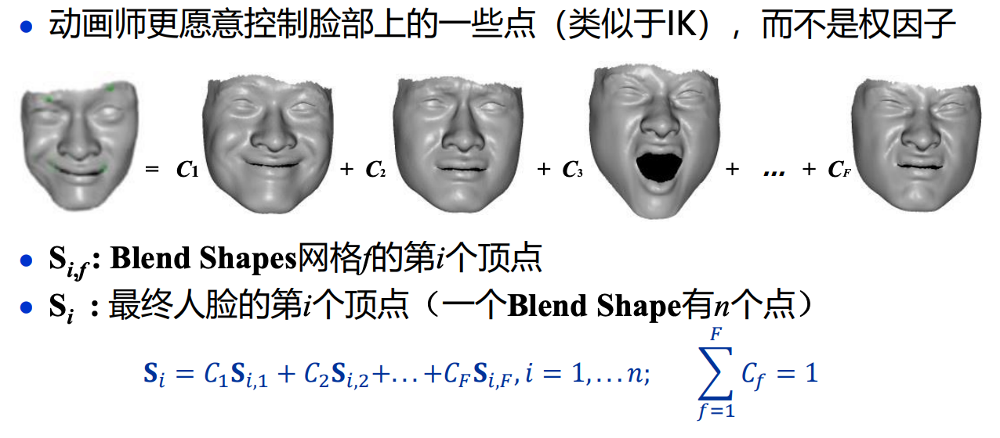

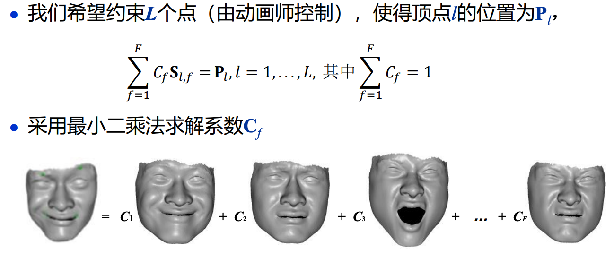

## 变形动画

### 21

#### 21.1 Deformation与Morphing的区别

变形Deformation是指将几何对象的形状作某种扭曲，形变，使它形成动画师所需要的形状。在这种变化中，**几何对象的拓扑关系保持不变**。

与Morphing不同，空间变形更具有某种随意性，所以空间变形也长称为自由变形。

#### 21.2 与物体表示无关的变形的原理

与物体表示有关的变形。是指针对物体的某种具体表示形式，如多边形网格、细分曲面、参数曲面等的变形方式。

与物体表示无关的变形。既可作用于多边形表示的物体，又可作用于参数曲面表示的物体。

用少量的点去有效控制更多的点。在传统CSG造型方法的基础上，进行非线性整体变形（变换是物体顶点位置的函数）和局部変形（改变物体的切向量空间，积分得到物体变形后的整体位置）。

在几何造型中，切向量和法向量是两个非常重要的向量，因为切向量决定了物体的局部几何信息，法向量决定了物体的方向和光照信息。

### 22. 扩展的FFD方法EFFD的原理

FFD：不直接操作物体，而是将物体嵌入一空间，当所嵌的空间变形时，物体也随之变形。只适合于平行六面体的lattice形状。

这类方法的本质：**物体参数化！**

FFD只适合平行六面体的lattice形状，扩展的FFD方法允许非平行六面体的lattice形状，从而能实现更任意的变形。EFFD型lattice允许FFD型lattice作为它结构的一部分，许多个FFD型lattice可合并构成EFFD的lattice。通过把多个基本EFFD块融合，得到更复杂的复合EFFD块。使用迭代求解采用EFFD块对物体进行变形。

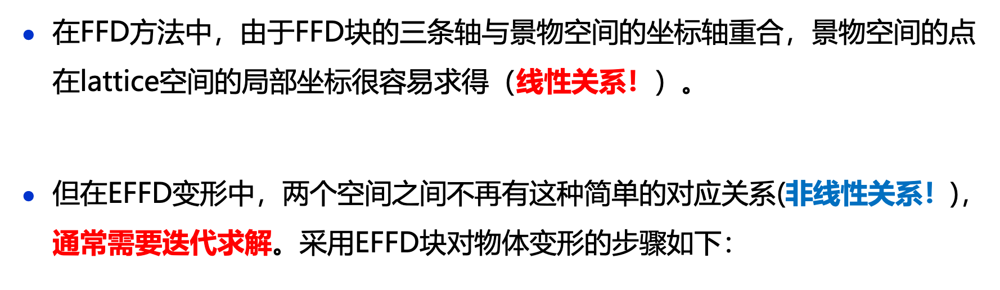

### 23. 基于Cage的变形原理

### 24. Laplacian微分坐标及其变形原理

原理：形变前的点的拉普拉斯坐标与形变后的点的拉普拉斯坐标尽可能相等。

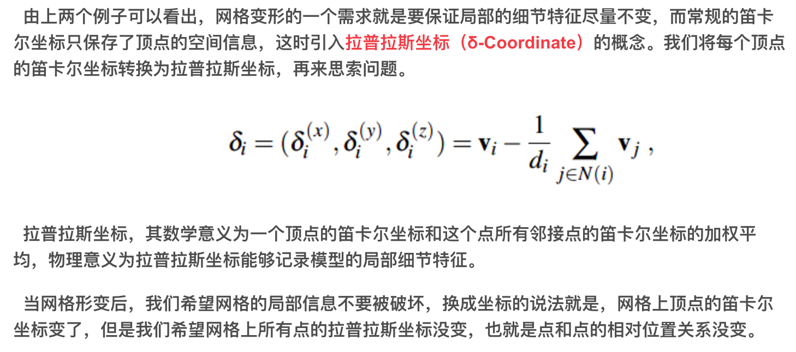

<https://blog.csdn.net/z136411501/article/details/107622967>

## 布料动画

### 25. 布料动画和仿真中的核心问题有哪4个

- 建立布料的物理(力学)模型（表达能力）
  - 需要考虑布料的拉伸、剪切、弯曲等物理力;
  - 布料不是各项同性的连续体；

- 布料物理参数的确定（缝线、纽扣、装饰物等都会影响布料的物理属性）

- 物理模型的求解（偏微分方程数值解）
  - 速度
  - 稳定性

- 碰撞检测和响应
  - 衣服与人体的碰撞、衣服与衣服的碰撞(自碰撞)
  - 多层衣服
  - 胳肢窝等特殊位置的处理
  - 纽扣、装饰物与衣服的碰撞

### 26. 布料的物理机械性能主要有哪 4 种？布料的弹簧-质点模型主要有哪 3 种弹簧，并图示。

**物理机械性能**：拉伸力(In-plane stretch)、压缩力(In-plane compression)、剪切力(In-plane shear(trellising))、弯曲力(Out-of-plane bending)

**弹簧-质点模型的弹簧**：

- 结构弹簧(Stretch spring)：结构弹簧连接上下左右的相邻的质点，用于结构力(拉力或者压力)的计算；

- 剪切弹簧(Shear spring)：剪切弹簧连接左上左下右上右下对角相邻的质点，用于剪力的计算；

- 弯曲弹簧(Bend spring)：弯曲弹簧连接上下左右隔一个质点的质点，用于弯矩的计算。

### 27. Provot的衣服模型的原理

Breen粒子系统模型：把布料模型表示成为一套相互作用的粒子(质点)系统。其目标是求解特定布料的平衡状态，采用能量最小化方法求解。

Provot提出了一种可以看作是从Breen的粒子系统（把布料模型表示成为一套相互作用的粒子系统）简化而来的弹簧-质点模型，并在此基础上发展了一套非常简单有效的算法。Provot采用了简单高效的显式Euler法求解微分方程组，效率与显示效果均不错。

该模型是一个由$$m\times n$$个虚拟质点组成的网格，质点之间用无质量的、自然长度不为零的弹簧连接。连接关系有如上三种弹簧，这三种弹簧分别用于与结构力（拉力或压力）、剪力和弯矩相关的计算。

为了保证算法的**稳定**，必须采用**很小的时间步长**或者减小方程组的刚度，也就是弹簧的刚度；然而取较小的刚度会形成**超弹性问题**，即布料产生了现实中不可能发生的伸长，使得算法的真实感明显下降。

### 28. 布料动画中大步长隐式方法的原理

布料模拟的积分计算部分的主要开销在由于稳定性限制计算步长只能取很小值，因而被迫在两帧画面之间计算多次；在布料模拟的积分计算部分设法取较大的时间步长可以有效的提高算法效率。使用隐式方法来积分，在不降低刚度的条件下可以取得较大的时间步长。

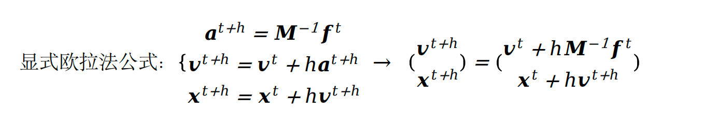

理论上隐式方法可以在取任意大的步长的情况下都保持稳定，但是实际计算中f一般由其一阶泰勒展开近似得到，因此稳定性仍然有限制，但是与前面讲到的显式计算方法相比有了非常大的提高。

## 隐函数曲面造型和动画技术

### 29. 隐式曲面表示的优缺点

优点：很容易进行点的内外测试(in/out test)（用于碰撞检测等）；很容易计算曲面的交/并/差（用于复杂物体的建模）；由于其Blending性质，很容易处理拓扑变化（用于动画）。

缺点：曲面通过间接指定；很难描述尖锐特征；很难对曲面上的点进行枚举；绘制慢。

### 30. 隐式曲面中核函数的选择。Wyvill的六次多项式势函数的图形形状。

核函数选择低通滤波函数。（例如高斯函数）

### !!!基于内在形状插值的多边形渐变方法的数学原理

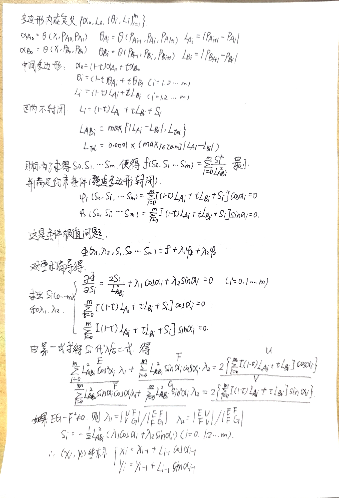

