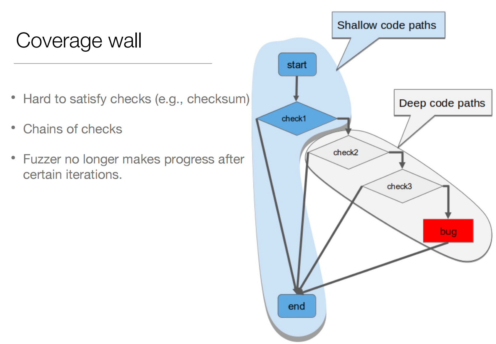
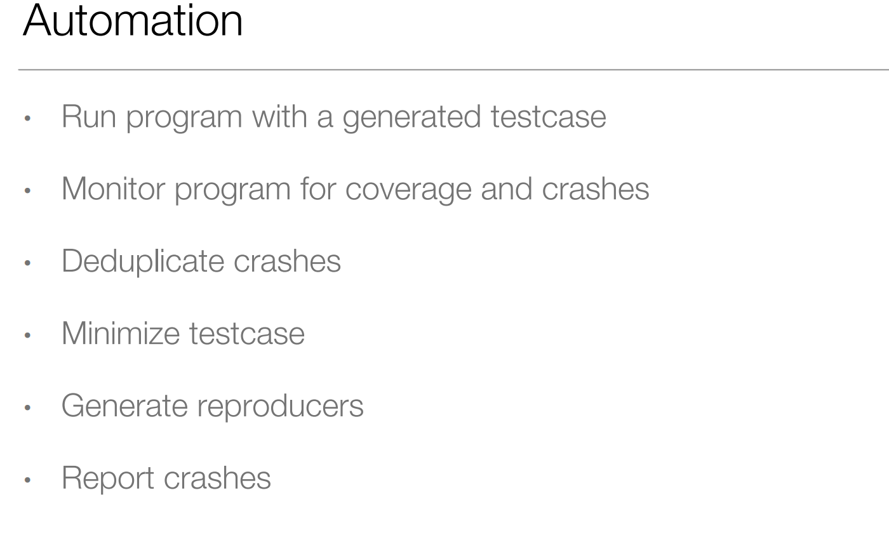
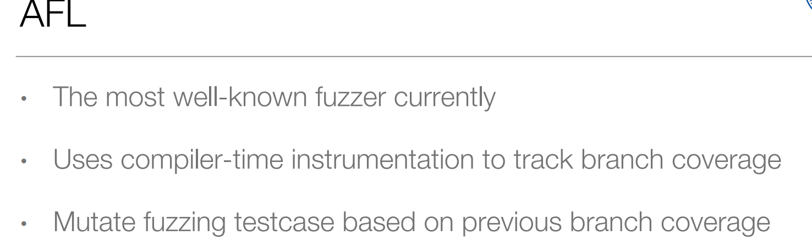
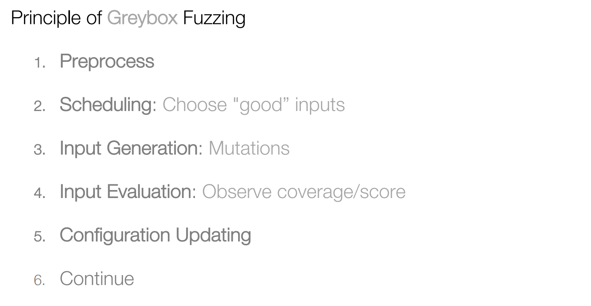

### Testing

测试分成人工测试（单元测试、集成测试、系统测试），模糊测试，符号化具体测试（通过静态分析的方式）。

### Fuzzing

模糊测试是随机生成输入来进行测试。我们给程序随机的输入，直到程序crash。

找到bug不一定导致crash(一般memory的bug会导致crash)，所以我们需要定义怎样算找到bug。

#### 如何生成输入

-  just generate random binary data. `cat /dev/urandom | xml_parser`，但是事实上这种方式效果不好，因为随机生成的输入不一定能通过header check，有很多都是无效输入。
- Structured inputs (a.k.a. structure-aware fuzzing). 生成一些有结构信息的输入，对于xml文件先把语法提取出来，我们通过语法来生成合法的xml文件。
- Generating better inputs for programs. 我们要生成的输入要尽可能地覆盖程序的所有basic block。更进一步，我们希望能够覆盖所有的路径（所有分支的排列组合），这比覆盖所有的的branch代价更高。
  - Coverage wall：有些分支非常难以进入，好像一堵墙隔着一样，导致覆盖率无法上升。这时我们可以利用符号求解去求解如何进入那些难以进入的分支。

- How to measure code coverage

#### 如何找到bug

有些bug并不会立即导致系统crash，而还有些bug不会导致系统crash。

#### 如何自动化过程

### Summary

