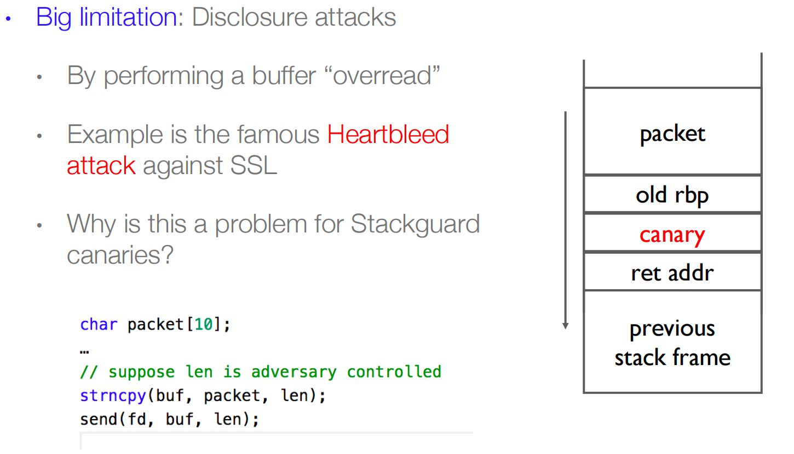
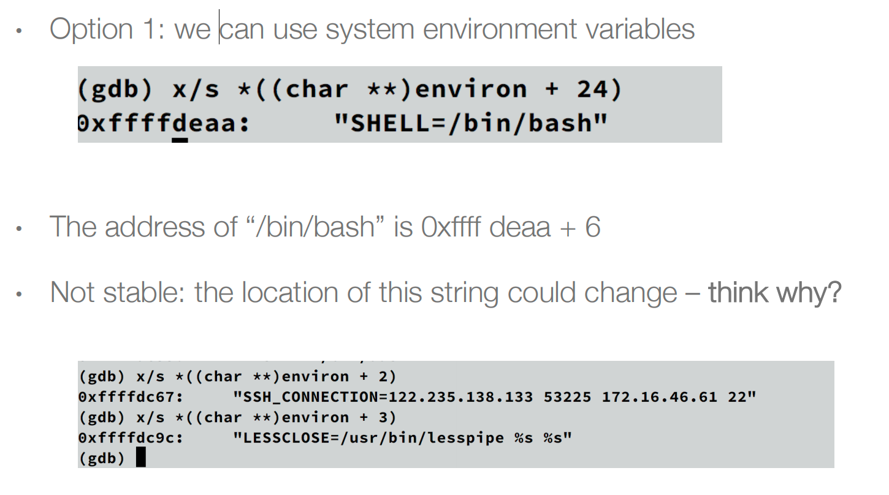
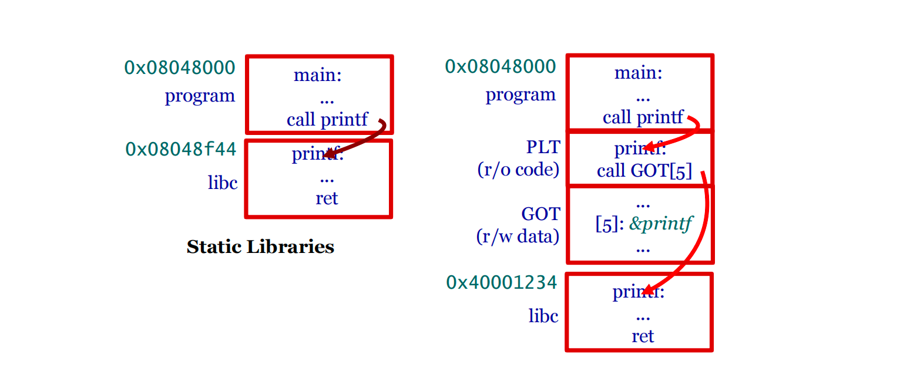
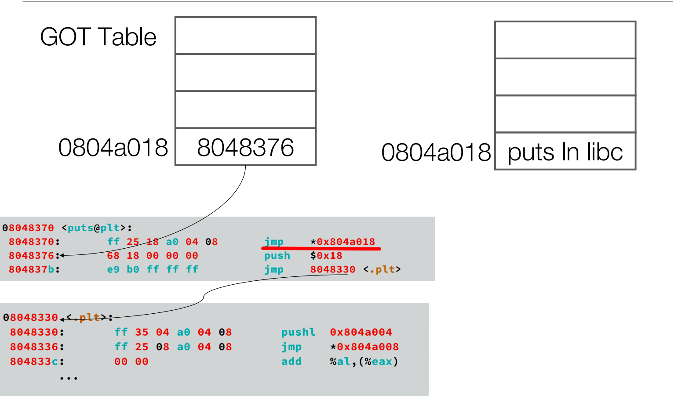
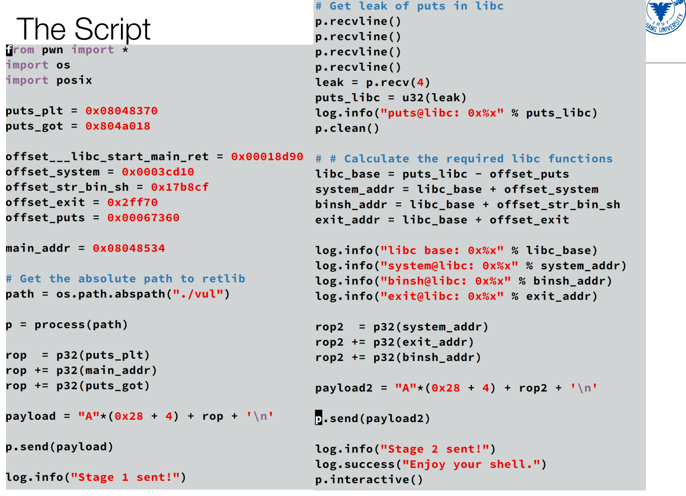
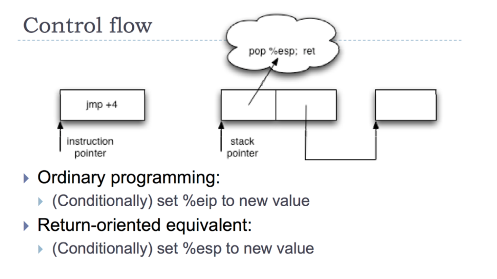

# 1. Buffer overflow

## Defenses

- 使用更加安全的函数，Strcpy -> strncpy, Sprintf -> snprintf。
- 替换库函数（动态链接时候），重定向到我们自己写的安全的库函数。
- 静态分析，编译器在编译的时候进行警告。
- 硬件中有一个影子栈（软件维护开销很大），存放重要数据，即将跳转的时候进行校验看数据是否被篡改。或者使用canary，放在return地址之前，只要覆盖了return地址那肯定会破坏canary，那么程序就会检测到栈数据被篡改。
- OS: ASLR，让栈堆甚至是程序的main函数每次加载的位置都不一样。这样就很难去猜测某些变量的值，比如/bin/sh的地址，比如libc的地址。
- 不可执行栈，系统中不可出现可读可写可执行的页，通过硬件来进行指示，而栈不可执行的话，就很难进行代码的注入攻击（payload是攻击者自己注入进去的）。

## 防御开启时如何攻击

**ASLR: brute force**（爆破）

**Stack Guard**

将当前栈的值和栈的canary的值，通过漏洞进行泄露，通过漏洞进行组合来进行攻击

# 2. Ret2libc

## 2.1 Stack Canary

### 2.1.1 多种漏洞组合泄漏Stack Canary

只要有一个信息漏洞能够泄露栈上的某个值，那就可以泄漏canary，来完成攻击。

### 2.1.2 爆破Stack Canary

通过爆破（Brute-forcing）来获取Stack Canary。子进程与其父进程具有相同的canary，有些服务端的程序不会主动响应请求，而是会fork一个子进程来响应，这样当canary被修改的时候，那么程序就crush，我们还能继续猜测，假设有8个字节，我们先猜第一个字节，需要0xFF次，猜对后猜第二个字节，这样只需要$8 \times 0xff$次就能完成猜测。

而且一般canary的第一个字节都是0x00，为了截断字符串。

### 2.1.3 改进Stack Canary

每次fork，子进程再随机生成一个canary，但是这样的话会造成比较大的性能开销。

PESC：每一次系统调用（从用户态进入内核态）都随机生成一个canary。

## 2.2 Runtime Mitigation: DEP (NX)

栈上的代码无法运行，所以无法进行代码注入。

### 代码重用攻击

重用当前进程空间里面的代码（包括程序本身的代码和库代码），这样就不用注入了。

Return-to-libc：将返回地址替换为危险库函数的地址

#### Ret2libc without ASLR

通过重定向到库里面的代码去

**Find the Address of the System Function**：我们可以通过gdb调试去寻找system函数的地址

**Find the String “/bin/sh”** 的三种方法

- 每次都会变，难以复用
- 通过用户定义的环境变量
- 真正使用的做法：libc中本来就有那个字符串，直接gdb find命令寻找“/bin/sh”

**目前我们找到了system函数的地址和调用的“/bin/sh”参数**，现在我们要进行参数传递并且调用system函数

Caller正常调用函数的时候，栈的变化，现在我们要进行模仿

我们仍然通过栈溢出的方法，在3的位置放系统函数的地址，2的地方随便放，1的地方放参数，也就是“/bin/sh”字符串的地址

#### Ret2libc with ASLR

libc的位置不是固定，也就是system函数不是固定的，我们并不能够事先找到系统函数的地址。

ASLR就是对关键的地址区域（比如stack, heap and libraries）进行了随机化的机制。

动态链接的调用原理：main函数调用的其实是PLT表，而表中记录的是GOT的表项，GOT记录着当次进程的函数的位置，从而实现动态链接

GOT(Global Offset Table)：放置当次加载程序时，某些函数的位置。GOT是在运行时候由linker或者loader来填充的。

Lazy binding：The loader does not need to resolve all the dynamic functions when loading a library. The address is resolved when it’s firstly invoked.例子：比如0x804a018 is the GOT entry for puts function，但是一开始GOT表中并没有puts的真正的地址，所以先跳转到了GOT表中的8048376，在这个地址中，会跳转到8048330，这段代码会把puts真正的地址放到804a018。

现在我们所拥有的：The address of the PLT of the puts function is fixed (not always true, we disable the PIE option when compiling the program)，也就是如上图所示的puts@plt段的三行代码是固定的。

我们把return地址改为puts@plt段的地址，然后构造puts的参数为GOT(puts)，这样我们就得到了puts的地址，而puts与libc的基地址的偏移量是不变的，现在我们去找到libc.so来获得偏移量，最后获得libc的基地址。

现在我们要把两次攻击串联起来形成一次完整的攻击链。第一次的返回地址是mian函数的地址，让他再进行一遍。

#### 局限性

这种方法需要程序那no PIE，如果打开了PIE，那么main函数，plt位置都是随机的，那就无法实现攻击了。

#### 总结

- Find system address
- Find /bin/sh
- Jump to system()

# 3. ROP

注意代码注入攻击和代码重用攻击的区别

- In **code injection**, we wrote the address of execve into buffer on the stack and modified return address to start executing at buffer.

- In **code reuse**, we can modify the return address to point to execve directly, so we continue to execute code.

在很多攻击中，我们可以使用代码重用攻击调用系统函数来disable DEP，然后再进行代码注入攻击。

Gadget是一串以ret为结尾的指令序列，ROP通过一列gadget的串联来实现各种指定的功能。

## ROP的函数

比如如下三个gadget的串联得到了一条store指令

我们通过一系列的ret指令来使esp变化，类似原本指令流中的nop指令，nop指令改变的是eip，而ret改变的是esp。

我们通过pop指令来实现往一个寄存器里面放立即数的事情

控制流在普通的机器里面是jmp指令，在ROP里面，我们pop esp即可

只要能找到足够的gadget，就能实现任何的操作。

## 如何防御ROP

**Control-flow integrity (CFI)**

ROP违反了程序控制流的完整性，因为ret是随便跳转的，我们可以事先生成一个控制流，如果运行时候ret跳转到的地方不在事先生成的某个地址范围内，则报错。但是这只是理论上的，控制流图的构建是NP-hard问题，

**Runtime Mitigation: Randomization**

ASLR使找gadget比较麻烦，即使找到了gadget，但是不知道libc基地址在哪，没办法调用gadget。使得构造gadget的效率变低，但是ASLR还是存在一些破解方法，比如爆破，或者是通过利用一些内存泄漏的漏洞。