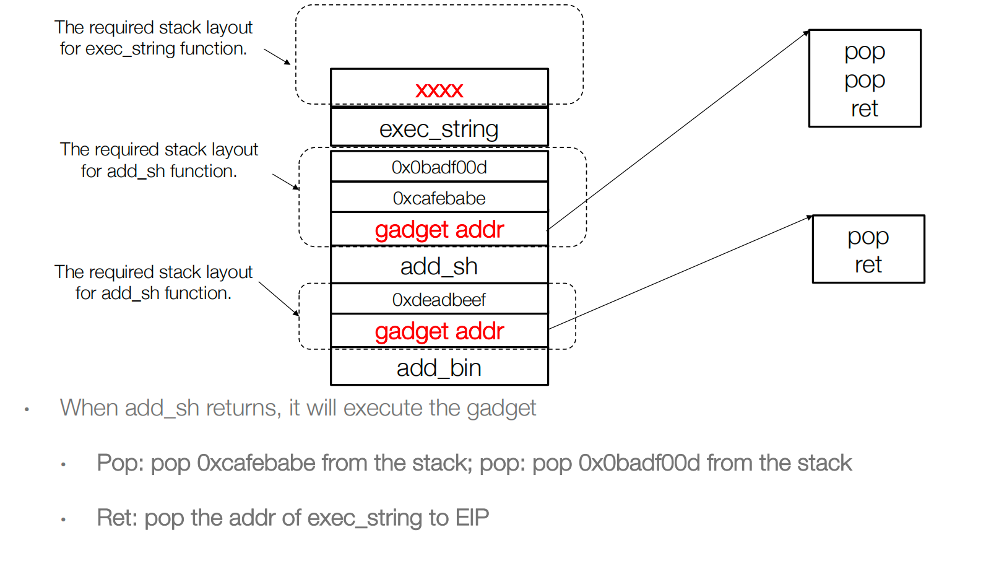
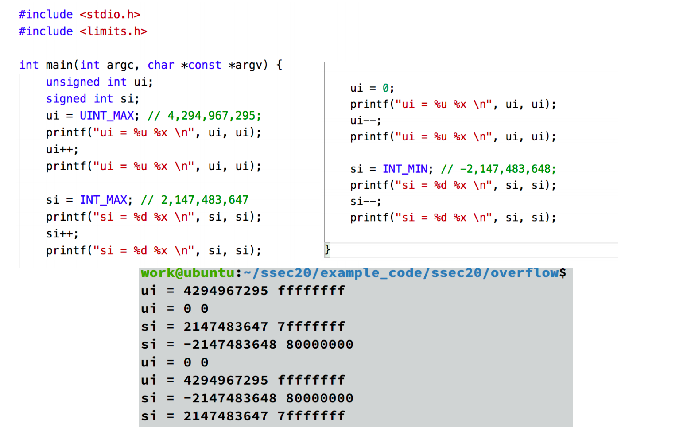

>第四课 5.22
## 1. ROP: Example

给出一个危险程序

第一步：执行add_bin

第二步：执行add_sh

第三步：执行 execute_string

也就是最后整体的栈地址就是

## 2. BROP

Blind Return-Oriented Programming(BROP)，适用于远程攻击场景，通过一些包含着payload的网络请求，获得远端的服务器的控制。

要求：1.堆栈漏洞，以及如何触发它的知识。2.崩溃后会重新出现服务器进程，例如nginx、MySQL、Apache、OpenSSH、Samba。

### 步骤

**Defeating ASLR: stack reading**

他需要猜栈里面的返回地址，还是采用跟猜canary一样去一个一个字节猜测。

**Find Gadgets**

Gadget的分类，我们可以很容易找到Stop gadget

我们的目标希望能把远端的binary泄露回来，所以我们要找到write的目标，为了实现write，我们要找如下的这些gadget

后面就开始寻找gadget

好的，后面开始就听不懂了……

## 3. Blind ROP in Practice

Step I: Find the offset to overwrite the return address

Step II: Find the stop gadget

Step III: find the BROP gadget

Step IV: find the puts PLT address

Step V: dump the binary

## 4. Interger Overflow and Heap Overflow

### Interger Overflow

当一个整数超出了所能容纳最大或者最小值时，就会产生溢出。

无符号数最大值加一变成了0，有符号数最大值加一变成了最小的负数。

!!! example

    

    整数溢出，那么buff的malloc的内存就很小，那么之后的两个指令就会溢出。

整数溢出大多数都与内存分配相关。

### Heap Overflow

