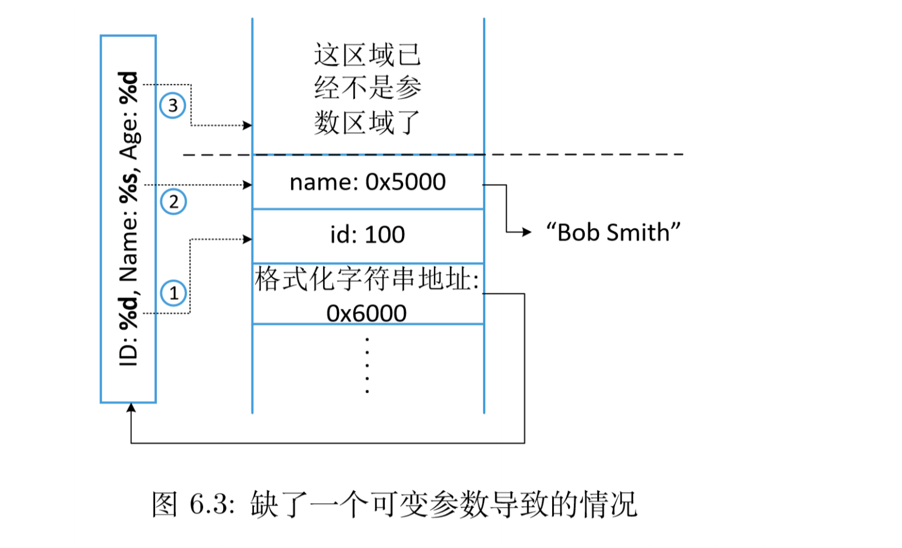
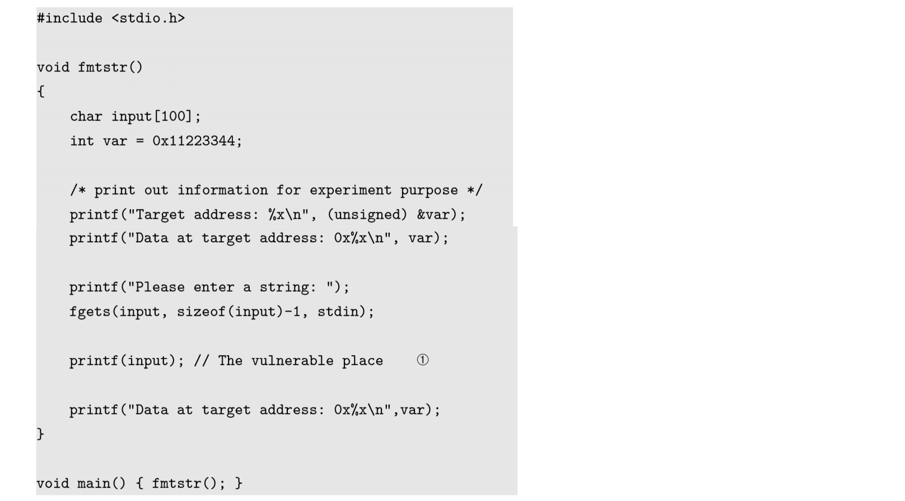
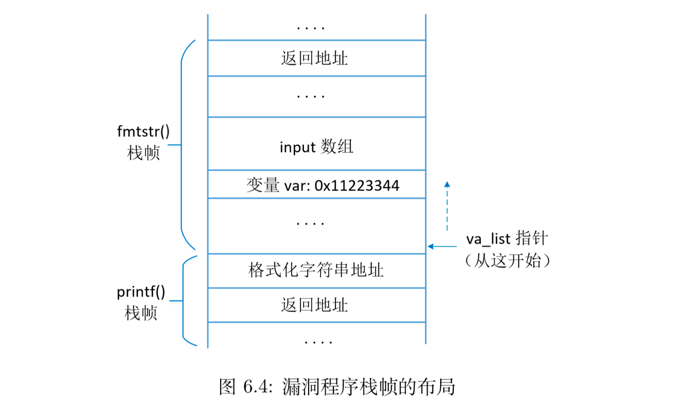
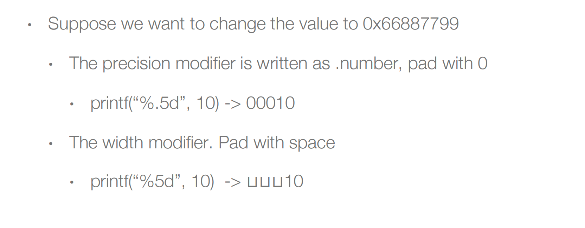
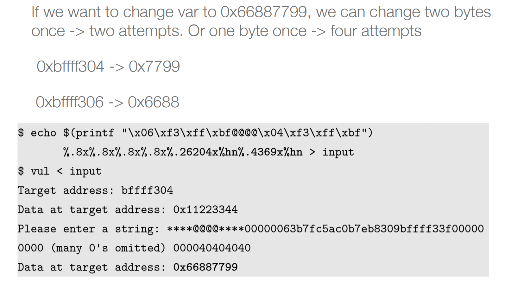
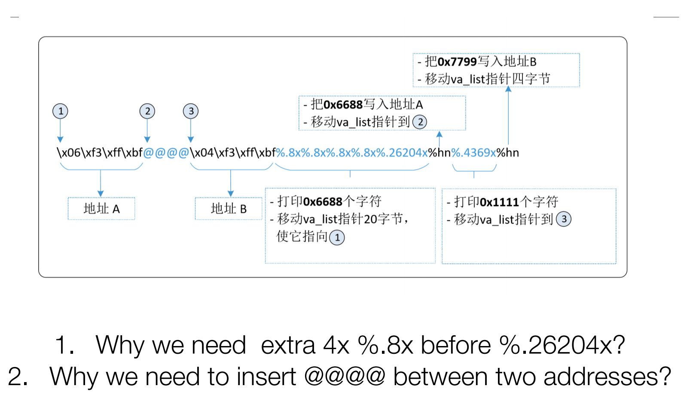
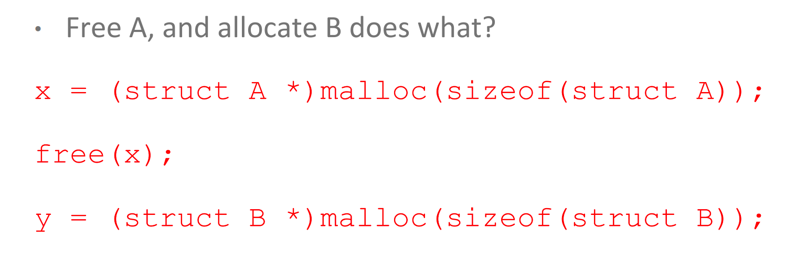
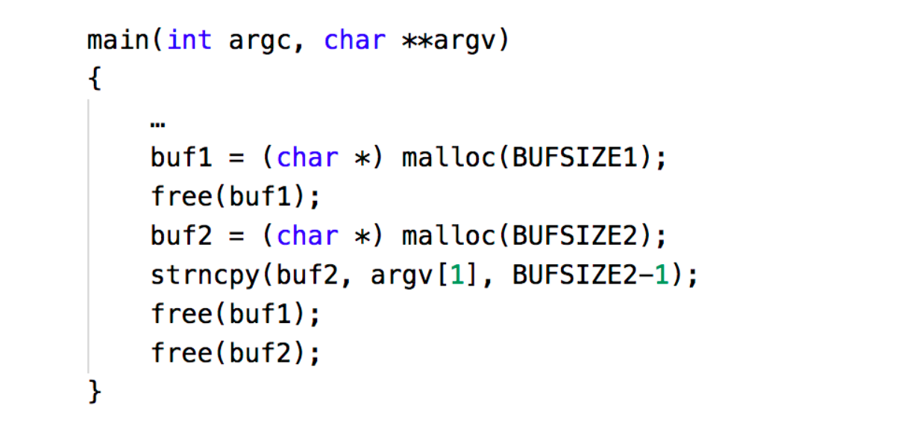

## Format String Vulnerability

### 概述

Printf()用于根据格式打印字符串。第一个参数称为格式字符串。这种格式化打印字符串函数也包括sprintf、fprintf等。攻击者控制第一个format string，从而进行任意地址的读和写。

Format格式指示符

### 任意地址读

Caller函数的栈被越界访问

一个例子来了解printf的参数读取

### 任意地址写

printf如何修改内存，简而言之，百分号就代表va_list会滑动

### 劫持控制流

老师略讲

### 降低风险

## UAF and Type Confusion

### UAF

程序在heap上已经把memory free掉，但是指针的地址还是有效的，再去使用这个指针，就是UAF(Use After Free)。

如上例子，我们可以通过buf1悬挂指针来修改buf2或buf3。

### Double Free

### Type Confusion

向下的类型转换是不安全的，这个主要用在C++中

### UAF In Practice

