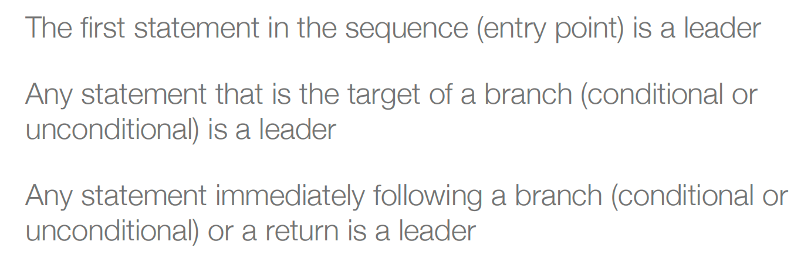
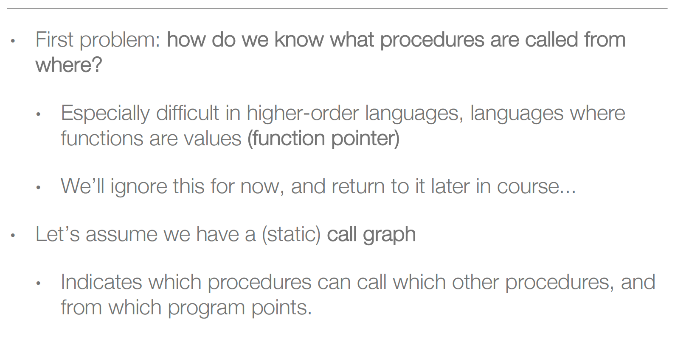
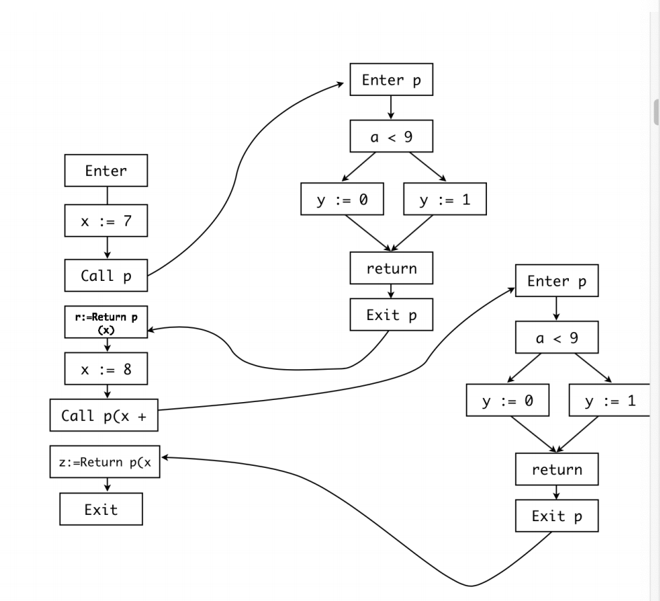
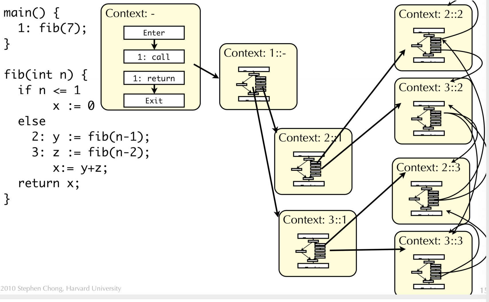
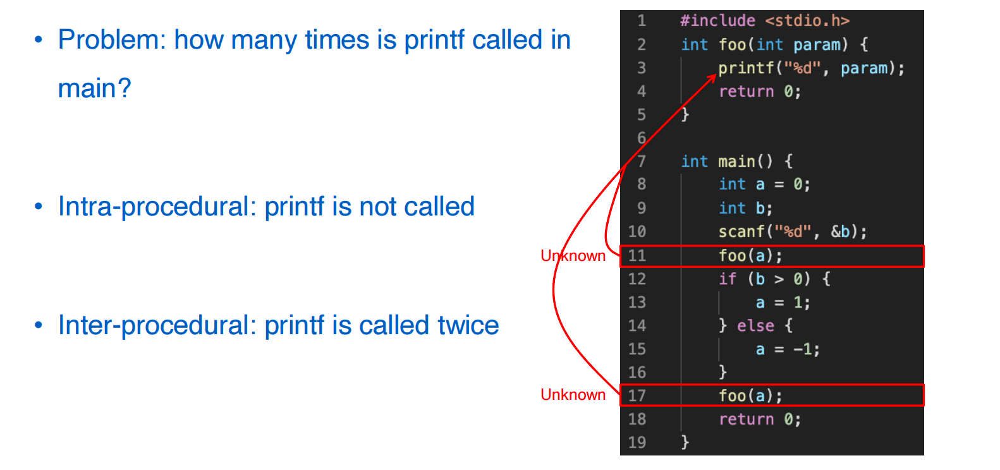
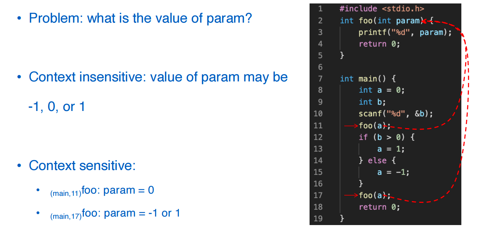

## Introduction, Control Flow Analysis

程序分析定义：Any *automated* analysis *at compile or dynamic time* to find potential bugs. （漏洞是一类可以被利用的bug）

程序分析分为动态（运行时）分析和静态（编译时）分析。

动态分析：基本上没有误报；缺点是会漏报，因为一个程序的空间是很大的，而且还取决于用户的输入。

静态分析：误报的概率比较高；可以覆盖所有输入的程序情况。

### 控制流分析

#### 定义

控制流就是一系列操作的序列，我们所关注的是Control flow graph、Control dependency、Call graph。

Control Flow Graph

Basic Block是具有单个入口点、单个出口点和没有内部分支的最大连续序列语句，这是控制流分析的最基本的单元。

#### 构建CFG

如何寻找basic block？先寻找开头，如下是开头的三种类型

划分好Basic Block之后进行CFG的构建

构建CFG中的困难

#### 分析CFG

**术语**

**DFS遍历**

**Dominance** ：到某个点必须经过的点的集合，方便分数据流

#### Call graph

#### 合并graph

加入数据之后

我们要添加上下文信息（比如函数的调用栈）到CFG，这样可以使CFG更加的精确。

当然我们不可能一直这么画下去，更大的程序需要进行近似操作。

### Common Concepts

**intra- and inter-procedura**l：intra是函数内部的分析，inter还需要考虑过程与过程之间的关系，也就是函数之间的关系。

**flow sensitive, context sensitive and path sensitive**：在分析的过程中，有没有考虑到路径，如果考虑到了，那么这就是路径敏感分析。

**例子**：

**Flow Sensitivity**

**Context Sensitivity**：分析时考虑函数被调用的地址

**Path Sensitivity**：

在一次执行的时候，如果b的值确定下来，那么a的值是确定的。

