- 记清楚基本概念，理解基本原理；
- 注意对数学表达式物理意义的理解；
- 注意知识的前后联系，融会贯通；
- 勤动手，多练习。

## 第一章 信号与系统

### 1.1 信号与系统的基本概念

#### 信号的基本概念

信号：**信号是信息的载体**，通常以声、光、电为载体传递信息。

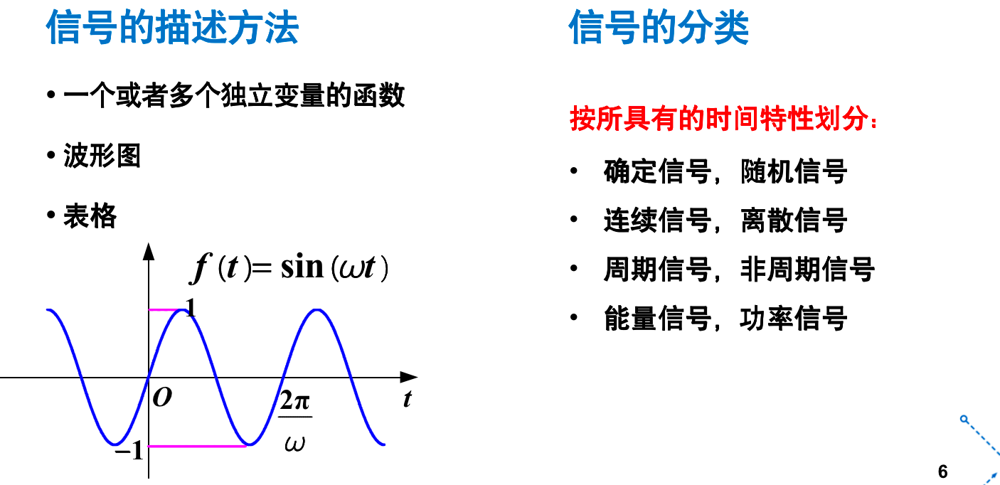

#### 信号的分类

- 确定信号和随机信号

确定信号：在定义域上的任一时刻， 都有确定的函数值。

随机信号：在任一时刻的取值都具有不确定性，只可能知道其统计特性。如在某个时刻取某一数值的概率。比如噪声，只能概率统计，某个时刻是不能确定数值的。

- 离散信号和连续信号


- 周期信号和非周期信号


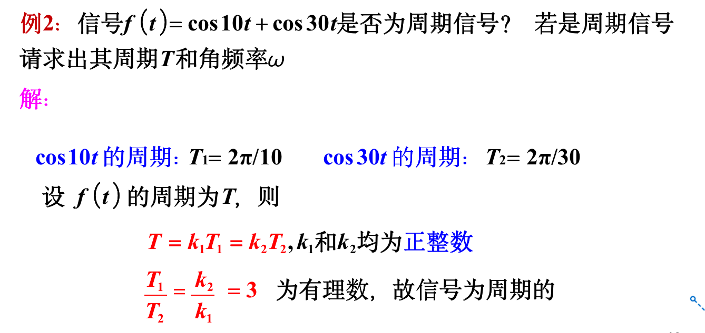


#### 系统的基本概念

系统：**若干相互作用、相互联系的事物按一定规律组成具有特定功能的整体称为系统。**

可以简单认为是对输入信号进行处理而输出信号的装置。

连续系统，系统的输入信号和输出信号均是连续信号。离散系统，系统的输入信号和输出信号均是离散信号。

#### 系统的分类

- 时不变系统与时变系统

时不变系统，亦称平稳系统，指特性不随时间变化的系统。用数学表示为：`T[x(n)]=y[n]`则 `T[x(n-n0)]=y[n-n0]`，这说明序列x(n)先移位后进行变换与它先进行变换后再移位是等效的。

线性时不变系统（LTI系统）：`f(a+b)=f(a)+f(b)`的时不变系统。


#### 系统的基本作用

**对输入信号进行加工和处理，将其转换为所需要的输出信号。**


举例：通信系统


#### 信号与系统

**信号**由系统产生、发送、传输处理和接收，离开系统没有孤立存在的信号。 **系统**的功能就是对信号进行加工、变换与处理，不处理信号的系统没有存在意义。“信号”与“系统”**相互依存**。


### 1.2 信号的运算

- 相加运算准则：在同一时刻对两个信号的取值进行对应相加。

- 相乘运算准则：在同一时刻对两个信号的取值进行对应相乘。

- 求导运算法则：


- 积分运算法则：


- 反转运算法则：时间为t，离散为k


- 时移运算法则：是针对函数自变量 t 或 k 的变换运算。 信号右移动可能表示如远程通信中接收信号的延时现象。


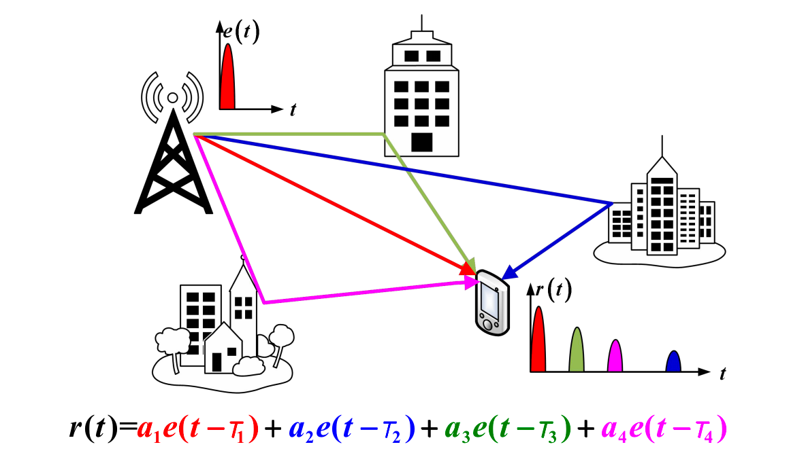

- 连续信号尺度变换运算：**时间变量乘以一个系数 等于改变观察时间的标度。**


- 离散信号尺度变换运算：


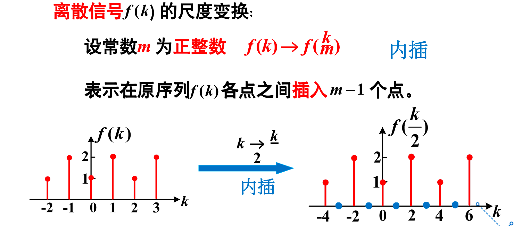


- 自变量变换的一般形式


- 卷积运算


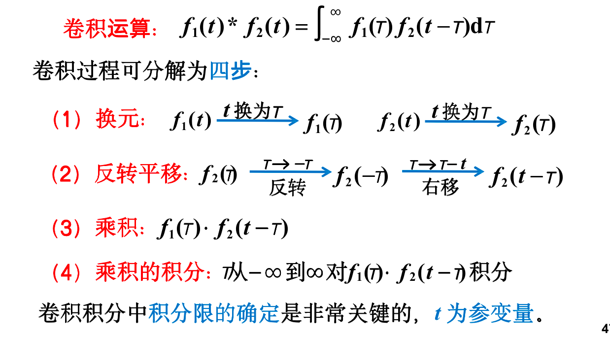

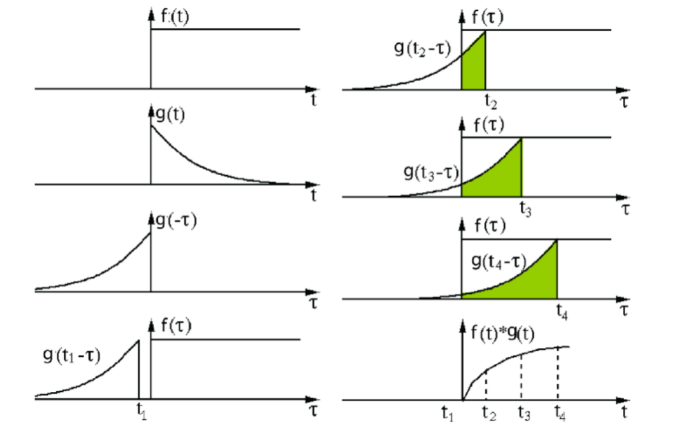


### 1.3 典型的连续信号

#### 指数信号


#### 单边指数信号

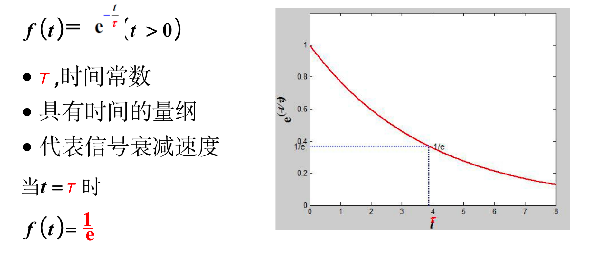

#### 正弦信号


```ad-note
title:欧拉公式

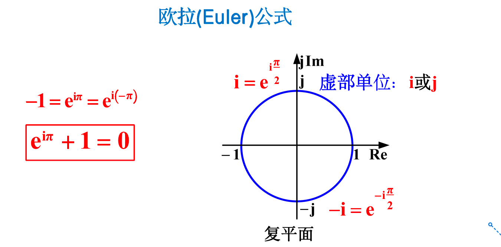


```

#### 单边衰减正弦信号


#### 采样信号


sinc函数是正弦基函数的缩写，sinc(x)=sin(pi*x)/(pi*x)，Sa函数是采样函数的缩写，Sa(x)=sin(x)/x。


#### 单位斜变信号


#### 单位阶跃信号


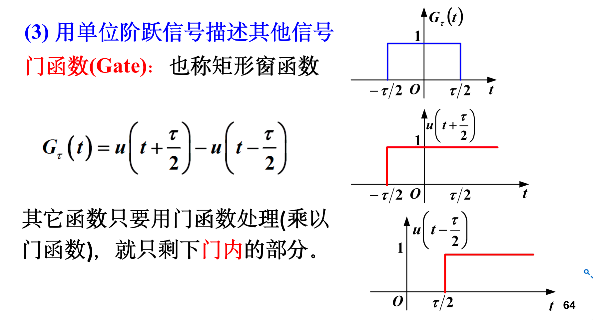


#### 冲激信号


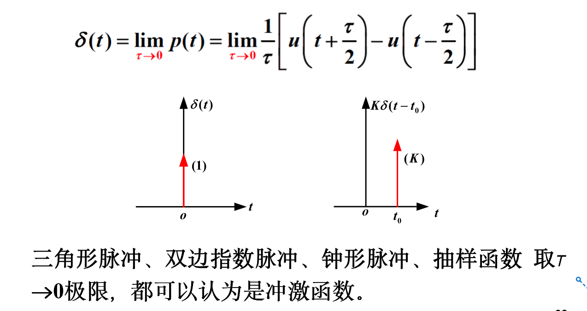


冲激函数求导就是冲激偶函数

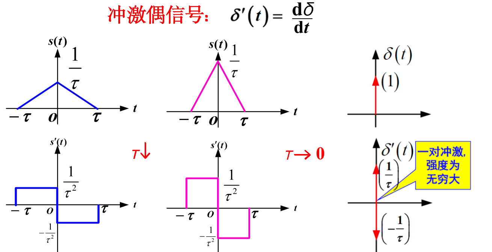

#### 斜变信号、阶越信号和冲激信号的关系


### 1.4 典型的离散信号

#### 表示方法


#### 典型的离散信号

##### 单位样值信号


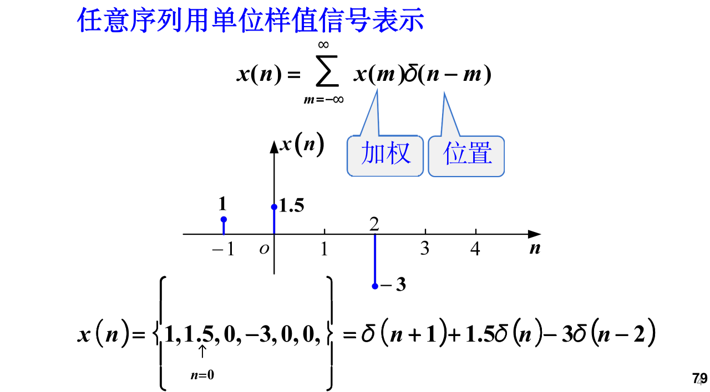

##### 单位阶跃序列


##### 矩形序列

时间上有一个范围

##### 斜变序列

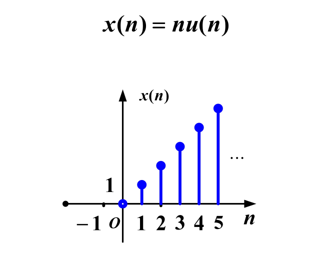

##### 正弦序列（重要！）

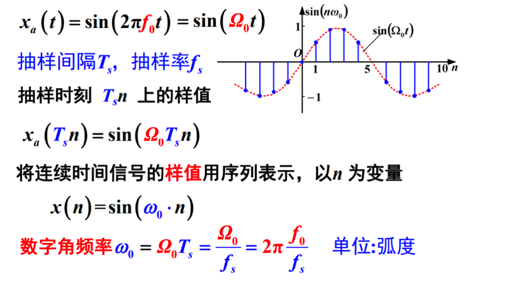


> 2023.9.20