# 第二章 信号频域分析

## 2.1 信号的频率特性

信号与系统的频率特性由其物理属性决定。乐谱中的音符就是一种频谱表示方式。

## 2.2 傅立叶级数(FS)

任一函数都能展开为由余弦函数构成的三角型FS和由虚指数函数构成的指数型FS。

### 一、狄利赫里条件

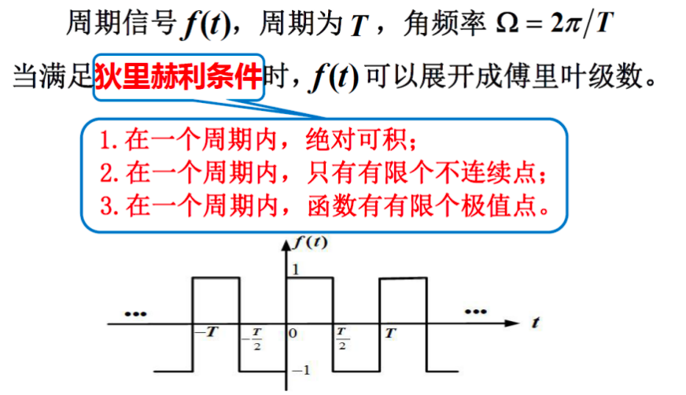

### 二、傅立叶级数

#### 三角型傅立叶级数

#### 指数型傅立叶级数

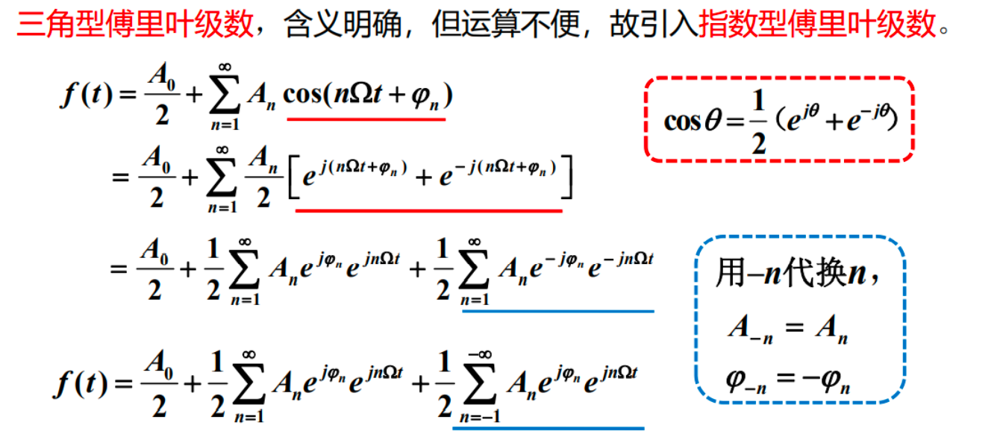

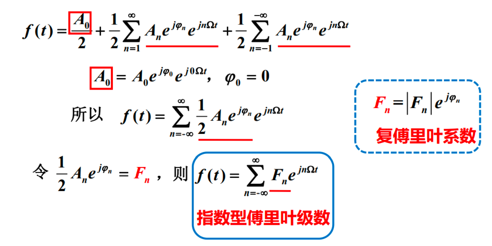

#### 傅立叶系数之间的关系

## 2.3 傅立叶变换(FT)

特殊的积分变换，将满足一定条件的某个函数表示成正弦函数的积分。

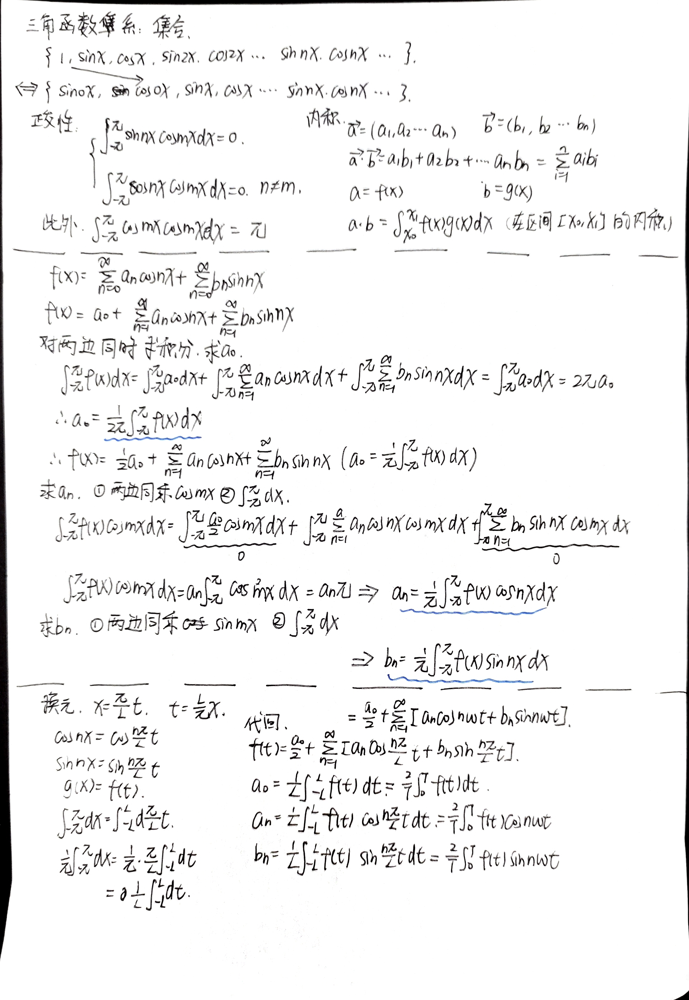

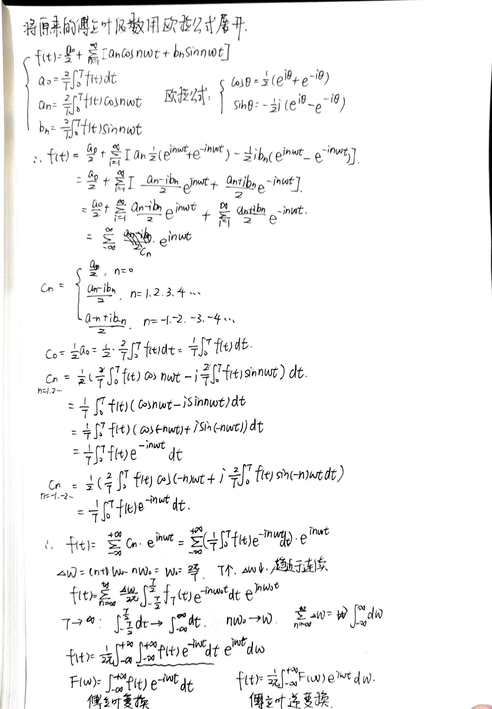

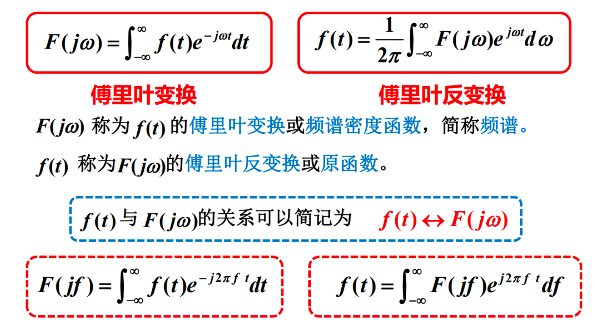

### 常用信号的傅立叶变换

#### 1. 单边指数信号

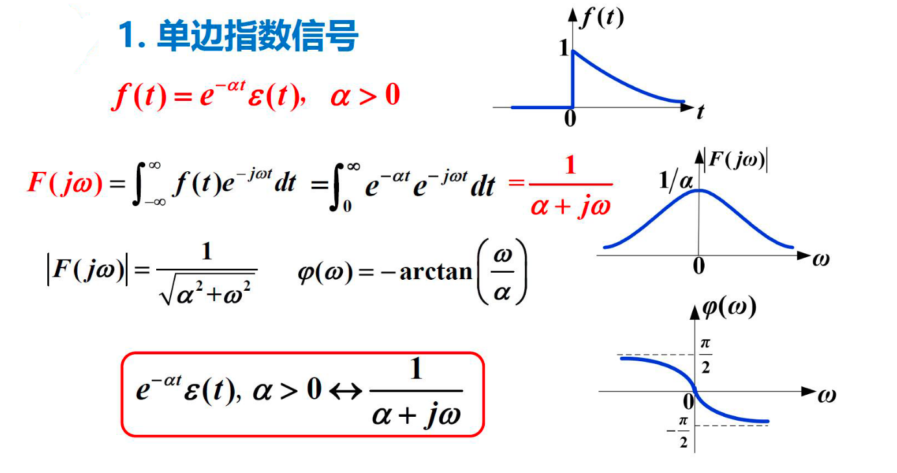

#### 2. 双边指数信号

#### 3. 门函数

#### 4. 单位冲激信号

#### 5. 直流信号

#### 6. 符号函数

#### 7. sinc函数（重要）

#### 小结

门函数和sinc函数对应；单位冲激函数和直流信号对应；

时域是周期的，频域就是非周期的；

时域是连续的，频域就是离散的。

#### 系统的频域分析法

## 2.4 傅里叶变换性质

### 1 线性

### 2 时移特性

### 4 尺度变换

频域有变换，幅度也有变化

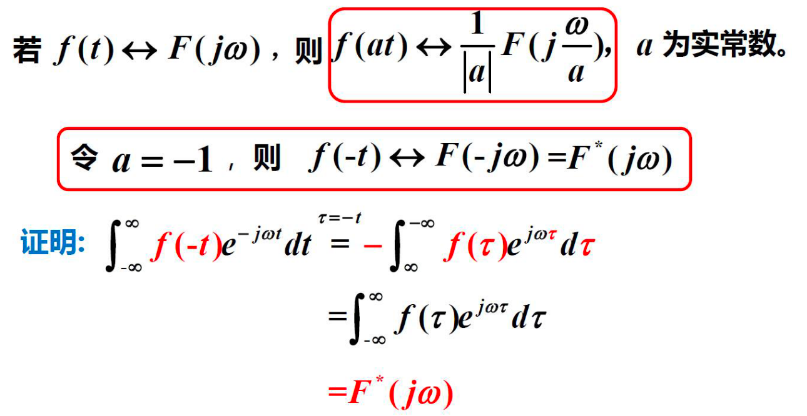

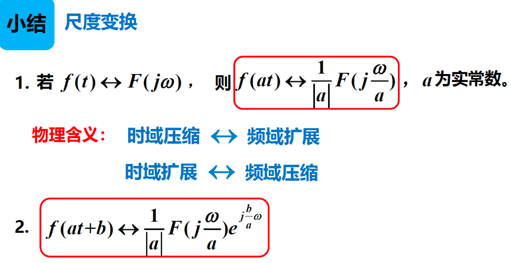

### 6 卷积定理

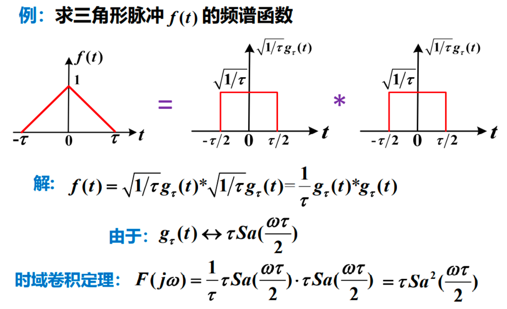

### 7 时域微分和积分

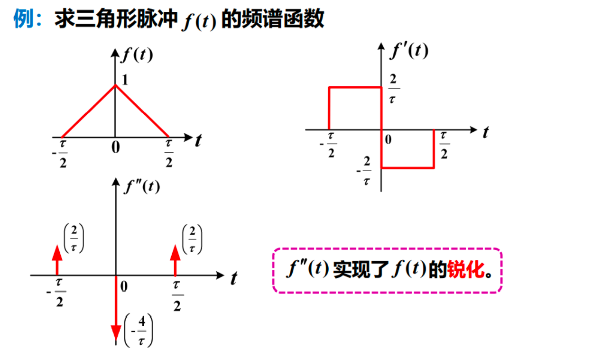

### 8 频域微分和积分

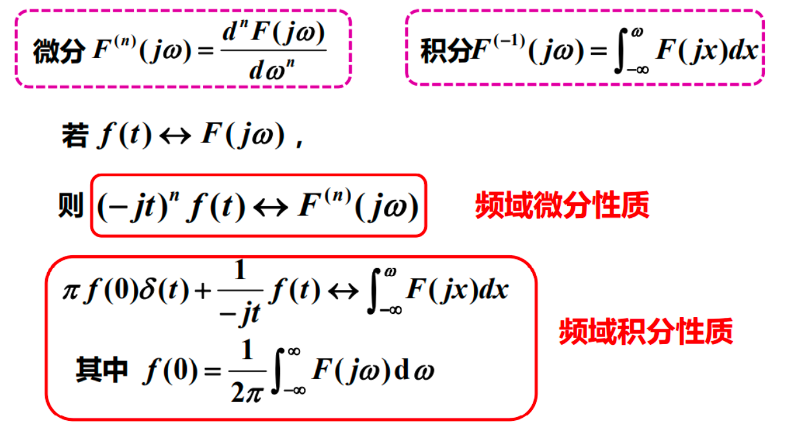

### 周期信号的傅立叶变换

## 2.7 短时傅里叶变换

### 引出

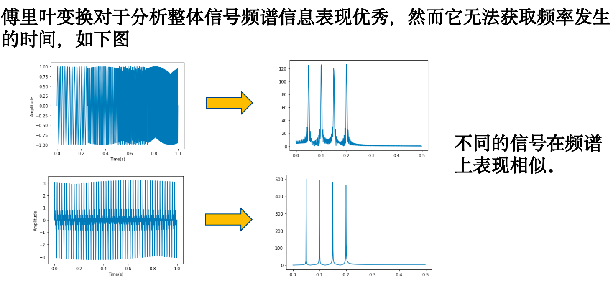

### 局限一

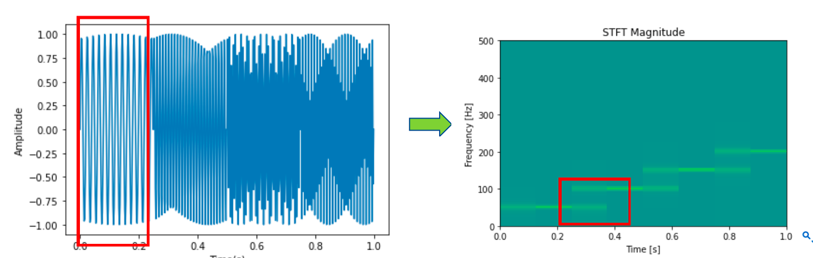

### 局限二

傅里叶变换的Gibbs效应：将具有不连续点的函数（如矩形脉冲的凹角)，需要用到大量的三角函数去拟合导致信息的大量冗余。

短时傅里叶**无法同时兼顾时域分辨率和频域分辨率**，且对于**突变点性能不佳**。

### 导致STFT性能不佳的原因：三角函数基（$e^{-jw}$）

短时傅里叶变换和傅里叶变换相同使用无限的三角函数作为分析信号频率的基，这导致了傅里叶变换无法在时域上分析频率，而短时傅里叶变换通过加窗解决这一问题，但是窗口大小是难以抉择的。

同样地，**由于三角基为全局性基，没有局部化能力，以至局部一个小小的摆动也会影响全局的系数，这使得Gibbs效应对于频率分析的影响更大**。

一种简单方案是通过**使用不同窗口大小的STFT对信号进行反复分析**，从而实现对于时频信息的有效分析。

小波变换是替代STFT将信号变换为时频信息的常用手段之一

## 2.8 小波变换

### 核心：小波基

三角函数基：无限的，稳定的；
小波基：有限的，突变的；

### 小波变换

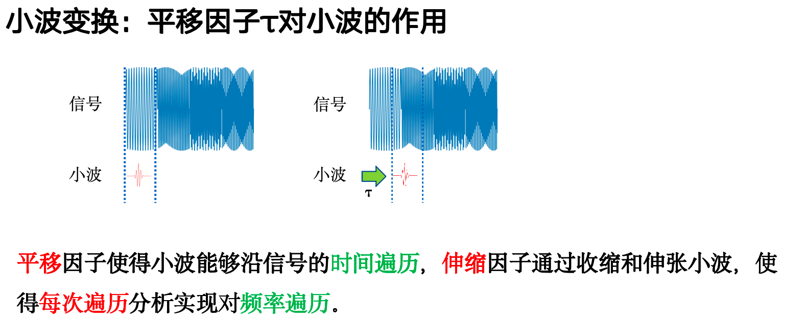

### 部分常见小波基

### 小波变换优势

### 连续小波变换（CWT）

### 离散小波变换

## 2.9 离散傅里叶变换(DFT)

## 2.8 快速傅里叶变换(FFT)

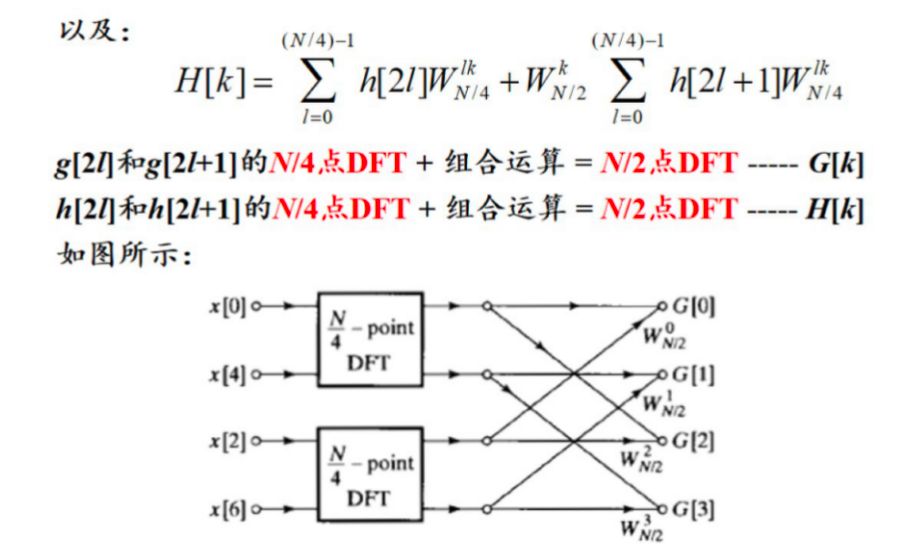

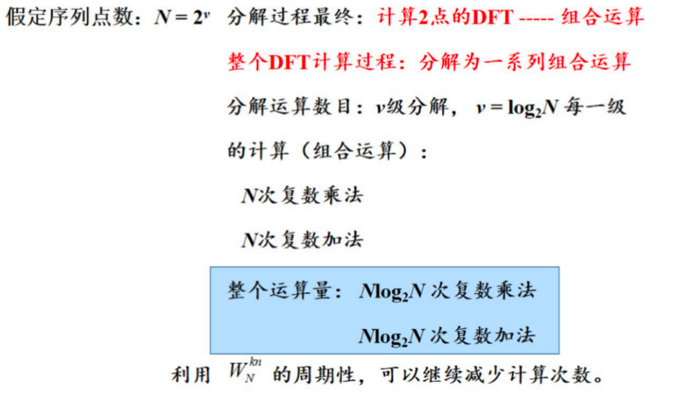

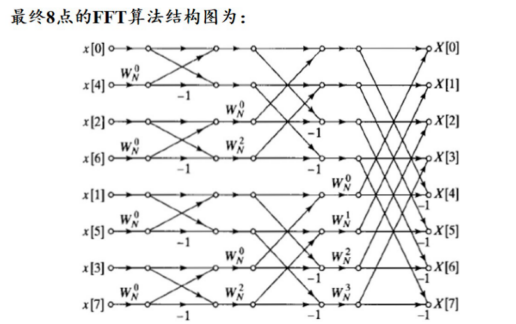

