# 第三章 采样与滤波

## 3.1 采样与混叠

将模拟信号采样并量化为离散数据是将模拟信号转换为数字信号的主流方法。

模拟信号经采样变为离散时间信号后，是否会失掉一些信息？信号的频谱会发生怎样的变化？不丢失信息应满足什么条件？

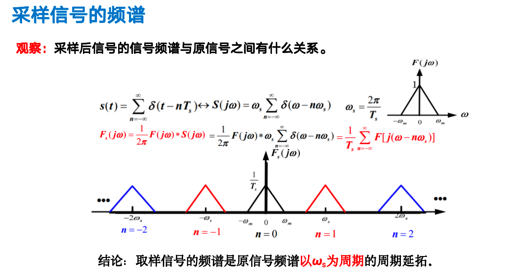

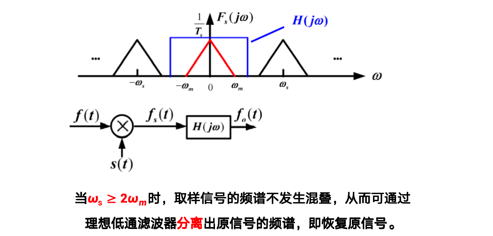

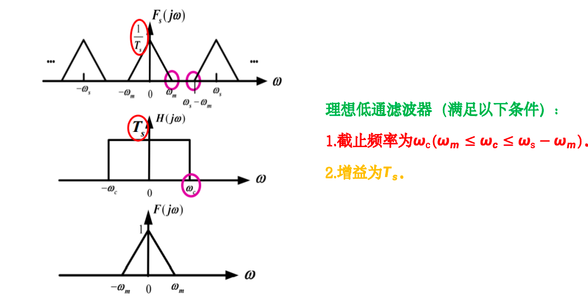

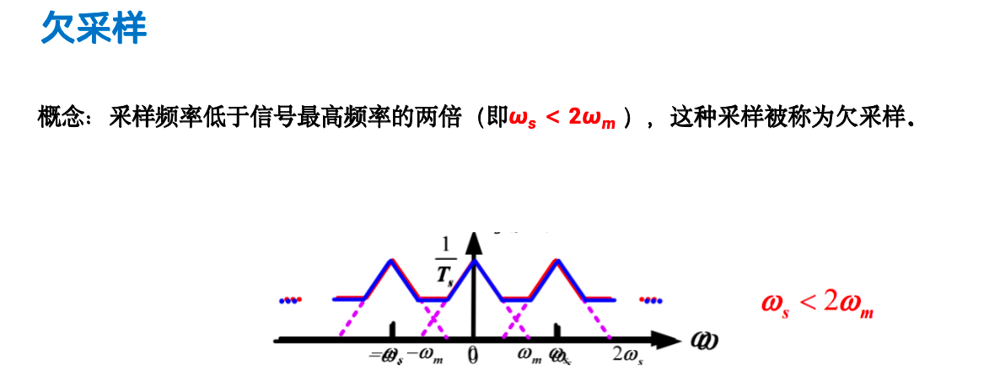

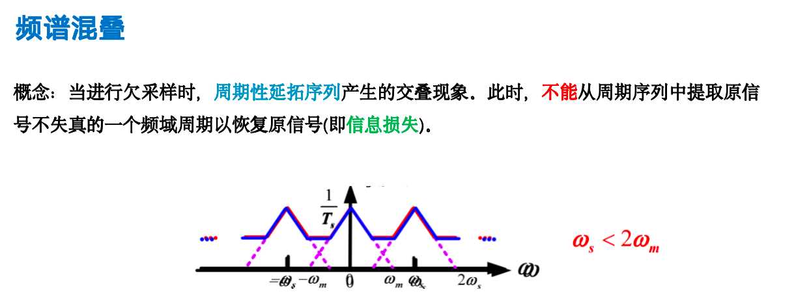

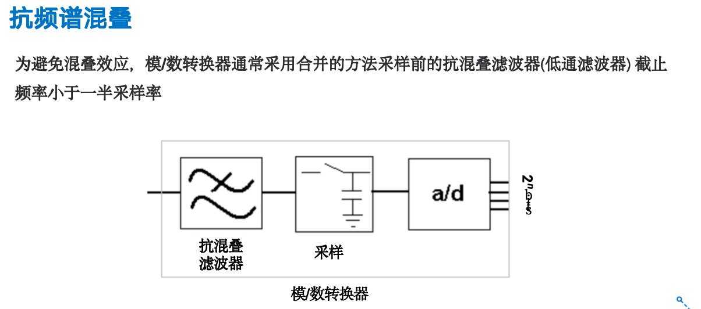

## 3.2 数字滤波算法

对于从物理世界采集的信号来说，噪声是不可避免的，为了提高下游应用的性能，需要对信号进行滤波，从而提高信号的质量。

### 1. 中值滤波

中值滤波相对于均值滤波，可以保护信息的边缘。均值滤波的话，边缘可能会产生模糊。

### 2. 低通滤波

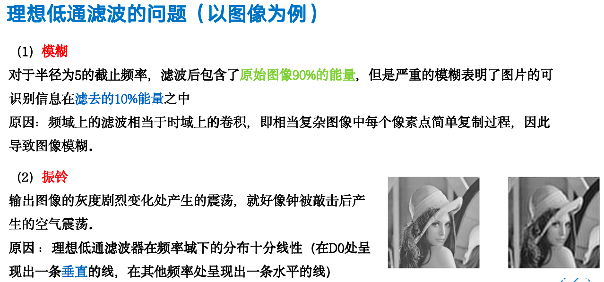

### 3. 高通滤波

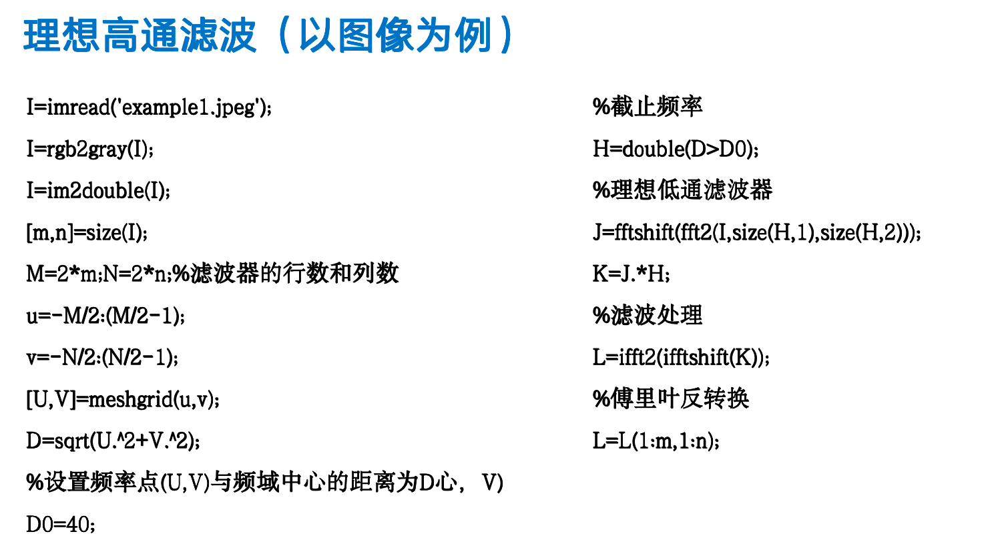

### 4. 带通滤波

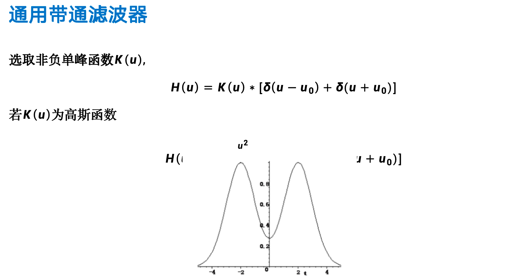

### 5. 小波滤波

### 6. 高斯滤波

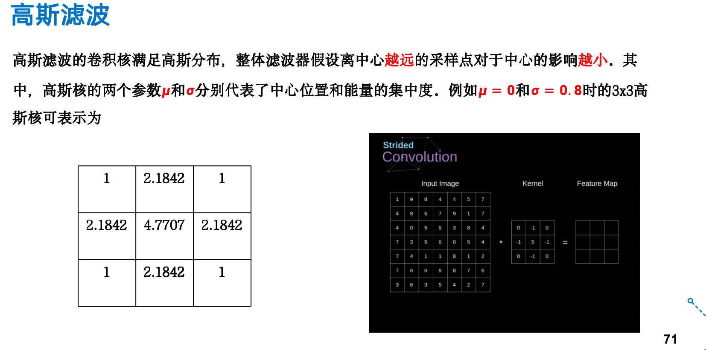

### 总结

## 3.3 卡尔曼滤波

卡尔曼滤波（Kalman filtering）是一种利用线性系统状态方程，通过系统输入输出观测数据，对系统状态进行最优估计的算法，其具有以下特点：

1.卡尔曼滤波根据**前一个估计值**和**最近一个观测数据**来估计信号的当前值；它是用状态方程和递推的方法进行估计，它的解是以**状态变量的估计值**的形式给出的。

2.卡尔曼滤波参数时变,适用于**非平稳（优于维纳滤波只适应平稳过程）**随机情况下最优滤波且性能优越。

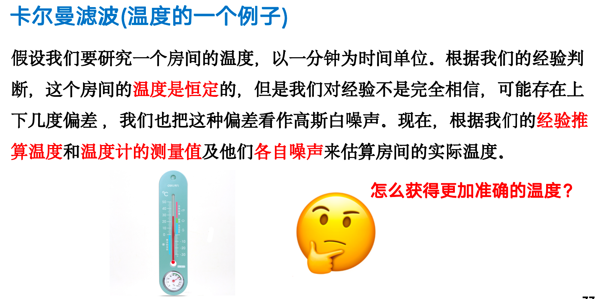

无人驾驶汽车遭受GPS攻击

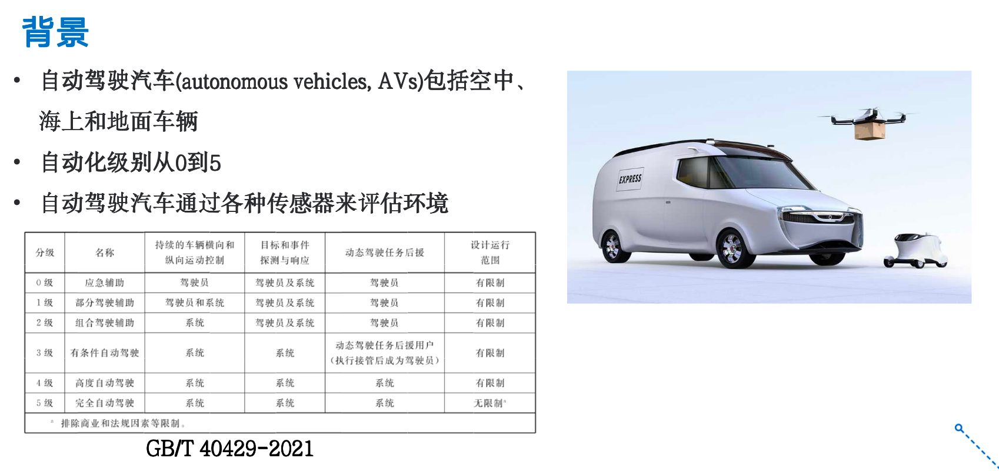

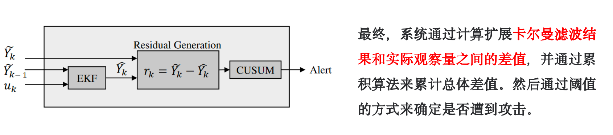

