# 第四章 语音信号处理

## Part1 引言

### 绪论

### 语音信号处理应用

鸡尾酒会问题指的是人们在鸡尾酒会中交谈，语音信号会重叠在一起，机器需要将他们分离成独立信号。可以采用**盲源分离中的独立成分分析**来分离各个声源。

### 语音的数字编码

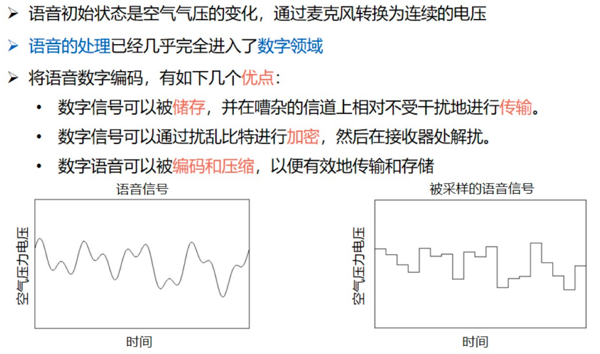

语音数字编码：A/D转换

语音数字编码：D/A转换

## Part2 基础处理

### 1. 傅立叶变化和它的各种形式

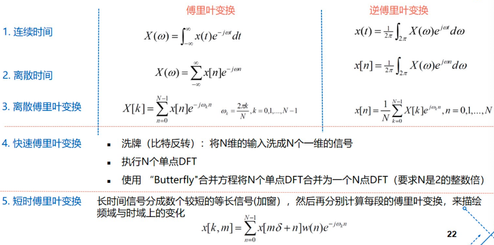

功率谱密度：幅度的平方

### 2. 时频谱图

横坐标是时间，纵坐标是频率，颜色越红表示功率越大，也就是幅度越大（而功率就是幅度的平方，所以颜色代表功率）。

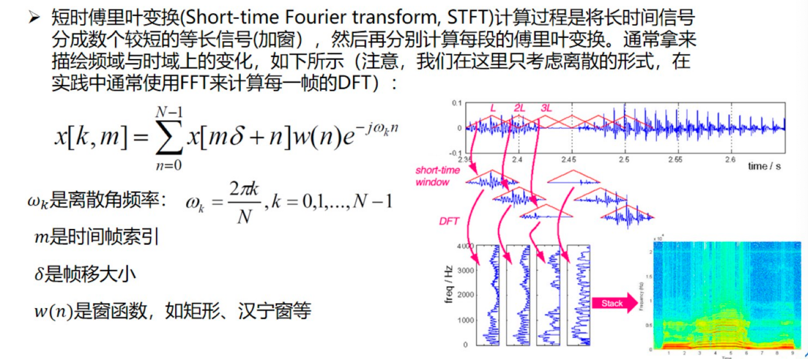

#### 时频谱图的分辨率问题

#### 时频谱图：加窗与混叠

### 3. 互相关和自相关

#### 随机信号的自相关

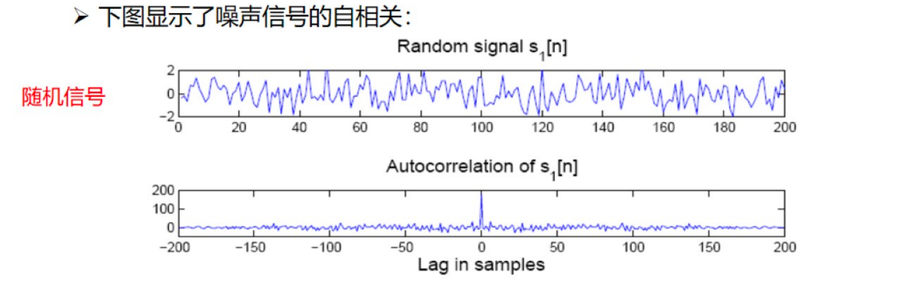

#### 用于周期性估计的自相关

#### 自相关和PSD之间的关系

### 4. 周期性估计

## Part3 特征提取

### 1. 源滤波器模型

语音生成中的“谐振”效应

源滤波器模型：共振峰

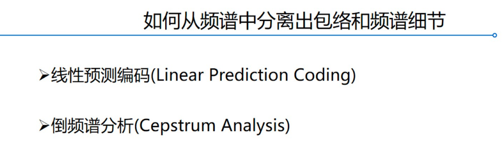

### 2. 线性预测

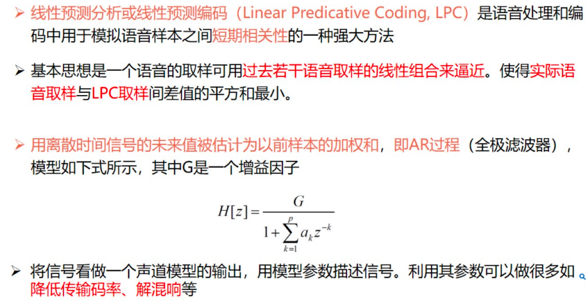

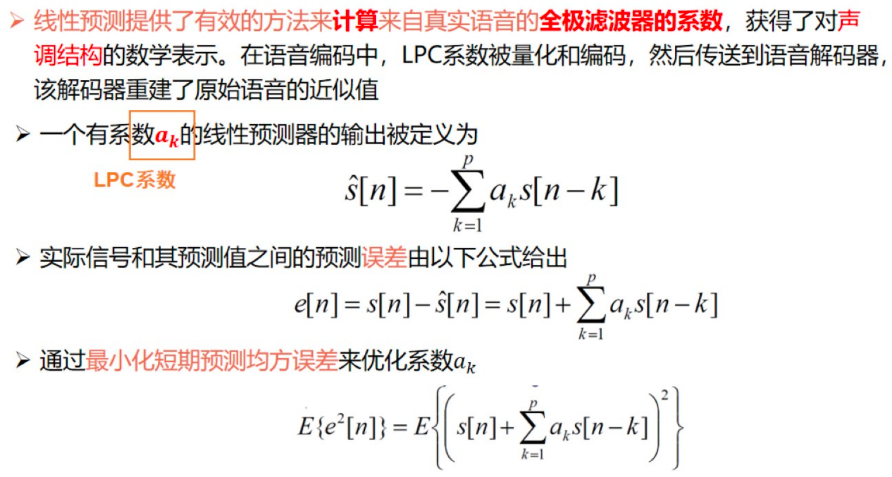

逆滤波器

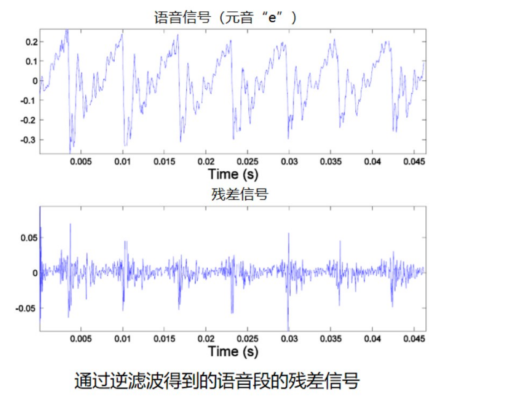

### 3. 线性预测编码(LPC)分析

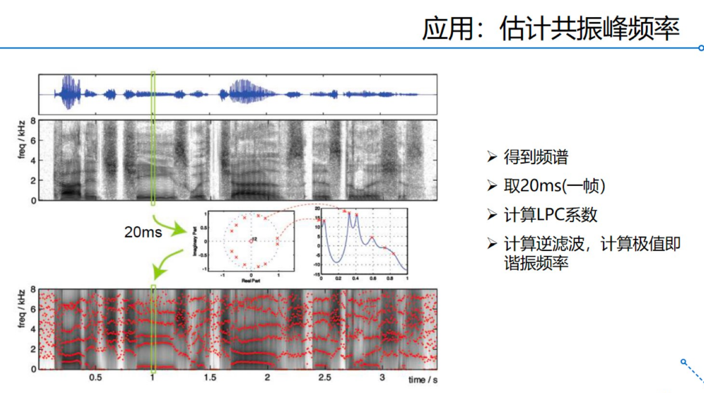

### 4. 倒谱分析与梅尔倒谱系数

LPC注重音调结构，细节被抛弃。

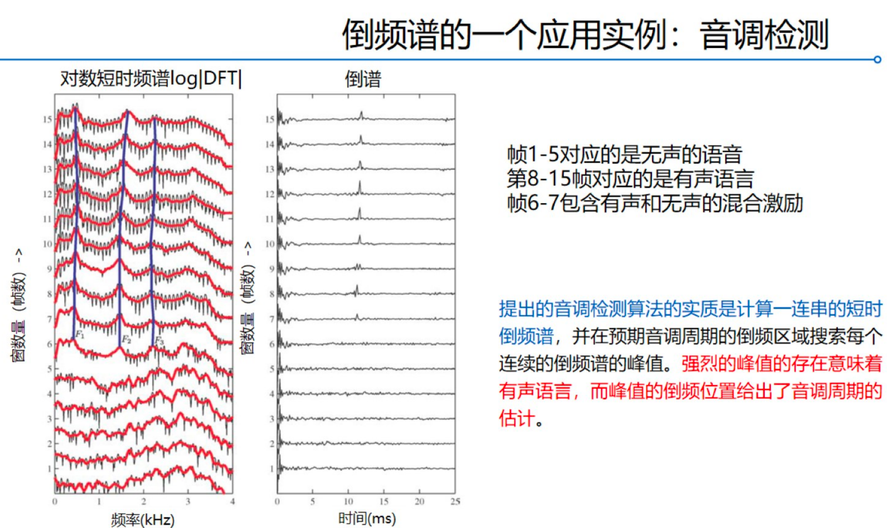

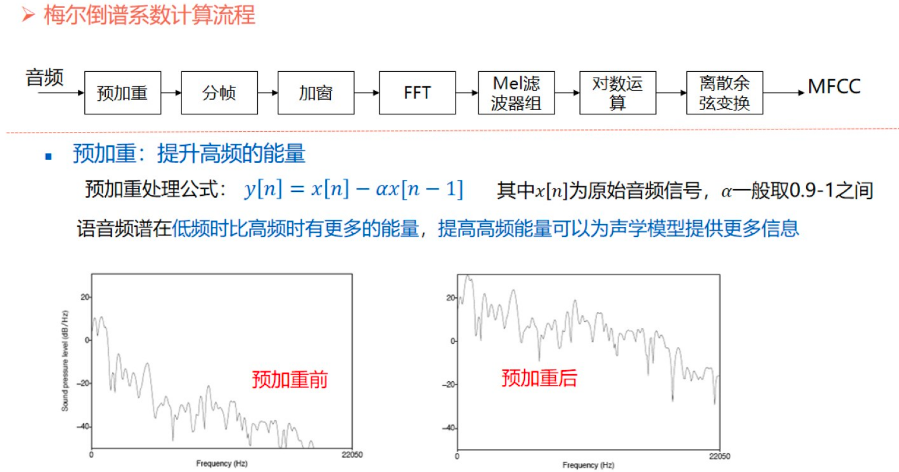

### 5. DTW(动态时间规划)

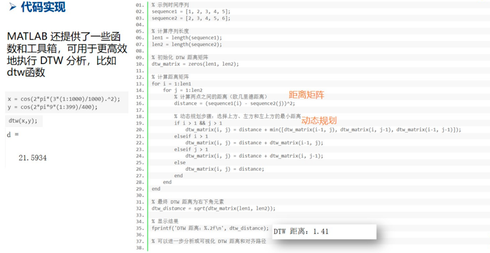

## Part4 应用

### 1. 语音识别

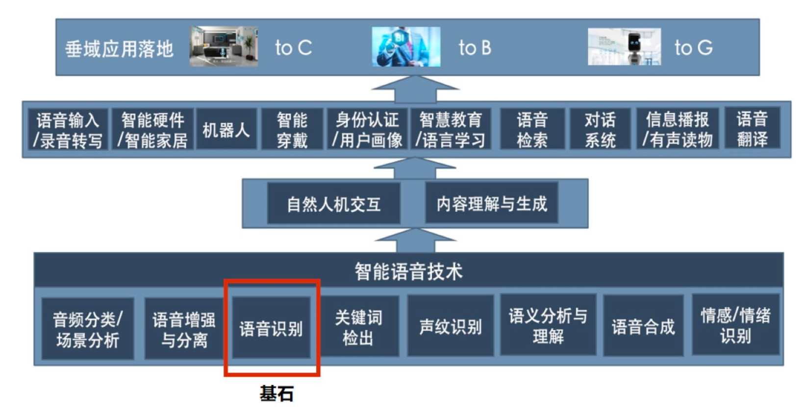

### 2. 语音合成

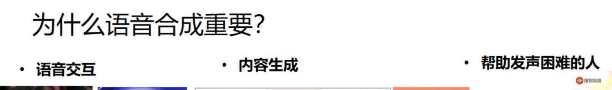

语音合成的两种方式：统计参数合成、单元拼接合成。

统计参数合成就是使用大量的语音数据来训练模型，用过对语音信号的统计特征进行建模，生成新的语音。

单元拼接合成如下所示。

## Part5 安全相关问题

