> 认真听了一遍，不用再看PPT了，这节课前几分钟可以看看，是对上节课的复习和习题的讲解。

# 第五章 数字图像处理与安全

## 1. 什么是数字图像

- 数字图像：是由像素组成的二维排列，可以用矩阵表示
- 对于单色（灰度）图像而言，每个像素的亮度用一个数值来表示
  - 通常数值范围在0到255之间
  - 0表示黑、255表示白
  - 其它值表示处于黑白之间的灰度

- 彩色图像由三个色彩分量组成（如RGB，HSV）
  - 彩色图像可以用红、绿、蓝三元组构成的二维矩阵来表示
  - 三元组的每个数值也是在0到255之间
  - 0表示相应的基色在该像素中没有
  - 255则代表相应的基色在该像素中取得最大值

> HSV（Hue, Saturation, Value）色调（H）、饱和度（S）和明度（V）

- 数字图像是真实场景的近似结果

> 什么是像素：数字图像由二维的元素组成，每一个元素具有一个特定的位置（x,y）和幅值f(x,y)，这些元素就称为像素。

## 2. 数字图像处理的发展

- 图像处理的三个层次

> 发展历史：
>
> - Early 1920s（20世纪20年代初）：应用于报纸工业、伦敦和纽约之间的海底电缆传输图像、图象编码传输，在接收端重建；
> - Mid to late 1920s（20世纪20年代中后期）：改进的Bartlane系统产生了较高质量的图像；
> - 1960s（20世纪60年代）：太空军备竞赛促进图像技术的发展；
> - 1970s（20世纪70年代）: 在医学中应用，CAT断层扫描；
> - 1980s – Today（20世纪80年代至今）: 应用于各个领域中——图像增强/恢复、艺术效果 Dall E2, Make a video，Midjourney、医学可视化 (生物医学图像)、工业检测、人机界面。

## 3. 数字图像处理的应用领域

- 数码相机(DC)、数码摄像机(DV)

- 互联网、视频、多媒体等

- 基于内容的图像检索、视频检索、多媒体检索

- 游戏、电影特技、虚拟现实、电子商务等

- *指纹识别、人脸识别等生物识别*

- *信息隐藏*

- *图像水印、数字取证*

- *伪造检测、深度伪造（与人工智能结合）*

---

- 图像增强（改善图像质量、去除噪声）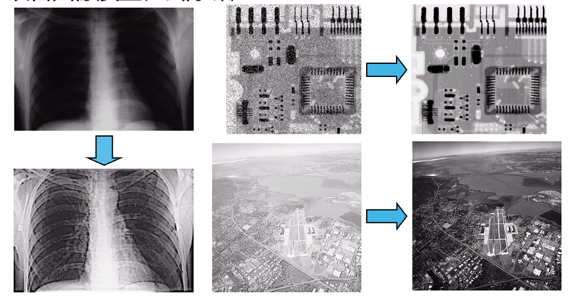
- 图像恢复
- 医学图像应用

- 图像分割

- 图像识别
- 法律识别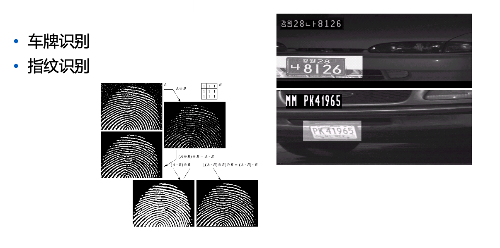

## 4. 数字图像处理的关键阶段

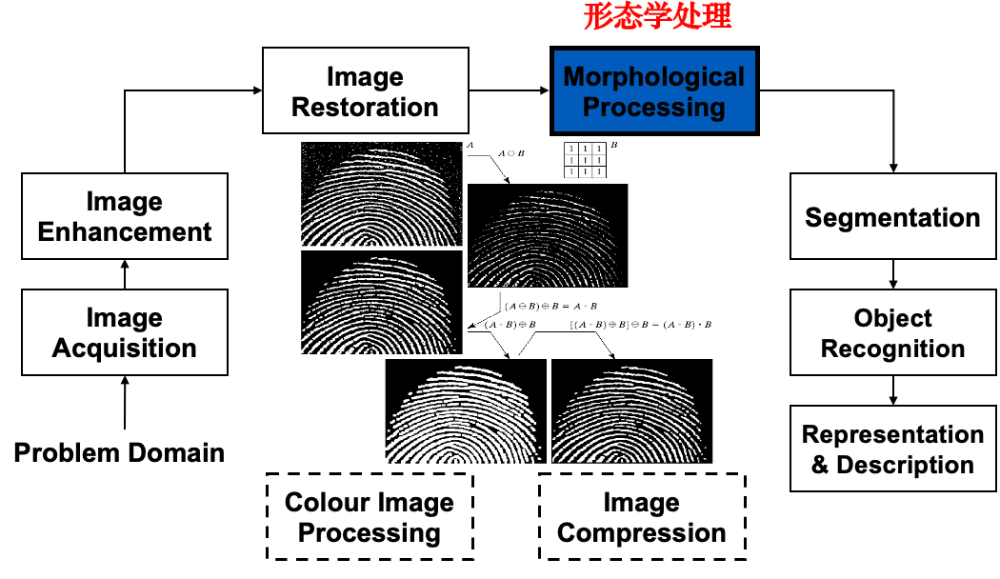

> 表达及理解涉及对场景的理解

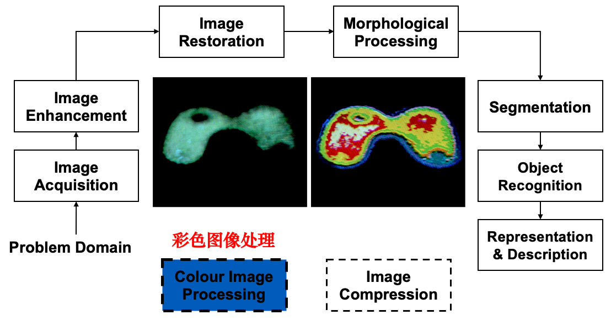

## 5. 数字图像处理的主要方法

### 空域法

> 类似时间信号的时域

把图像看作是平面中各个像素组成的集合，然后直接对这个二维函数空间的像素进行相应的处理，其包括：

- 邻域处理法
  - **梯度运算（Gradient Algorithm）**
  - 拉普拉斯算子运算（Laplacian Operator）
  - 平滑算子运算（Smoothing Operator）
  - 卷积运算（Convolution Algorithm）

- 点处理法
  - 灰度处理(grey processing），面积、周长、体积、重心运算等等

### 空换域法（频域）

- 首先对图像进行正交变换，得到变换域系数阵列，然后再施行各种处理；
- 处理后再反变换到空间域，得到处理结果。
- 这类处理包括：
  - 滤波
  - 数据压缩
  - 特征提取等处理

---

### 图像增强

#### 空域的平滑

1. 邻域操作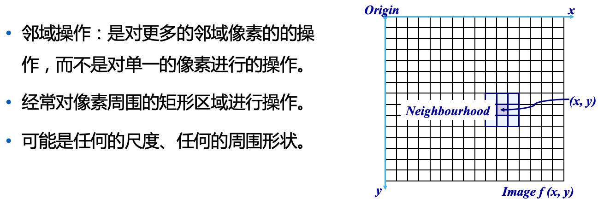

2. 均值滤波

3. 加权平滑滤波器

4. 中值滤波法（非线性平滑

5. 图像边缘的处理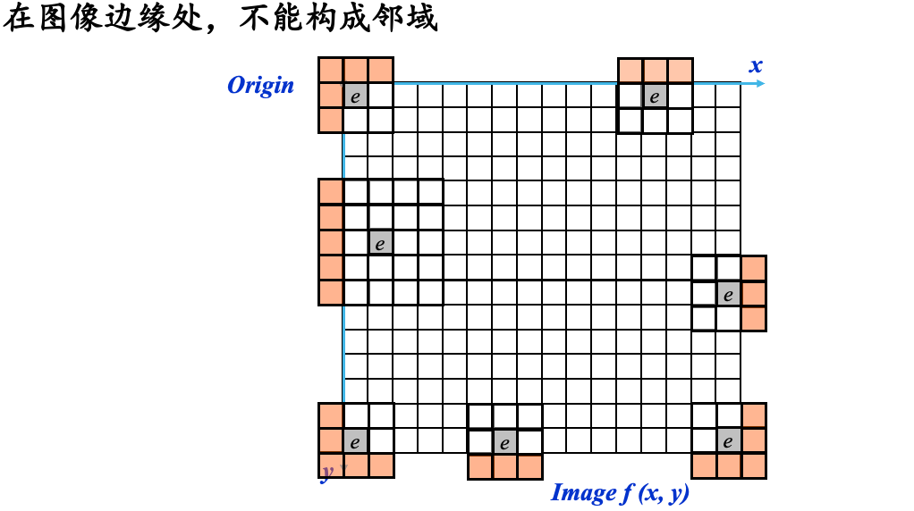

#### 频域的平滑

1. 数字图像的频率处理基础

2. 频域平滑的技术（平滑的作用是消除毛刺，也就是过滤掉高频部分）

	- 理想低通滤波器

	- 巴特沃思低通滤波器

	- 指数形低通滤波器

---

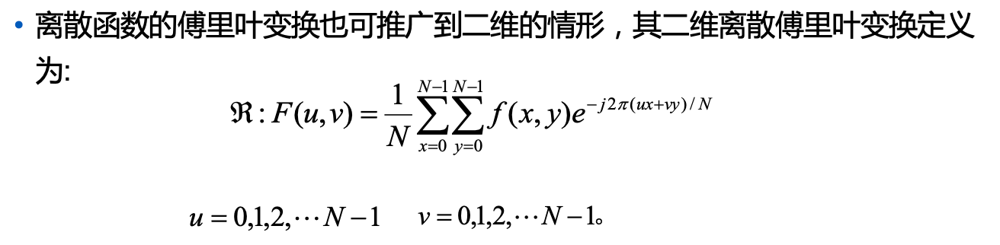

---

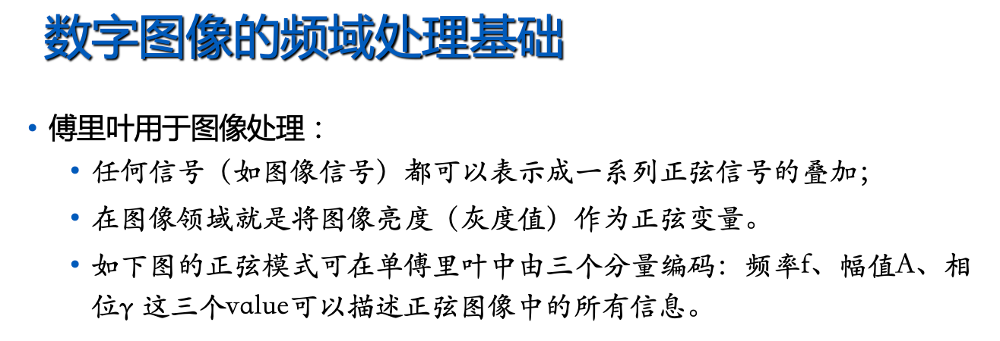

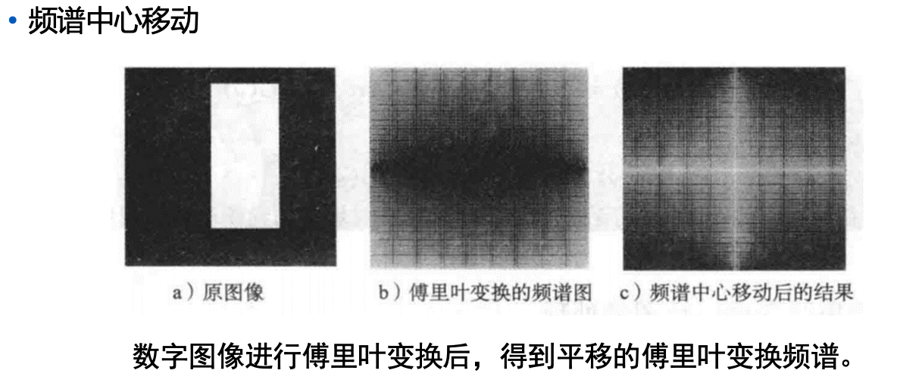

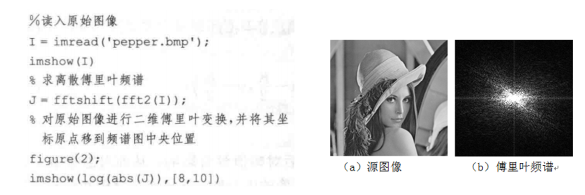

数字图像与频谱的对应关系是：频域反应了图像在空域灰度变化剧烈程度，也就是图像灰度的变化速度。

- 图像中灰度变化剧烈的特征，如线条细节、边缘等信息在频谱中的高频区的特征加以反映；（噪声也是）

- 图像中的平滑区域的特性在频谱中的靠中心处的低频成分加以反映。

---

---

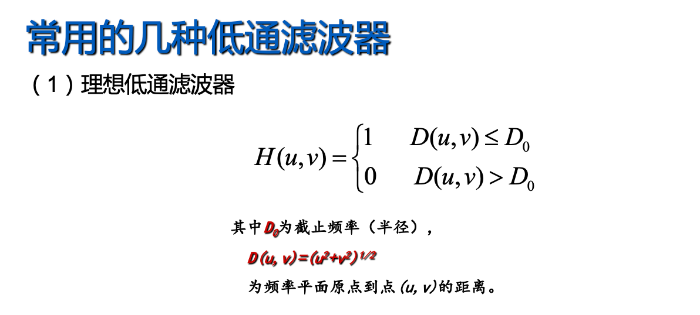

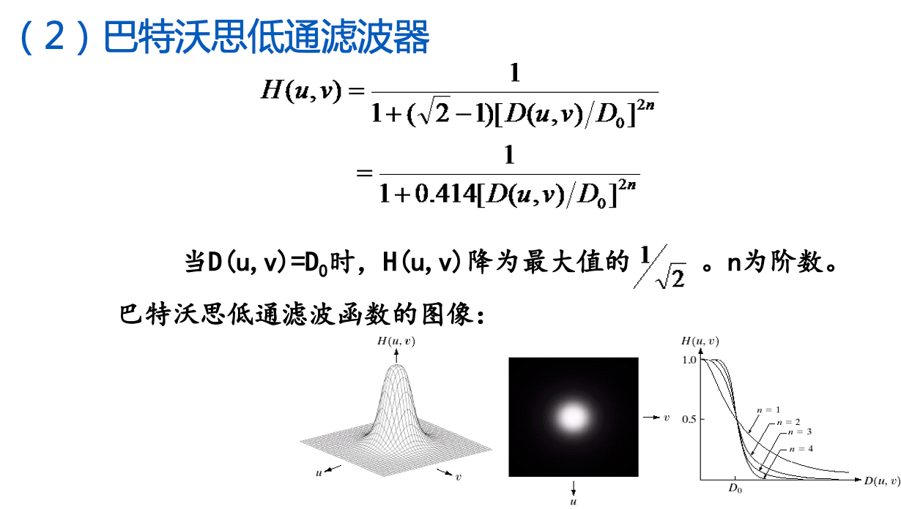

#### 空域的锐化

图像锐化的背景

- 图像经转换或传输，质量可能下降，难免有些模糊

- 图像锐化目的：加强图像轮廓，使图像看起来比较清晰

空间锐化滤波器求取图像中突出的细节信息

- 去除模糊的成分

- 突出边缘

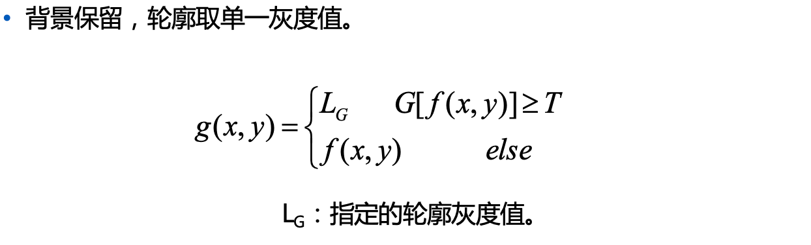

#### 频域的锐化

1. 频域锐化的原理

2. 频域的锐化技术

   - 高频加强滤波器 

   - 几种常见的高通滤波器

---

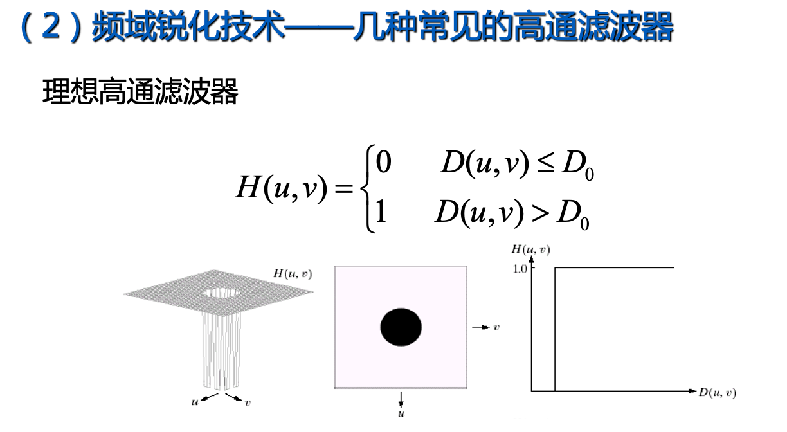

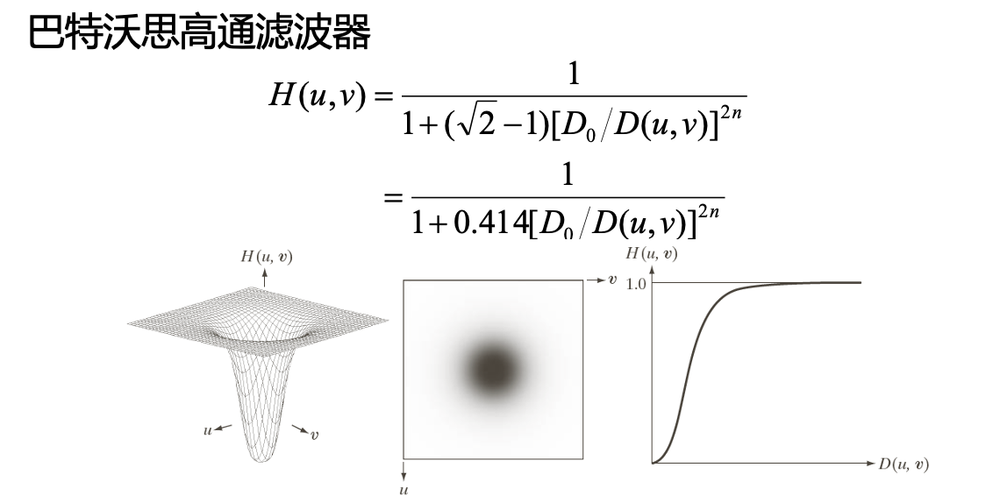

### 图像压缩

#### 1. 图像压缩的意义和原理

- 数字图像通常会占用很大的存储空间，这给图像的存储和传输带来了相当大的困难，因此，有必要对数字图像进行压缩处理。

- 图像压缩的主要原理是利用数字图像的相邻像素及图像序列相邻帧之间的相关性，并利用人眼的视觉特性，去除数字图像中的冗余来减少数据量。

- 常用方法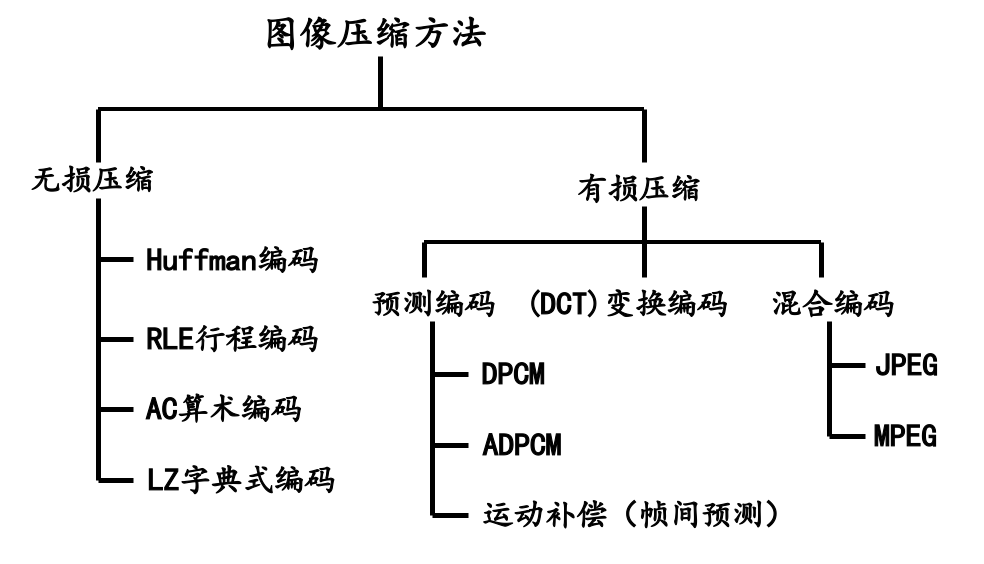

#### 2. 图像压缩基础

- 图像数据压缩是可能的
  - 原始图像中存在很大的冗余度
  - 用户通常允许图像失真
  - 降低输入的原始图像的分辨率对输出图像分辨率影响不大
  - 用户对原始图像的信号不全都感兴趣，可用特征提取和图像识别的方法，丢掉大量无用的信息，提取有用的信息

## 6. 图像处理和图像分析

### 图像处理在指纹识别中的应用

指纹识别是将识别对象的指纹进行分类比对从而进行判别。指纹识别技术作为生物体特征识别技术之一在新世纪逐渐成熟，进入了人类的生产生活领域。

其中，细节点提取是通过对增强图的形态学分析获得的，匹配通常通过统计学的模型实现，在本课程中不进行过多展开。

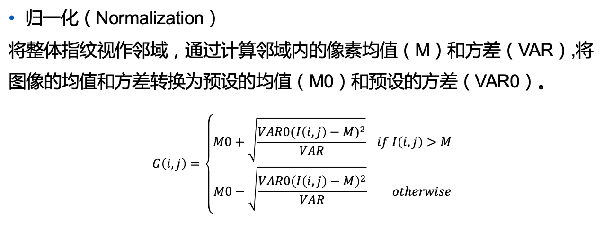

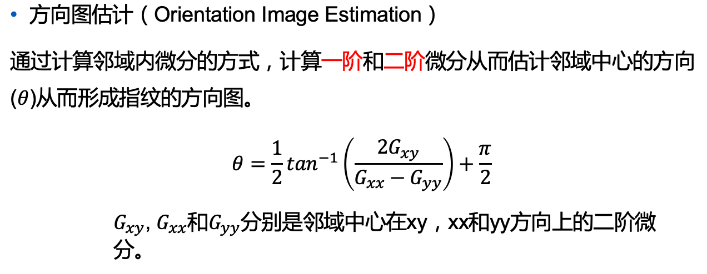

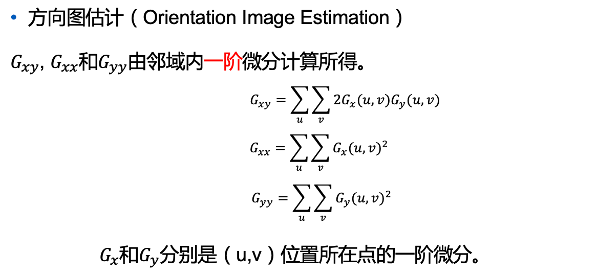

## 7. 图像信息隐藏

### 图像信息隐藏

- 图像信息隐藏是一种将秘密信息隐蔽的嵌入到图像中并传输的技术
- 通过在接收端提取的秘密信息可以达到隐秘传输等目的

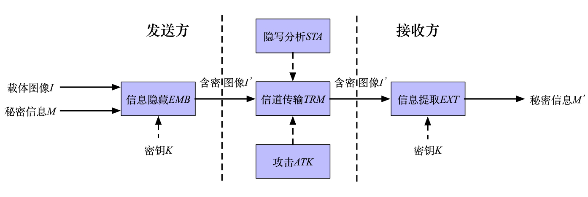

---

- 分类（频域操作比空域操作鲁棒性更强）

### LSB(Least Significant Bits)替换算法

> 图像基本表示

**将秘密信息嵌入到载体图像像素值的最低有效位，也称最不显著位，改变这一位置对载体图像的品质影响最小。**

- 将原始载体图像的空域像素值由十进制转换到二进制表示 
- 用二进制秘密信息中的每一比特信息替换与之相对应的载体数据的最低有效位，假设待嵌入的二进制秘密信息序列为[ 0 1 1 0 0 0 1 0 0 ]，则替换过程如图所示。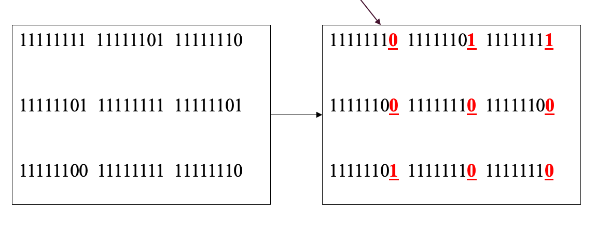

- 将得到的含秘密信息的二进制数据转换为十进制像素值，从而获得含秘密信息的图像，如图所示。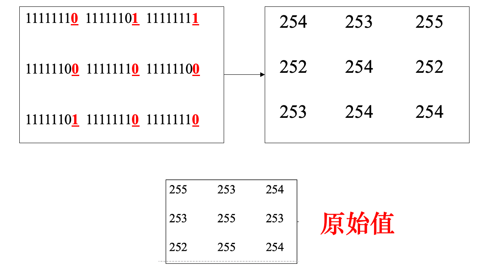

---

- 将得到的隐藏有秘密信息的十进制像素值转换为二进制数据，如图所示。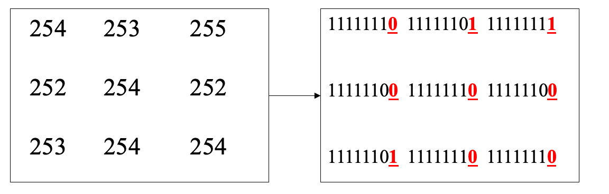
- ②将二进制数据的最低有效位提取出来，即为秘密信息序列[ 0 1 1 0 0 0 1 0 0 ]。如图所示。

### 图像水印

- 数字图像水印是在不影响载体图像原本使用价值的前提下将水印标识直接嵌入到载体图像中的技术
- 通过提取的水印标识可以达到版权保护、内容认证和秘密传输等目的

---

- 分类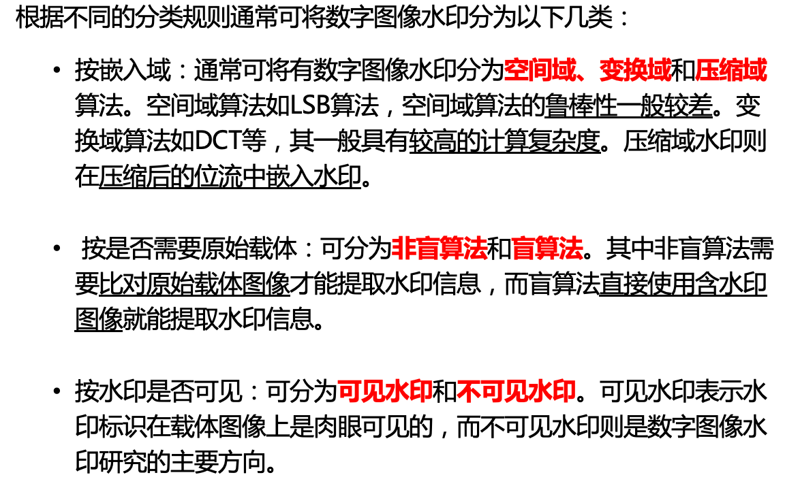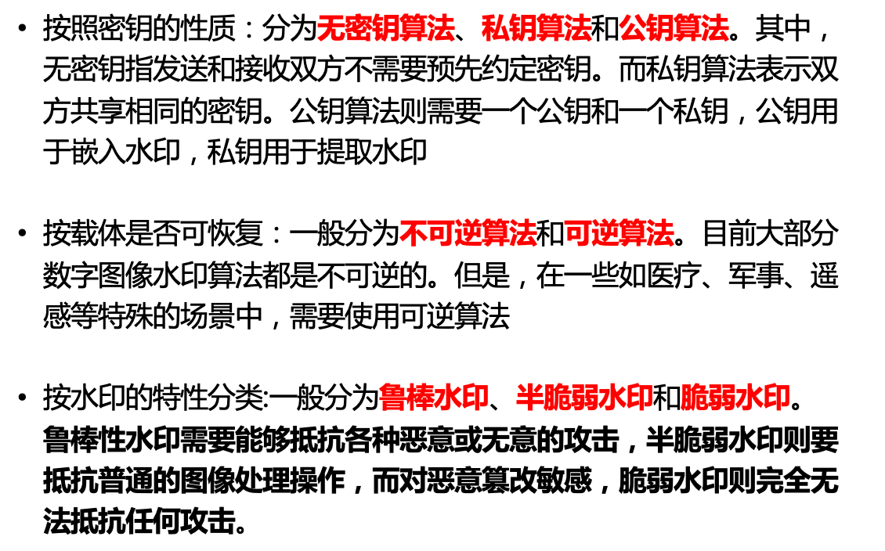

- 应用场景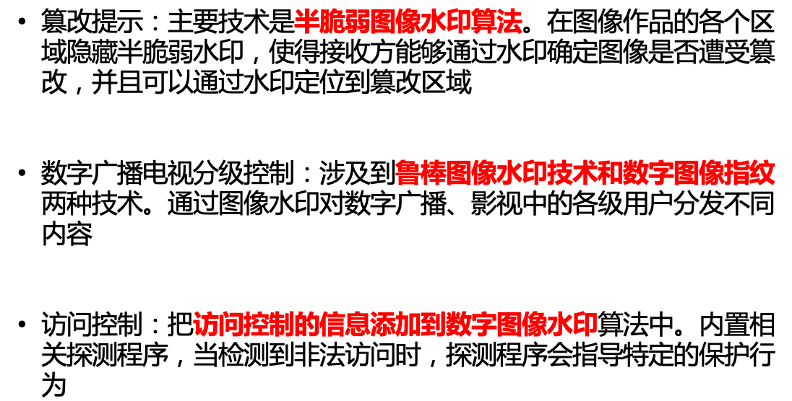

- 性能要求

- 挑战
